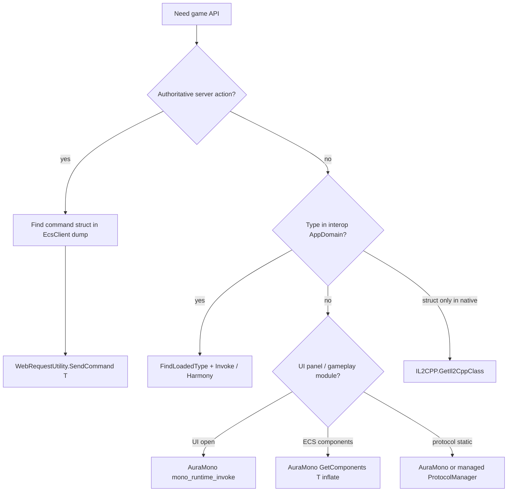

# AGENTS.md — Bugtopia

Guide for AI agents and developers working on this mod. Read this file first, then follow links into `docs/` for depth.

---

## 1. What this project is

| Item | Value |
|------|--------|
| Product | Automation / utility mod for **Heartopia** (Unity, hybrid **IL2CPP + embedded Mono**) |
| Output | Single assembly **`bugtopia.dll`** |
| Loaders | **MelonLoader** or **BepInEx IL2CPP** — one per build, never both in-game |
| Core code | `partial class HeartopiaComplete` split **by domain** across ~39 `buddy/HeartopiaComplete*.cs` files (`HeartopiaComplete.cs` is now ~6k lines of lifecycle glue) |
| Game access | Reflection, Harmony, `WebRequestUtility.SendCommand`, IL2CPP native API, **AuraMono** (`mono_runtime_invoke`) |
| Hard rule | **No RVA / offset patching** — resolve types and methods at runtime |

---

## 2. Documentation map (read in this order)

| When you need… | Read |
|----------------|------|
| **Orientation (start here)** | This file |
| Game + mod architecture, file map, access channels | [docs/ARCHITECTURE.md](docs/ARCHITECTURE.md) |
| **Type resolution** (`FindLoadedType`, pitfalls, workflows) | [docs/TYPE_RESOLUTION.md](docs/TYPE_RESOLUTION.md) |
| **Services, ECS, `EcsService.TryGet`, DataModule** | [docs/GAME_TYPES_AND_SERVICES.md](docs/GAME_TYPES_AND_SERVICES.md) |
| **Decompilation folders + per-feature game types** | [docs/DECOMPILED_SOURCE_MAP.md](docs/DECOMPILED_SOURCE_MAP.md) |
| Disk paths, interop, Il2CppDumper, tools | [docs/GAME_ASSEMBLIES_AND_TOOLS.md](docs/GAME_ASSEMBLIES_AND_TOOLS.md) |
| Build, deploy, logs, troubleshooting | [docs/BUILD_AND_RUN.md](docs/BUILD_AND_RUN.md) |
| Patches, config, frame loops | [docs/TECHNICAL.md](docs/TECHNICAL.md) |
| User-facing features / menu | [docs/FEATURES.md](docs/FEATURES.md) |
| Inventory / `ItemNetPair` / bag pipelines | [docs/BACKPACK_AND_ITEMS.md](docs/BACKPACK_AND_ITEMS.md) |

**Rule:** Do not guess type names from memory. Copy **full namespaces** from decompilations or interop DLLs for the target game build.

---

## 3. Repository layout

```
Bugtopia/
├── AGENTS.md                 ← you are here
├── README.md
├── docs/                     ← canonical documentation
├── buddy/                    ← all mod source + buddy.csproj
│   ├── HeartopiaComplete.cs  ← lifecycle/OnUpdate glue (most logic now in the files below)
│   ├── HeartopiaComplete.*.cs ← partials split by domain: NetCook, AutoSell, Radar,
│   │                            Reflection, AuraMono, AuraMonoEngine, UiKit, Teleport, …
│   ├── AuraFarm.cs           ← partial: aura gather/chop/mine feature
│   ├── *Feature.cs           ← partials: bubble, pets, homeland, daily claims, …
│   ├── *Farm.cs              ← static controllers: fishing, insect, bird
│   ├── MelonLoaderPlugin.cs / BepInExPlugin.cs
│   ├── build-all.bat
│   └── Directory.Build.props.example  → copy to Directory.Build.props (gitignored)
├── ilspy-dumps/              ← offline Mono decompile (gitignored, ~20k .cs)
└── gameassembly-dumps/       ← offline IL2CPP decompile (gitignored)
```

**Not compiled** (on disk but excluded from `buddy.csproj`): research dumps / experimental tooling. Do not edit them for shipping features. (The legacy `AutoFish*.cs` and `InsectFarm.cs` orphans were deleted — fishing/insect now ship as the net-based `AutoFishingFarm.cs` / `InsectNetFarm.cs`.)

---

## 4. Build and deploy (correct commands)

### Prerequisites

1. Heartopia installed with **one** loader; game launched once (generates interop).
2. .NET SDK **6+**, Windows x64.
3. Set game path: copy `buddy/Directory.Build.props.example` → `buddy/Directory.Build.props`:

```xml
<Project>
  <PropertyGroup>
    <HeartopiaDir>C:\path\to\Heartopia</HeartopiaDir>
  </PropertyGroup>
</Project>
```

### Build

```bat
cd buddy
build-all.bat
```

Produces:

```
buddy/bin/MelonLoader/Release/bugtopia.dll
buddy/bin/BepInEx/Release/bugtopia.dll
```

Single loader:

```powershell
dotnet build buddy.csproj -c Release -p:Loader=MelonLoader
dotnet build buddy.csproj -c Release -p:Loader=BepInEx
```

One-off path override:

```powershell
dotnet build buddy.csproj -c Release -p:Loader=BepInEx -p:HeartopiaDir="C:\Games\Heartopia"
```

Shipping build (hides loader console): `-c ReleaseShip`

### Deploy

| Loader | Copy `bugtopia.dll` to |
|--------|-------------------------|
| MelonLoader | `<HeartopiaDir>/Mods/bugtopia.dll` |
| BepInEx | `<HeartopiaDir>/BepInEx/plugins/bugtopia.dll` |

### Verify

- Logs: `MelonLoader/Latest.log` or `BepInEx/LogOutput.log`
- In-game menu: **Insert** (default)
- Config: `%LocalLow%/Bugtopia/Config.xml` (migrated automatically from legacy `%LocalLow%/HelperSettings/` on first run)

**After game patch:** regenerate loader interop, rebuild mod, re-verify type names in dumps.

---

## 5. Game runtime model (three layers)

```
IL2CPP (GameAssembly.dll)     ← Harmony targets, Il2CppInterop stubs
        ↓
Interop (BepInEx/interop or MelonLoader/Il2CppAssemblies)  ← compile-time refs, FindLoadedType
        ↓
Embedded Mono (mono-2.0-bdwgc.dll, images EcsClient, XDT*)  ← AuraMono for many gameplay paths
```

| Layer | Use for |
|-------|---------|
| **Interop + reflection** | Most `FindLoadedType`, Harmony on Unity/known stubs, `SendCommand` |
| **IL2CPP native** | Types missing from interop (`TryFindIl2CppClass`, `ItemNetPair` v10 path) |
| **AuraMono** | Backpack, aura farm, pets, bubbles, daily claims, UI open via `mono_runtime_invoke` |

Many assemblies load **only after entering a town** — test in-world, not main menu.

---

## 6. Decompilations — which folder to open

| Folder | Runtime | Bodies? | Use for |
|--------|---------|---------|---------|
| **`ilspy-dumps/`** | Embedded **Mono** | Full C# | Gameplay, ECS, protocols, UI, tables — **primary research** |
| **`gameassembly-dumps/`** | **IL2CPP** | Stubs + RVA only | `GameApp`, launcher, bootstrap, native layout |
| **`<Game>/BepInEx/interop/*.dll`** | Live interop | Stubs | Exact names `FindLoadedType` sees at runtime |

### Decision table

| Question | Open |
|----------|------|
| `ResourceProtocolManager`, `Entities`, birds, fishing, gather | `ilspy-dumps/XDTLevelAndEntity`, `XDTDataAndProtocol` |
| `ItemNetPair`, task commands, `TableData` | `ilspy-dumps/EcsClient` |
| `BackPackSystem`, `BattlePassSystem` | `ilspy-dumps/XDTGameSystem` |
| UI panel openers, shops | `ilspy-dumps/XDTGameUI` |
| `EcsService`, `ClientSystem.*` services | `ilspy-dumps/EcsSystem`, `XDTDataAndProtocol` |
| `GameApp`, session, hotfix | `gameassembly-dumps/` |
| What name works in mod at runtime | Loader **interop** folder first, then confirm in Mono dump |

**Path pattern (Mono):**

```
ilspy-dumps/<AssemblyRoot>/<ProjectName>/.../Namespace/ClassName.cs
```

**Do not** copy dump folders into `BepInEx/interop`. **Do not** use `gameassembly-dumps` to look up `EcsClient` / `XDT*` gameplay types — they live in Mono dumps.

### Search tips in decompilations

1. Start from **UI** or **ProtocolManager** that performs the action → copy called types.
2. Search **both** namespace variants: `Gameplay` vs `GamePlay`, `ScriptsRefactory.*` duplicates.
3. For network actions, find the **command struct** in `XDT.Scene.Shared.Modules.*` (`EcsClient` image).
4. For ECS state, find **component** under `XDTLevelAndEntity.Gameplay.Component.*`.
5. Cross-check [DECOMPILED_SOURCE_MAP.md](docs/DECOMPILED_SOURCE_MAP.md) matrix (feature → types → mod file).

If `ilspy-dumps/` is missing locally: dump to `%LocalLow%/Bugtopia/DecryptedAssemblies/` (empty folder opt-in, wait ≥60 s in-world), then decompile per assembly with `ilspycmd` — see [GAME_ASSEMBLIES_AND_TOOLS.md](docs/GAME_ASSEMBLIES_AND_TOOLS.md#decompiling-mono-pe-to-ilspy-dumps).

---

## 7. Type resolution (critical)

### Core API

**`HeartopiaComplete.FindLoadedType(params string[] names)`** — first match across `AppDomain`, with 30 s miss cache.

Always pass **multiple aliases**:

```csharp
this.FindLoadedType(
    "XDTLevelAndEntity.Gameplay.Component.Bubble.BubbleComponent",
    "XDTLevelAndEntity.GamePlay.Component.Bubble.BubbleComponent",
    "Il2CppXDTLevelAndEntity.Gameplay.Component.Bubble.BubbleComponent",
    "BubbleComponent");
```

Related helpers:

| Helper | When |
|--------|------|
| `FindLoadedTypeBySuffix` | Namespace drift between patches |
| `FindEntitiesRuntimeType` | Disambiguate short name `Entities` by method shape |
| `FindTypeByName` / `FindTypeBySignature` | Aura Farm assembly filtering |
| `FindAuraMonoClassByFullName` | Type not in interop — AuraMono class `IntPtr` |
| `TryFindIl2CppClass` | No managed stub at all |

Full detail: [TYPE_RESOLUTION.md](docs/TYPE_RESOLUTION.md).

### Choosing an access path

> **Events first.** Before adding a new feature or reworking an existing one, if it needs to **react
> to a game state change** (panel open/close, item added, stove/object spawned, QTE/bite, cooking
> status, …), **search [docs/GAME_EVENTS_LIST.md](docs/GAME_EVENTS_LIST.md) for a suitable
> `EventCenter` event first** and prefer hooking it via the reusable engine
> (`RegisterGameEventHook` / `RegisterGameEventHookByNetId`, see [docs/GAME_EVENTS.md](docs/GAME_EVENTS.md))
> over per-frame polling / AuraMono scans. Use the event-primary + poll-fallback pattern
> (`IsGameEventHookInstalled`). **Exceptions** (keep polling): genuinely *continuous* per-frame values
> (camera-dependent ESP screen projection, battle reel pull-strength) — events only mark *transitions*;
> and cases where the existing poll is already cheap & build-independent (Unity uGUI text-input focus).



| Pattern | Examples |
|---------|----------|
| **Event hook (EventCenter)** ← *prefer for reacting to state changes* | Instrument open/close, cooking status, cat/dog QTE, backpack add (AutoSell), fishing bite/result — [docs/GAME_EVENTS.md](docs/GAME_EVENTS.md) |
| **SendCommand** | Bird photo, bubbles, backpack move, task submit, farm commands |
| **ProtocolManager static invoke** | `ResourceProtocolManager.SendHitStoneCommand`, `MailProtocolManager.*` |
| **EcsService.TryGet&lt;T&gt;** (AuraMono inflate) | Daily claims services |
| **DataModule&lt;T&gt;.Instance** (AuraMono) | `BattlePassSystem`, `BackPackSystem` reads |
| **Harmony** | Movement, `SendCommand` prefix rewrite, input patches |
| **GameObject scan** | Radar, meteor props `p_rock_meteorite*`, player `p_player_skeleton(Clone)` |

### Aura Farm specifics

- Discovery: **AxeChecker** (`HandholdCylinderChecker.PhysicalSelect`) → level object `ownerNetId`.
- Commands: bush/tree/stone via protocol managers; **meteor** uses `SendHitStoneCommand(**parent**NetId)` after resolving view → logic parent (`CollectableMeteorite*`, `MeteoriteLogic`).
- Entity lookup: prefer **`Entities.GetEntity`**, not `EntityUtil.GetEntity`, for meteor parent walks.
- Mono field reads: never unbox reference-type members (`*Entity`) as scalars — use `TryGetAuraMonoEntityNetId`.

See [FEATURES.md § Aura Farm](docs/FEATURES.md), [TECHNICAL.md § Aura Farm](docs/TECHNICAL.md).

---

## 8. Finding objects and live instances

| Goal | Approach | Notes |
|------|----------|-------|
| ECS entity by `netId` | `Entities.GetEntity` / `GetAnyEntity` (managed or AuraMono) | Preferred for components |
| All instances of a component type T (radius/whole-world scan) | `Entities.GetComponents<T>` | **Preferred over the entity-graph walk.** Managed if available; else AuraMono generic inflate via reusable `TryAuraMonoGetComponentObjects` ([TYPE_RESOLUTION.md](docs/TYPE_RESOLUTION.md)). Used by farm/cook/bird/gift/insect/bubble. |
| "What my equipped tool is pointed at" (NOT all-of-type) | `InteractSystem` / AxeChecker / SweepNetManager / visual GameObject scan | GetComponents does **not** fit here (would target the whole world) — aura-farm gather + fishing stay proximity/visual |
| Sphere / cylinder overlap | `Entities.SphereQueryEntities`, interact cylinders | Aura farm; shape validation required |
| Interact targets | `InteractSystem` select priority / `SelectPriorityInfo.shape` | Aura farm primary path |
| Level object owner | `EntityHelper.GetLevelObjectOwner`, shape `ownerEntity.netId` | Link UI shape → entity |
| Player position | `GameObject.Find("p_player_skeleton(Clone)")` or host helpers | Fragile on prefab rename |
| World props by name | `GameObject.FindObjectsOfType` + name prefix | e.g. radar, meteor rocks |
| Backpack items | `BackPackSystem.GetAllItem(EStorageType)` | AuraMono or managed — [BACKPACK_AND_ITEMS.md](docs/BACKPACK_AND_ITEMS.md) |
| Service singleton | `EcsService.TryGet<IService>` | AuraMono inflate, not `Managers._serviceDic` |
| UI panel instance | `UIManager.GetView<T>` / `OpenView` | Usually **AuraMono** for `XDTGame.UI.*` |

**Worked example — meteor (aura farm):**

1. Scene: `p_rock_meteorite*` positions classify live rocks.
2. AxeChecker registers **view** `ownerNetId` on level object shape.
3. Resolve **parent** logic `netId` via component scan / `DataCenter.TryGetComponentData`.
4. `SendHitStoneCommand(parentNetId)` with axe equipped.

---

## 9. Mod source conventions

### File placement

| Change type | Where |
|-------------|--------|
| New menu / small feature | New `*Feature.cs` or `HeartopiaComplete.<Domain>.cs` `partial class HeartopiaComplete` |
| Large farm loop | `*Farm.cs` static class + tick from `HeartopiaComplete.OnUpdate` |
| Aura / Mono **bridge** infra | `HeartopiaComplete.AuraMonoEngine.cs` (mono_* delegates, `EnsureAuraMonoApiReady`, GC pinning) |
| Generic AuraMono helpers | `HeartopiaComplete.AuraMono.cs` (`TryInvokeAuraMono*`, `FindAuraMonoClass*`, field readers) |
| Harmony patch | Dedicated `*Patch.cs` or feature file |

### Code style (project)

- Match surrounding naming and patterns; minimal diff scope.
- Cache resolved `Type` / `MethodInfo` / `IntPtr` — do not scan assemblies every frame. Class/method `IntPtr`s may stay raw (image lifetime); **object** `IntPtr`s cached across frames go through `AuraMonoObjectCache` (HeartopiaComplete.AuraMonoEngine.cs).
- New AuraMono invokes: prefer `TryAuraInvoke(method, obj, args, out result, out error)`; the `auraMonoRuntimeInvoke` delegate is also safe (bound to the central guard), the raw export is not.
- Per-frame feature ticks: wrap in a `FeatureBreakerState` (ModLogger.cs) so a systematic failure cools down instead of spamming every frame.
- Crash-hardening invariants are enforced by `ci/crash-hardening-lint.ps1` (runs in CI; run locally before pushing interop changes).
- Log failures **once** (`ModLogger.Msg`); use `MasterLog*` flags in `HeartopiaComplete.cs` for verbose traces (default `false`).
- `AllowUnsafeBlocks` is on — AuraMono paths use `unsafe` and pointers; follow existing `ref`/`out` pointer patterns ([TYPE_RESOLUTION.md § gotchas](docs/TYPE_RESOLUTION.md)).

### Compiled vs orphan

Only files listed in `buddy/buddy.csproj` `<Compile Include="...">` ship. Adding a new `.cs` requires a csproj entry.

---

## 10. Workflow: add or fix a feature

1. **Decompile** — find UI / manager / command in `ilspy-dumps/`; note assembly image.
2. **List type aliases** — full name, `Gameplay`/`GamePlay`, `Il2Cpp` prefix, `ScriptsRefactory`, short name.
3. **Check for a suitable event FIRST** — if the feature reacts to a state change, search
   [docs/GAME_EVENTS_LIST.md](docs/GAME_EVENTS_LIST.md) and prefer an `EventCenter` hook over polling
   (§7 "Events first" + [docs/GAME_EVENTS.md](docs/GAME_EVENTS.md)). Only fall back to polling for
   continuous per-frame values or where the poll is already cheap/build-independent.
4. **Pick access channel** — Event hook vs SendCommand vs Invoke vs AuraMono vs Harmony (§7).
5. **Implement resolver** — reuse existing helpers; add shape check if short name collides.
6. **Gate on readiness** — retry in `Update` after world load; separate managed vs AuraMono ready flags.
7. **Build both loaders** — `build-all.bat`.
8. **Test in private town** — verify logs, no native crash (Mono generic/ref mistakes crash the process).
9. **Update docs** — `DECOMPILED_SOURCE_MAP.md` matrix row + `FEATURES.md` if user-visible.

---

## 11. Debugging

| Symptom | Action |
|---------|--------|
| `type unavailable` / `null` | [TYPE_RESOLUTION.md](docs/TYPE_RESOLUTION.md) pitfalls; enter town; check interop folder |
| Harmony `[ERR]` | Game update broke signature — re-dump, fix patch target |
| Silent crash | Last AuraMono breadcrumb; check generic `method_inst` and `ref` args |
| Feature idle | `MasterLog*` flag + rebuild; read `auraLastError` / feature status fields |
| Wrong behavior, no error | Wrong type patched — add shape validation |

Log locations: [BUILD_AND_RUN.md](docs/BUILD_AND_RUN.md).

### Analyzing a crash dump (native AV → process exit)

AuraMono mistakes (stale object `IntPtr`, bad generic `method_inst`, `ref`/value-type arg) crash the process with an **uncatchable native access violation** — nothing reaches the file log. The game runs on **CoreCLR** (BepInEx IL2CPP), so a Windows Error Reporting full dump (`*.dmp`, often multi-GB) can be opened with **`dotnet-dump`** (installed at `%USERPROFILE%\.dotnet\tools\dotnet-dump.exe`). This recovers the **managed** call chain into the interop P/Invoke, which is enough to identify the faulting feature/method.

```powershell
# 1. Find the faulting thread. WER dumps often have NO exception stream; instead look for the
#    thread carrying System.ExecutionEngineException (CoreCLR's fatal-fault marker) — usually the
#    STA (main Unity/BepInEx) thread.
dotnet-dump analyze <dump.dmp> -c "clrthreads -live" -c "exit"

# 2. Managed stack of that thread (DBG index from the first column, e.g. 0):
dotnet-dump analyze <dump.dmp> -c "setthread 0" -c "clrstack" -c "exit"
```

The stack shows the mod frames (`HeartopiaMod.HeartopiaComplete.*`) down to the `IL_STUB_PInvoke` where the native mono call faulted — e.g. a crash in `TryEnumerateAuraMonoLoadedEntityObjects` → `TryGetMonoObjectMember` means the recursive entity-graph walk dereferenced a moved/stale pointer. Prefer the direct `Entities.GetComponents<T>` path over that walk (see [TYPE_RESOLUTION.md § AuraMono generic GetComponents](docs/TYPE_RESOLUTION.md)).

**Quick triage without dotnet-dump** (no symbols, faulting module+offset / stack pointer scan) — repo scripts, PS 5.1, no WinDbg:

```powershell
tools/Read-MinidumpException.ps1 -DumpPath <dump.dmp>   # faulting module+offset (needs exception stream)
tools/Read-MinidumpStack.ps1     -DumpPath <dump.dmp>   # module-pointer scan of crash thread stack
```

These rely on the dump having an **ExceptionStream**; WER full dumps frequently omit it (then use `dotnet-dump` as above).

### Fixing a stale-pointer AuraMono crash (the most common one)

If `clrstack` ends in `TryGetMonoObjectMember` / `TryGetMono*Member` / `auraMonoObjectGetClass` → `IL_STUB_PInvoke` inside a loop that holds raw mono object `IntPtr`s (backpack items, ECS component objects, orders, scan results) — surfaced as `System.ExecutionEngineException` (`0x80131506`) or a mono FAILFAST assert (`mono_class_get_flags: unexpected GC filler class`, `sgen-scan-object.h`) — it is the **moving-GC stale-pointer** bug. The game's mono GC is **SGen (moving)**; a raw `MonoObject*` is not a root it can see, so any mono-side allocation between obtaining the pointer and dereferencing it (member reads box values, `mono_runtime_invoke`, `mono_string_new`, the next enumeration step) can move/collect the object → the held `IntPtr` is stale → AV. Tell-tale: it works for the first N items, then crashes once allocation pressure triggers a GC.

Fix it exactly like this:

1. **Enumerate with pins.** Pass a `List<uint> pins` to `TryEnumerateAuraMonoCollectionItems(collectionObj, items, pins)` — it `AuraMonoPinNew`s each element at collection time (pin index aligns with `items` index).
2. **Free in `finally`.** Wrap the whole processing loop in `try { … } finally { FreeAuraMonoPins(pins); }`.
3. **If a pointer outlives the method** (stored in a snapshot/cache), transfer ownership: copy the pin into the stored entry, set `pins[i] = 0U` so the `finally` skips it, and release it when the snapshot is cleared. Reference: `ResolveDirectBackpackRuntimeItems` / `ClearDirectBackpackRuntimeItems` (HeartopiaComplete.AutoSell.cs); helpers `AuraMonoPinNew` / `AuraMonoPin` / `FreeAuraMonoPins` in HeartopiaComplete.AuraMonoEngine.cs.

**Do NOT** "fix" it with `mono_gc_disable` / `auraMonoGcDisable` — those exports are **absent on this build, so the wrappers are silent no-ops** and give zero protection. Pinning is the only mechanism. (Also never write a raw `MonoObject*` into a managed mono ref-field — no write barrier on this build — and never hold one across a coroutine `yield`; CI lint W1.)

---

## 12. Anti-patterns (do not)

| Do not | Why |
|--------|-----|
| Guess namespaces | Builds differ; use dumps |
| Cache a MonoObject* across frames in a raw `IntPtr` field | bdwgc collects it once the game drops its reference → random AV; use `AuraMonoObjectCache` (gchandle + world-epoch invalidation). CI lint E3 |
| Cache or pin **transient** character states (`GamePhotoMode`, equip states, UI panels) across frames | Not singletons — the game tears them down on tool/state change; a pin keeps a detached object alive → AV on field read. Re-resolve from `Character._states` (or equivalent) each tick; pointer valid only in sync scope |
| Call `auraMonoRuntimeInvokeRaw` or re-resolve `mono_runtime_invoke` | Bypasses `InvokeAuraMonoChecked` (null guard, exc check, garbage-result suppression); use `auraMonoRuntimeInvoke` or `TryAuraInvoke`. CI lint E1/E2 |
| Carry an object `IntPtr` across `yield return` in a coroutine | GC can collect it between frames; scalarize to netIds/strings before the first yield, or pin via `AuraMonoPin` in try/finally. CI lint W1 |
| Enumerate mono objects into a bare `List<IntPtr>` then read members in a loop | SGen moves the still-held items as each member read allocates → AV mid-loop (`ExecutionEngineException`). Pass a `pins` list to `TryEnumerateAuraMonoCollectionItems` + `FreeAuraMonoPins` in finally (§11). `mono_gc_disable` is a **no-op on this build** — pinning is the only fix |
| Pass an out-param slot to `mono_runtime_invoke` for a value type wider than a pointer | mono writes the whole struct into the slot → stack corruption (crashed AutoSell scan); use `ContainsKey` + `get_Item` (boxed returns) |
| Probe a dictionary with `get_Count` + `get_Item(0..n)` | Dictionary `get_Item` takes a KEY, not an index — exceptions per element / wrong items; use the enumerator path |
| Invoke an inflated generic method without signature validation | Wrong `method_inst` AVs the process on invoke; check `AuraMonoMethodParamCountIs` first |
| Walk all loaded entities (`TryEnumerateAuraMonoLoadedEntityObjects`) to find instances of one type | Dereferences arbitrary mono entity pointers → random native AV on dense/visiting/streaming fields. Use `Entities.GetComponents<T>` (reusable `TryAuraMonoGetComponentObjects`) for "all of type T" ([TYPE_RESOLUTION.md](docs/TYPE_RESOLUTION.md#reusable-helper-tryauramonogetcomponentobjects--cross-feature-adoption)) |
| Use `gameassembly-dumps` for `XDT*` gameplay | Wrong runtime — use `ilspy-dumps` |
| Harmony on `FindLoadedType("XDTGame.UI.*")` | UI types often AuraMono-only |
| Mono thunk hook on IL2CPP UI openers | Hook never fires in-game |
| `EntityUtil.GetEntity` for meteor parents | Prefer `Entities.GetEntity` |
| Unbox `*Entity` fields as `uint` | Native crash (`mono_object_unbox`) |
| Edit orphan `.cs` not in csproj | Won't ship |
| Install MelonLoader + BepInEx together | Unsupported |
| Commit `Directory.Build.props` | Machine-specific path |

---

## 13. Quick reference — high-traffic game types

| Purpose | Types (verify in dump for your build) |
|---------|----------------------------------------|
| Network send | `WebRequestUtility`, `ChannelType`, `*NetworkCommand` |
| Gather / aura | `ResourceProtocolManager`, `InteractSystem`, `HandholdCylinderChecker`, `EntityHelper`, `Entities` |
| Meteor | `CollectableMeteoriteViewComponent`, `MeteoriteLogic`, `p_rock_meteorite*` |
| Backpack | `BackPackSystem`, `BackpackProtocolManager`, `ItemNetPair`, `EStorageType` |
| Services | `EcsService`, `IOperationActivityCenterService`, `ClientSystem.*` |
| Tables | `TableData`, `Table*` rows |
| Fishing | `HandHoldFishingRod`, fish shadow components |
| Birds | `TakingBirdPhotoCommand`, `BirdScannableComponent` |

Full matrix: [DECOMPILED_SOURCE_MAP.md § 4](docs/DECOMPILED_SOURCE_MAP.md).

---

## 14. Related entry points in code

| File | Responsibility |
|------|----------------|
| `HeartopiaComplete.cs` | Lifecycle / `OnUpdate` glue, `MasterLog*` flags (most logic split into `HeartopiaComplete.*.cs`) |
| `HeartopiaComplete.Reflection.cs` | `FindLoadedType`, Mono/Il2Cpp member access |
| `HeartopiaComplete.AuraMonoEngine.cs` | AuraMono native bridge: `mono_*` delegates, `EnsureAuraMonoApiReady`, GC pinning |
| `AuraFarm.cs` | Aura gather/chop/mine feature (interact pointers + gather invokers) |
| `BubbleFeature.cs` | SendCommand patch, mono native hooks pattern |
| `HomelandFarmFeature.cs` | Managed + AuraMono `GetComponents<T>` reference |
| `DailyClaimsFeature.cs` | `EcsService.TryGet<T>` AuraMono inflation reference |
| `DailyQuestSubmitFeature.cs` | `ItemNetPair` list construction |
| `WildAnimalGiftFeature.cs` | AuraMono-only feature (no `FindLoadedType`) |

---

*Last aligned with repo docs and aura meteor pipeline. After major game patches, re-read [TYPE_RESOLUTION.md](docs/TYPE_RESOLUTION.md) and regenerate dumps.*
