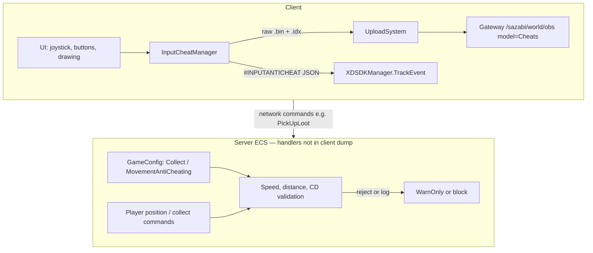

# Behavioral Anti-Cheat (Client Dump Analysis)

Analysis based on decompiled client sources in `ilspy-dumps/`. This document covers **behavioral** cheat detection: what is collected, when, and how it is sent to the server/backend.

**Not covered here:** MelonLoader, BepInEx, Harmony, mod folder scans, or loaded-assembly enumeration — none of these appear in the client dump.

---

## 1. Overview

Three largely independent layers:

| Layer | Where it runs | Visible in client dump |
|-------|---------------|------------------------|
| **Input anti-cheat** | Client collects; **backend** scores anomalies | Full `InputCheatManager` collector; **no** client cutoffs |
| **Collect anti-cheat** | Server (inferred from config) | `CollectAntiCheating` config + GM command only |
| **Movement anti-cheat** | Server (inferred from config) | `MovementAntiCheating` config + GM command only |
| **Native Themis** | Client native + server correlation | Managed binding only (§9) |
| **LivePatcher integrity** | Client | Hotfix **file** integrity, not mod DLLs |

### Architecture (high level)



### Feature flags

`GameModuleName` (`EcsClient/XDT/Scene/Shared/Modules/GameModuleSwitch/GameModuleName.cs`):

- `CollectAntiCheating = 0x100`
- `MovementAntiCheating = 0x200`

Modules can be disabled per build/region via `IGameModuleSwitchService`. The dump does not show explicit `IsModuleClose` call sites for these flags—only the enum and config fields.

---

## 2. Input Anti-Cheat (`InputCheatManager`)

**Source:** `ilspy-dumps/XDTLevelAndEntity/XDTLevelAndEntity/BaseSystem/InputCheatManager/InputCheatManager.cs`

**Scope:** Active only on main game level (`[ModuleScope(typeof(GameLevel_Main))]`).

### 2.1 What is collected

Each significant touch event is a **12-byte** record:

| Field | Size | Meaning |
|-------|------|---------|
| Type + Index | 1 byte | Event type (Down / Move / Up) in high 4 bits; finger id 0–15 in low 4 bits |
| X | 3 bytes | Screen X |
| Force | 1 byte | Always `0` in `_PushInputData` |
| Y | 3 bytes | Screen Y |
| Source + Timestamp | 4 bytes | Source = `4` (touchscreen); timestamp = ms since buffer session start |

Before upload, the client computes **aggregates**:

| Field | Meaning |
|-------|---------|
| `track_cnt` | Total event count |
| `move_track_pct` | Percentage of Move events |
| `most_move_track_cnt` | Max points in one gesture |
| `move_track_speed` | Move events / gesture time × 1000 |
| `most_move_2point_distance` | √(max squared delta between Move samples) |
| `track_time` | Timestamp of last event |

### 2.2 When data is recorded

**UI hooks** (non-exhaustive):

- `PointerButton`, `JoyStickBase`, `HoldButton`, `BuildGestureComponent`, `SwapComponent`
- `DrawingPanel`, `SkillButtonWidget`, `InstrumentBtnWidget`, `ItemLongPressButton`

**Filters and session rules:**

- Events are **skipped** if `|deltaX| ≤ 1` and `|deltaY| ≤ 1` (micro-movements filtered out).
- After a successful upload, a **1-hour cooldown** (`UploadColddown = 3_600_000` ms) blocks starting a new buffer.
- `Source` is hardcoded to **4** (touchscreen) even when input comes from mouse/gamepad through Unity UI.

**Upload triggers (`Upload`):**

| Trigger | Constant / condition |
|---------|----------------------|
| Buffer full | `MaxDataCount = 10_000` events |
| Session age | `MaxTime = 3_600_000` ms (1 hour) since first event |
| Level teardown | `OnDestroy` |
| App quit | `OnApplicationQuit` (sync upload) |
| Sub-mode change | `EnterSubMode` / `ExitSubMode` (e.g. drawing mode `"Drawing"`) |

**Minimum for upload:** more than **`MinUploadCount = 100`** events; otherwise the buffer is cleared without upload.

### 2.3 How data is sent

Two parallel channels:

#### A. Analytics (summary)

`XDSDKManager.TrackEvent("#INPUTANTICHEAT", properties)`

JSON fields use naming policy prefix `#c_log_` (`date`, `platform`, `playerid`, `filename`, aggregates).

#### B. OBS “Cheats” bucket (raw + index)

| Object | Content |
|--------|---------|
| `.bin` | Concatenation of all 12-byte records |
| `.idx` | Six `int32` aggregate values |

**Object paths:**

```text
data/{yyyyMMdd}/Standalone/{encodeShortId}/{filetime}.bin
index/{yyyyMMdd}/Standalone/{encodeShortId}/{filetime}.idx
```

With sub-mode (e.g. drawing):

```text
data/{yyyyMMdd}/Standalone/{encodeShortId}/{submode}/{filetime}.bin
index/{yyyyMMdd}/Standalone/{encodeShortId}/{submode}/{filetime}.idx
```

**Upload pipeline:**

1. `InputCheatManager.Upload`
2. `UploadSystem.UploadCheat` → queue (max **3** concurrent uploads)
3. `IObsSDKManager.AsyncUploadStream(..., ObsClientType.Cheats)`
4. `ObsSdk.Upload`:
   - `GET {Gateway}/sazabi/world/obs?model=1&opt=Upload&objectId=...&os=...` → presigned `ObsOptData`
   - `PUT` bytes to object storage

On application quit: `SyncUploadStream` (bypasses queue).

`platform` is hardcoded as `"Standalone"` in upload metadata.

**Config reference** (`WorldServerAddressConfig`): OBS base URL is typically `{GatewayAddress}/sazabi/world/obs` (see `Obs` field).

### 2.4 Client thresholds vs anomaly detection

**Important:** `InputCheatManager` defines **session/upload** thresholds only. It does **not** compare aggregates against cheat cutoffs or block gameplay locally. Any “anomaly” decision happens on the **backend** after OBS ingest and/or `#INPUTANTICHEAT` analytics.

| Constant | Value | Role |
|----------|-------|------|
| `MaxDataCount` | 10 000 | Flush buffer to OBS |
| `MaxTime` | 3 600 000 ms (1 h) | Flush by age |
| `MinUploadCount` | 100 | Below this: discard buffer, no upload |
| `UploadColddown` | 3 600 000 ms (1 h) | After upload, block new session start |
| Micro-movement filter | `\|deltaX\| ≤ 1` **and** `\|deltaY\| ≤ 1` | Drop event before append |

There is a public `Enable` property (default `true`), but the dump shows **no call sites** that toggle it.

### 2.5 Aggregate formulas (exact client math)

Computed in `Upload()` after finalizing per-finger gesture lists via `CalcMoveIndex`:

| Field | Formula | Notes |
|-------|---------|-------|
| `track_cnt` | `data.Count` | All Down/Move/Up records in session |
| `move_track_pct` | `(int)(total_move_track / data.Count * 100)` | Integer percent |
| `most_move_track_cnt` | Max Move count in one finger gesture | Updated on each `XDTouchUp` |
| `move_track_speed` | `(int)(total_move_track / total_move_time * 1000)` | `0` if `total_move_time == 0`; units ≈ Move events per second of gesture duration |
| `most_move_2point_distance` | `(int)√(max_move_2point_distance_square)` | Max squared delta between consecutive **Move** samples (`deltaX² + deltaY²`) |
| `track_time` | Last record’s `Timestamp` | Ms since session `_firstimestampe` |

Per-gesture timing: on `XDTouchUp`, `total_move_time += lastMove.Timestamp - firstMove.Timestamp` for that finger.

**Backend inference (not in client code):** analysts can flag sessions with e.g. very low `move_track_pct` (tap-only bots), very high `move_track_speed`, large `most_move_2point_distance` (pointer teleport between frames), or inconsistent raw `.bin` replay vs claimed aggregates.

### 2.6 Recording paths and blind spots

**Down / Up** — usually via `RecordPositionAndPushInputData`: delta = `eventData.position - lastPosition`.

**Move** — via `PushInputData` with `pointer.delta` / `touch.deltaPosition`.

**Default delta bypass:** `PushInputData(..., deltaX = 1000, deltaY = 1000)`. Down/Up from `GestureComponent.PushFingerInputData` omit delta → always pass the micro-movement filter.

**Hardcoded fields in every record:**

- `Force = 0`
- `Source = 4` (`AINPUT_SOURCE_TOUCHSCREEN`) even for mouse/PC Unity UI
- Finger id masked: `figner & 0xF` (0–15)

**Complete UI hook list (dump):**

| Component | Path under `ilspy-dumps/` |
|-----------|----------------------------|
| `PointerButton` | `XDTGameUI/XDTGUI.View.Components/PointerButton.cs` |
| `JoyStickBase` | `XDTGameUI/XDTGUI.View.Components/JoyStickBase.cs` |
| `HoldButton` | `XDTGameUI/XDTGUI.View.Components/HoldButton.cs` |
| `SwapComponent` | `XDTGameUI/XDTGUI.View.Components/SwapComponent.cs` |
| `BuildGestureComponent` | `XDTGameUI/XDTGUI.View.Components/BuildGestureComponent.cs` |
| `GestureComponent` | `XDTGameUI/XDTGUI.View.Components/GestureComponent.cs` |
| `DrawingPanel` | `XDTGameUI/XDTGame.UI.Panel/DrawingPanel.cs` |
| `SkillButtonWidget` | `XDTGameUI/XDTGame.UI.Widget/SkillButtonWidget.cs` |
| `InstrumentBtnWidget` | `XDTGameUI/XDTGame.UI.Widget/InstrumentBtnWidget.cs` |
| `ItemLongPressButton` | `XDTGameUI/XDTLevelAndEntity.Game.View.Components/ItemLongPressButton.cs` |

**Sub-mode:** `DrawingPanel` calls `InputCheatManager.EnterSubMode("Drawing")` on open and `ExitSubMode()` on close — each triggers upload and routes OBS objects under `.../{submode}/...`.

**Blind spot:** actions invoked through **game APIs** without passing through hooked Unity UI do **not** appear in `InputCheatManager`. Native Themis (`ThemisSDKManager.InputData`, §9) is a separate channel.

---

## 3. Resource Collect Anti-Cheat (`CollectAntiCheating`)

**Config:** `EcsClient/XDT/Scene/Shared/Data/Scriptable/CollectAntiCheating.cs`  
**Embedded in:** `GameConfig.CollectAntiCheating` (header: “资源采集反作弊设置”).

**Client validation logic:** not found in the client C# dump—only configuration and a GM network command.

### 3.1 Default parameters

| Parameter | Default | Purpose (from headers) |
|-----------|---------|------------------------|
| `Distance` | 2 m | Max distance to resource when collecting |
| `IsNoCdInCloseDist` | true | Relax CD when collects are close together |
| `CloseDist` | 2 m | “Close” threshold for CD rules |
| `MaxSpeed` | 8.6 m/s | Max horizontal speed for **reachability** checks |
| `SpeedTolerance` | 1.1 | +10% buffer for lag / buffs |
| `Slack` | 2 m | Extra distance margin for small `dt` |
| `WarnOnly` | false | `true` = log only; `false` = enforce rejection |

### 3.2 Inferred server behavior

On collect-related network commands, the server likely runs checks derived from config field headers (Chinese comments in `CollectAntiCheating.cs`). **No handler code** appears in the client dump.

#### Reconstructed validation (pseudocode)

```text
dist = horizontal_distance(player_pos, resource_pos)

// 1. Range check
if dist > Distance → reject (or log only if WarnOnly)

// 2. Reachability (anti teleport-collect)
dt = time_since_last_position_or_collect
max_reach = MaxSpeed * SpeedTolerance * dt + Slack
if distance_from_last_pos > max_reach → reject

// 3. Cooldown
if IsNoCdInCloseDist && dist_from_previous_collect <= CloseDist
    → skip CD enforcement
else
    → enforce Cd (runtime; see GM command)
```

With defaults: `max_reach = 8.6 × 1.1 × dt + 2` metres.

#### Network commands (client sends ID only)

| Command | Payload | Notes |
|---------|---------|-------|
| `PickUpLootNetworkCommand` | `[VerifyEntity] itemNetId` | `ResourceProtocolManager.SendPickLootCommand` |
| `ShakeTreeNetworkCommand` | `resourceNetId` | Bush shake |
| `AxeAttackTreeNetworkCommand` | `resourceNetId`, `isHit` | Tree chop |
| `HitStoneNetworkCommand` | `resourceNetId`, `isHit` | Mining |
| `WaterMapResourceNetworkCommand` | `resourceNetId` | Watering |

Client-side distance/CD validation for these commands was **not found**. The client sends intent; loot and resource state change only after server acceptance.

**Failure surface:** `PickUpLootNetworkEvent` carries `errorCode`. Client UI shows tip `10027` when `errorCode != 0` (`UIMessageSyncSystem`).

#### Correlation with game movement speeds

| Config / constant | Default | Context |
|-------------------|---------|---------|
| `CollectAntiCheating.MaxSpeed` | 8.6 m/s | Reachability cap |
| `MotionInfo.MovingSpeedLimit` | 4.0 m/s | On-foot run cap |
| `VehicleSystemConfig.AnimatorBikeForwardRunMaxSpeed` | 10.5 m/s | Bike animation cap |
| `VehicleSystemConfig.AnimatorCarForwardRunMaxSpeed` | 12 m/s | Car animation cap |

`MaxSpeed = 8.6` sits above foot speed but below full vehicle top speed — consistent with allowing mounted travel while blocking impossible cross-map collects.

### 3.3 GM override

`GmCollectAntiCheatingSetCommand` — runtime server override. Fields: `Cd`, `Distance`, `IsNoCdInCloseDist`, `CloseDist`, `MaxSpeed`, `SpeedTolerance`, `Slack`, `WarnOnly`.

**Note:** `Cd` exists on the GM command but **not** on `CollectAntiCheating` ScriptableObject — collect cooldown is likely stored and tuned server-side separately from shipped defaults.

---

## 4. Movement Anti-Cheat (`MovementAntiCheating`)

**Config:** `EcsClient/XDT/Scene/Shared/Data/Scriptable/MovementAntiCheating.cs`  
**Embedded in:** `GameConfig.MovementAntiCheating` (header: “角色移动反作弊设置”).

**Client implementation:** no references to `WindowSize`, `AbnormalRatio`, etc. outside config/GM—typical **server-side position sampling**.

### 4.1 Default parameters

| Parameter | Default | Interpretation |
|-----------|---------|----------------|
| `WindowSize` | 20 | Samples per analysis window |
| `SampleInterval` | 250 ms | Time between samples (~5 s per window) |
| `SpeedThresholdWalk` | 4.3 m/s | Speed cap on foot |
| `SpeedThresholdOnVehicle` | 9 m/s | Speed cap on vehicle |
| `AbnormalRatio` | 0.5 | Flag if ≥50% of samples exceed threshold |
| `ReportInterval` | 10 s | Reporting / logging interval (server-side) |

### 4.2 Inferred server behavior

The authoritative simulation likely samples player position on an interval, computes horizontal speed between samples, and compares against walk vs vehicle thresholds. **No sampling code** appears in the client dump.

#### Reconstructed algorithm (pseudocode)

```text
every SampleInterval ms (250):
    sample authoritative horizontal position

window = last WindowSize samples (20)  → 20 × 250 ms = 5 s

abnormal = 0
for each consecutive pair in window:
    speed = horizontal_distance / dt
    threshold = on_vehicle ? SpeedThresholdOnVehicle : SpeedThresholdWalk
    if speed > threshold:
        abnormal++

if abnormal / WindowSize >= AbnormalRatio (0.5):
    flag violation

every ReportInterval s (10):
    log / report / escalate (exact action not in dump)
```

**Flag condition with defaults:** ≥ **10 of 20** samples in a 5 s window exceed **4.3 m/s** on foot or **9.0 m/s** on vehicle.

#### Correlation with game movement speeds

| Anti-cheat field | Default | Game reference | Margin |
|------------------|---------|----------------|--------|
| `SpeedThresholdWalk` | 4.3 m/s | `MotionInfo.MovingSpeedLimit` = 4.0 m/s | +7.5% |
| `SpeedThresholdOnVehicle` | 9.0 m/s | Bike 10.5 / car 12 m/s | Conservative vs vehicle caps |
| `AbnormalRatio` | 0.5 | — | Majority of window must be “fast” |

**Buff caveat:** client syncs `MoveSpeedWalkBonus` (`PlayerSyncClientService` / `PropertySyncSystem`). Legitimate buffs can push speed above 4.3 m/s briefly. Unlike collect reachability, movement anti-cheat has **no** explicit `SpeedTolerance` field — server may hard-code slack or use a separate tuning path.

Exact enforcement (rollback, kick, ban) is not visible in the client dump.

### 4.3 GM override

`GmAntiCheatingMovementConfigCommand` — runtime override of all movement anti-cheat fields on the server.

**Mod relevance:** client-side speed/fly/teleport without server position sync should desync from authoritative state; detection is based on server trajectory, not client visuals alone.

---

## 5. Other Related Systems (Not Player Behavior)

| System | Role |
|--------|------|
| `ObsClientType.Cheats` / `ObsModel.Cheats` | Dedicated OBS model for telemetry (including input traces)—not mod-loader detection |
| `LivePatcher.IntegrityCheckResult` | Integrity of **hotfix/patch files**, not BepInEx/MelonLoader assemblies |
| ECS `[VerifyEntity]` on commands | General authoritative-server pattern; baseline action validation |

---

## 6. Risk Summary for Mod / Cheat Tool Authors

| Vector | Risk level | Notes |
|--------|------------|-------|
| Input telemetry (hooked UI) | **High** for autoclickers/macros | Raw `.bin` replay + aggregates; backend defines anomaly cutoffs (§2.4–2.5) |
| Input via game API (no UI hook) | **Medium** for ICM, **High** for Themis | ICM blind spot; native AC may still observe (§9) |
| Movement | **High** for speed/fly/teleport | Server sampling; ≥50% of 5 s window over 4.3 / 9.0 m/s (§4.2) |
| Collect | **High** for remote collect / CD bypass | `dist ≤ 2 m`, reachability `8.6×1.1×dt+2`, CD rules (§3.2) |
| Collect (`WarnOnly=true`) | **Medium** | Server may log without rejecting — gray rollout |
| Loader / injector detection | **High (active)** | Native Themis: generic module-enum + memory scan + integrity hash — detects injected modules regardless of name; no loader blocklist (§10.4) |
| Native user-mode hooks (ntdll/WinAPI) | **High** | Code integrity-hash + clean-ntdll unhook/compare (§10.5); managed Mono-method detours are **not** hashed |
| Debugging the live game | **High** | HW-breakpoint (DR regs), ThreadHideFromDebugger, kernel-debugger, IsDebuggerPresent, Wine/Sandboxie/VM (§10.4) — use dead snapshots, not live attach |

---

## 7. Research Limitations

- Only **client** decompilation is available in this repository.
- Server-side handlers for `CollectAntiCheating` / `MovementAntiCheating` (Orleans/Sazabi ECS) are **not** in the dump; §3.2 and §4.2 are **reconstructed** from config headers, GM commands, and game speed constants.
- `InputCheatManager` anomaly cutoffs are **not** in the client; §2.5 lists aggregates only.
- No `IsModuleClose(CollectAntiCheating | MovementAntiCheating)` call sites found — module gating may be server-only.
- Game build/version may change constants, URLs, and module flags.

---

## 8. Key Source Paths

| Topic | Path (under `ilspy-dumps/`) |
|-------|-------------------------------|
| Input collector | `XDTLevelAndEntity/XDTLevelAndEntity.BaseSystem.InputCheatManager/InputCheatManager.cs` |
| Upload queue | `XDTLevelAndEntity/XDTGUI.Module.Upload/UploadSystem.cs` |
| OBS client | `XDTDataAndProtocol/Network/ObsSdk.cs` |
| Collect config | `EcsClient/XDT.Scene.Shared.Data.Scriptable/CollectAntiCheating.cs` |
| Movement config | `EcsClient/XDT.Scene.Shared.Data.Scriptable/MovementAntiCheating.cs` |
| Motion defaults | `EcsClient/EcsClient.XDT.Scene.Shared.Data.ServerData/MotionInfo.cs`, `MotionConfig.cs` |
| Vehicle speed caps | `XDTLevelAndEntity/XDTLevelAndEntity.GameplaySystem.Vehicle/VehicleSystemConfig.cs` |
| Game config | `EcsClient/XDT.Scene.Shared.Data.Scriptable/GameConfig.cs` |
| Module flags | `EcsClient/XDT.Scene.Shared.Modules.GameModuleSwitch/GameModuleName.cs` |
| GM collect | `EcsClient/XDT.Scene.Shared.World.MapResource/GmCollectAntiCheatingSetCommand.cs` |
| GM movement | `EcsClient/XDT.Scene.Shared.Modules.GM/GmAntiCheatingMovementConfigCommand.cs` |
| Collect commands | `EcsClient/XDT.Scene.Shared.World.MapResource/PickUpLootNetworkCommand.cs`, `ShakeTreeNetworkCommand.cs`, etc. |
| Client collect send | `XDTDataAndProtocol/XDTDataAndProtocol.ProtocolService.Resource/ResourceProtocolManager.cs` |
| PickUpLoot UI error | `EcsSystem/EcsSystem.ClientSystem.UI/UIMessageSyncSystem.cs` |
| UI hook example | `XDTGameUI/XDTGUI.View.Components/PointerButton.cs` |
| Drawing sub-mode | `XDTGameUI/XDTGame.UI.Panel/DrawingPanel.cs` |

---

## 9. Native Anti-Cheat — TapTap Themis

> Added after IL-deobfuscation of the full client dump. This is the layer §6 previously listed as
> "Loader / injector detection: **Not found**" — it exists, but its detection logic is **native**
> (engine + `themis.res`), so only the thin managed binding is visible in the dump.

**Managed binding:** `ilspy-dumps/EngineWrapper/ThemisSDKManager.cs` (all real work is `[MethodImpl(InternalCall)]`
`icall_*` into native), plus the game wrapper `ilspy-dumps/XDTBaseService/ThemisManager.cs`.
Native config ships as `<Game>/themis.res`.

### What the managed surface exposes

| Capability | API (`ThemisSDKManager`) | Purpose |
|-----------|--------------------------|---------|
| Init / enable | `InitTHEMIS`, `TMInit`, `SetSwitch(bool)`, `TMCR(scene,on)` | Bring up native AC; toggled per scene/flow |
| **Integrity heartbeat** | `GetHeartbeat(index, random)` | Challenge→signed token; validated server-side. Native-driven (no managed caller) |
| Device identity | `GetOneID`, `GetOneidData`, `SetGamePlayer`, `SetGameScene` | Fingerprint / OneID sent at login |
| **Input feed** | `InputData(type, force, x, y, index, source)` | Raw input into native AC (parallel to `InputCheatManager`) |
| Context tags | `AddCustomPlayer(key, value)` | Tags reports: player/scene state, pos, level, timestamps |
| Reporting | `ReportException`, `ReportLogError`, `ReportCustomException(Ex)` | Send events; `isQuitApp` flag can **force-close the game** |
| **Auto-kill** | `AutoQuitApplicationAfterReport`, `U3d_ConfigAutoQuitApplication`, `U3d_ConfigAutoReportLogLevel` | Native may quit the app automatically on a report |
| Native→managed callback | `AddCallback(asm, ns, type, method)` + `SetUseExtendCallback` | Native AC invokes managed `[ExportMethod]` snapshots |

### How it is wired (call sites)

- **Login:** `ClientSession` sends `FingerPrint = GetOneidData()` and tags `xdid` / `playerinfo` / `shortid`;
  `SceneTcpConnectionHandler` sends `Device = GetOneID()`.
- **Context tagging:** `ThemisManager.SetPlayerState / SetCurScene / UpdatePlayerPos / SetCurLevel / AddTime`
  push player state, scene, **position**, level and timestamps via `AddCustomPlayer` (e.g.
  `PlayerStateFishing` → `SetPlayerState(Fish)`).
- **Native callback:** `EntityManager.InitThemisCallbacl()` registers `ExtraEntityMsg` with native AC.
  When the native side builds a report/heartbeat it calls back into managed `ExtraEntityMsg()`, which
  snapshots **self-player position, player state, vehicle status, character mode, player count**:

  ```csharp
  [ExportMethod] public static string ExtraEntityMsg() { ... PlayerPos:{entity.position},State:{...} ... }
  ```
- **Scene toggles:** `PackageUpdatePanel` does `SetSwitch(false)` during package update.

### Detection model & implications

- The actual detection (memory/tamper/injection/hook/debugger/speed checks) lives in **native Themis**
  (`themis_x64.dll`) — not in the managed dump, but now **reverse-engineered directly from the binary**:
  see **§10** for the enumerated detection surface, the recovered string cipher, the integrity-heartbeat
  model, the server-exchange visibility, and the unpacking workflow.
- **The dump's managed callback leaks game state into AC reports:** `ExtraEntityMsg` reads
  `entity.position` and `playerState` directly. Teleport / fly / speed / state-spoof mods that mutate
  these are captured *at report time* and correlated server-side — independent of the §2 input layer.
- **Two input channels:** input is fed to both `InputCheatManager` (OBS traces, §2) **and**
  `ThemisSDKManager.InputData` (native). Absent/synthetic input around game actions is observable to
  both; the project already prefers calling game APIs over `Input` simulation for this reason.
- **Auto-quit:** native Themis can call `ReportCustomException(..., isQuitApp:true)` or honor
  `AutoQuitApplicationAfterReport` — a detection can close the client outright.

### Updated risk note

§6's "Loader / injector detection: **Not found**" should read: **not found in managed code; a native
anti-cheat (Themis) is present and has now been reverse-engineered** (§10). Process integrity, injected
modules, memory edits, hooks, and debuggers are **actively observed** by the native layer via **generic
module/memory scanning + integrity hashing** — *not* a loader name blocklist (there are no
`BepInEx`/`doorstop`/`winhttp` strings; renaming the loader does not help).

### Key source paths

| Topic | Path (under `ilspy-dumps/`) |
|-------|-------------------------------|
| Themis managed binding | `EngineWrapper/ThemisSDKManager.cs` |
| Game wrapper | `XDTBaseService/ThemisManager.cs` |
| Native callback snapshot | `XDTLevelAndEntity/ScriptsRefactory.LevelAndEntity.BaseSystem/EntityManager.cs` (`ExtraEntityMsg`) |
| Login fingerprint | `XDTGameSystem/XDTGameSystem/ClientSession.cs` |
| Device id at connect | `EcsSystem/Network/SceneTcpConnectionHandler.cs` |

---

## 10. Native Themis — Binary Reverse Engineering (`themis_x64.dll`)

> Added from static + memory-dump analysis of the shipped native binary in Ghidra (Ghidra-MCP).
> This supersedes §9's "detection logic is out of dump scope": the detection **surface** and the
> **architecture** are now enumerated. The exact per-check *logic* remains behind code obfuscation (§10.8).

### 10.1 Binary identity & layout

| Property | Value |
|----------|-------|
| Path | `<Game>/xdt_Data/Plugins/x86_64/themis_x64.dll` |
| Size / arch | 16.7 MB, x86-64 PE, on-disk ImageBase `0x180000000` |
| Vendor | TapTap / XD **Themis** anti-cheat SDK |
| Exports | 25 named (map 1:1 to `ThemisSDKManager` icalls, §9) |
| Config | `<Game>/themis.res` (read via export `ReadCfgFile`) |
| Aux SDK | `taptap_api.dll` (156 KB — not the AC core) |

**Exports** → managed API: `init_themis`/`init_themis_by_appid`/`tminit`/`tminit_windows`/`tmcr` (bring-up), `get_themis_heartbeat` (integrity challenge), `get_oneid`/`get_oneid_data` (device fingerprint), `input_data` (native input feed), `add_custom_field` (context tags), `report_exception`/`report_custom_exception`/`report_custom_exception_ex`/`report_hang_info` (reporting; `isQuitApp` force-closes), `set_exception_callback`/`set_native_callback`/`set_themis_callback`/`set_extra_callback_ex`/`set_use_extend_callback` (native→managed callback reg), `OutOfProcessException{,DebuggerLaunch,Signature}EventCallback`, `ReadCfgFile`, `event_tracking`, `enable_debug_mode`.

**Section table (empirical) — note which sections are empty on disk:**

| Section | RVA | VSize | On-disk raw | Role |
|---------|-----|-------|-------------|------|
| `.text` | 0x1000 | 0x164E2A | **0 (empty)** | code — **unpacked at load** |
| `.rdata` | 0x166000 | 0x7BF4A | **0** | unpacked at load |
| `.data` | 0x1E2000 | 0xA8A37C (10.8 M) | **0** | unpacked at load |
| `.pdata` | 0xC6D000 | 0xE4A8 | **0** | unpacked at load |
| `.TH0` | 0xC7E000 | 0xB0A7E7 (11.5 M) | **0** | code — unpacked at load; **heartbeat body lives here** |
| `.TH1` | 0x1789000 | 0xB98 | 0xC00 | resolved-import (IAT) table |
| `.TH2` | 0x178A000 | 0xFF8358 (16 M) | 0xFF8400 | **shipped bulk**: engine code + encrypted strings |
| `.reloc` / `.rsrc` / `.mdata` | … | … | small | — |

**Packer model:** the file ships the bulk engine + all encrypted strings in **`.TH2`** (present on disk → a plain Ghidra load already shows ~28 k functions there). The loader **unpacks `.text`/`.rdata`/`.data`/`.pdata`/`.TH0` at runtime** (empty on disk). Therefore export entry points and the ~11.5 MB `.TH0` the heartbeat calls into are **only visible in a memory image** of the running process (§10.7).

### 10.2 Obfuscation layers & static walls

| Layer | Effect | Status |
|-------|--------|--------|
| Packing (empty `.text`/`.TH0`/…) | export bodies + `.TH0` unreadable from file | ✅ defeated by memory dump (§10.7) |
| Function shredding | funcs split into fragments, register-passed args (`unaff_` everywhere) | partial |
| CFF + junk + opaque predicates | e.g. `if ((x & 0x2928458a) != 0) return;`, "bad instruction data", dead blocks | ⛔ blocks reading exact logic |
| Dynamic API resolution | all non-bootstrap APIs via `GetProcAddress`; static import table = **16 bootstrap only** | ✅ names recovered (§10.3–10.4) |
| String cipher `0x75A007BE` | every string encrypted | ✅ **cracked** (§10.3) |
| Encrypted pointer cache | resolved detection-API pointers stored non-cleartext (**not** fixed XOR/ADD) | ⛔ per-routine API attribution blocked |

Anti-analysis instructions (~170 sites, **all in `.TH2`**): heavy **RDTSC** (timing anti-debug), **CPUID** (VM/hypervisor detect), **INT3 / INT1 (ICEBP) / INT 0x2D** (debugger-interrupt tricks).

### 10.3 String / API-name cipher — RECOVERED

All strings use a **data-independent keystream** keyed by `0x75A007BE`:

```
key[i]   = LOBYTE( ROL32(0x75A007BE, i & 31) ) + i     # i = byte index from string start
plain[i] = enc[i] XOR key[i]                            # NUL-terminated; the terminator is encrypted too (raw = key[len])
# keystream = BE 7D FB F6 EB D3 A3 41 7D F4 E0 B8 66 C1 76 DF ...
```

Decryptors are in the `.TH2` bootstrap cluster (`FUN_1824e2e5e` = decrypt-name → `GetProcAddress`; `FUN_1824e28b6(enc, plain, flag)` = decrypt-compare; a `#`+digits name ⇒ GetProcAddress-by-ordinal). Dump every string offline by applying the keystream across `.TH2` (brute-decode each offset, keep printable NUL-terminated runs ≥ 4). Verified against live bytes (encrypted `IsDebuggerPresent`, `CreateToolhelp32Snapshot` byte-found in `.TH2`).

### 10.4 Detection surface (decoded — 568 strings)

The concrete "what Themis looks at", by category:

| Category | APIs |
|----------|------|
| **Anti-debug** | IsDebuggerPresent · OutputDebugStringW · GetThreadContext/SetThreadContext (DR0–7 / hardware breakpoints) · ZwQueryInformationProcess (DebugPort/DebugObject/DebugFlags) · ZwQueryInformationThread + **ZwSetInformationThread (ThreadHideFromDebugger)** · ZwQuerySystemInformation (kernel debugger) |
| **Environment / VM** | **wine_get_version** (Wine) · **sbiedll.dll** (Sandboxie) · CPUID + RDTSC (hypervisor / timing) |
| **Process / thread / module scan** | CreateToolhelp32Snapshot · Process32First/NextW · Module32First/NextW · Thread32First/Next · OpenThread · ReadProcessMemory |
| **Memory integrity** | VirtualQuery · VirtualProtect · VirtualAlloc/Free · ZwQueryVirtualMemory · ZwProtectVirtualMemory |
| **ntdll unhook / baseline** | ZwOpenFile + ZwCreateSection + ZwMapViewOfSection + `ntdll.dll` (maps a clean ntdll from disk → bypass user-mode hooks & compare vs in-memory copy) |
| **Self-report machinery** | dbghelp!StackWalk/SymFromAddr/SymInitialize + **dbgcore!MiniDumpWriteDump** (reports carry a symbolized stack / minidump) |
| **Native input AC** | hid!HidP_*/HidD_* + user32!GetRawInputData/GetRawInputDeviceInfoW (raw-HID monitoring, parallel to managed InputCheatManager §2) |
| **Threading / kill** | ntdll!ZwCreateThreadEx (watchdog threads via syscall wrapper — bypasses CreateThread hooks) · ZwRaiseHardError · ExitProcess |
| **Misc** | RegOpenKeyExW/RegQueryValueExW (registry / VM artifacts) · GetForegroundWindow · CheckTokenMembership |

Modules touched: `ntdll`, `kernel32`/`KERNELBASE`, `user32`, `advapi32`, `ole32`/`oleaut32` (WMI fingerprint), `ws2_32`, `shell32`, `shlwapi`, `winmm`, `version`, `dbghelp`/`dbgcore`, `hid`, **`sbiedll`**.

> **Key finding for modders:** there are **no** `BepInEx` / `doorstop` / `winhttp` / `version.dll` / `hook` / `inject` name strings. Themis does **generic module/memory scanning + integrity hashing** — it detects *the fact of* an injected module / patched code, **not** a blocklist of known loaders. Renaming the loader does not help.

### 10.5 Integrity heartbeat model

`get_themis_heartbeat(index, random)` → managed `ThemisSDKManager.GetHeartbeat(int index, long random) → string token`.

- **Model (inferred from the resolved API set):** server issues a challenge (`index` selects a module/region, `random` = nonce); native computes `token = keyed_hash(code_region[index], nonce, embedded_secret)`; server validates against a known-good baseline. It hashes module `.text` (ntdll / kernel32 / game / self) via the scan/memory APIs above; the ntdll-unhook path supplies a clean baseline. The nonce prevents replay.
- **Crypto:** **no Windows CryptoAPI is resolved at all** (no SHA / MD5 / HMAC / BCrypt) → the hash/MAC is a **custom inline** routine; only `SystemFunction036` (RtlGenRandom) is used, for nonces.
- **Body:** `get_themis_heartbeat` (RVA 0x81340) = three `CALL` into `.TH0` + INT3; the `.TH0` target is CFF/junk-obfuscated (§10.2) → exact region descriptors are **not** statically recoverable without deobfuscation.

### 10.6 Server exchange / wire visibility

The Themis integrity heartbeat is **native-only**: `GetHeartbeat` has **no managed caller**, so the challenge/token never traverse the game protocol. Native Themis talks to its own backend (TapTap/XD) via `ws2_32!send`; those messages (heartbeat token, detection reports, `ExtraEntityMsg` snapshots) are **not** in the managed dump and are composed by walled code (likely encrypted) — capturing them needs a network trace of Themis's own traffic.

**What IS visible on the wire (managed, readable):**

| Exchange | Client → server | Server → client |
|----------|-----------------|-----------------|
| Pre-login risk check (HTTP) | `LoginRiskCheckRequest{ ClientId, OsType, XdId, FingerPrint = GetOneidData() }` → `WorldClusterLoginRiskCheckUrl` (`ClientSession.cs`) | `LoginState` — `RiskControlBan` ⇒ device banned |
| Scene connect (TCP) | `ConnectScene_CS{ …, Device = GetOneID() }` (`SceneTcpConnectionHandler.cs`) | — |
| Input AC (managed) | raw touch `.bin` + aggregate `.idx` → OBS `Cheats` bucket, `{Gateway}/sazabi/world/obs` (§2) | backend scoring |
| Context tags | `AddCustomPlayer(xdid / playerinfo / shortid / PlayerState / SceneState / playerPos / LevelState)` → attached to **native** reports | — |

`FingerPrint` / `Device` payloads are opaque native-computed blobs (device fingerprint via WMI / HID / version); the message envelopes are fully clear.

### 10.7 Unpacking workflow (memory dump → Ghidra)

Because `.text`/`.TH0`/`.rdata`/`.data` are empty on disk, the export bodies and the heartbeat's `.TH0` code are only analyzable from a **running-process image**:

1. Launch the game, enter the world (Themis fully up: `InitTHEMIS` done, `.TH1` IAT filled, heartbeat active).
2. Full-memory dump of `xdt.exe`: `MiniDumpWriteDump(…, MiniDumpWithFullMemory)` (or `rundll32 comsvcs.dll,MiniDump <pid> <out> full`). ~5 GB, ~12 s. **This is an external dump, not a debugger attach** — Themis anti-debug targets a debugger on *itself*; only the ~2 s thread-suspend is a small residual timing risk.
3. Carve `themis_x64.dll`'s module range (ModuleList → runtime base `0x7FFF…` under ASLR; Memory64List → bytes) → ~39.5 MB flat image (100 % captured).
4. Ghidra: `import_file` raw `x86:LE:64:default` (finds 0 funcs — no PE seed) → `set_image_base <runtime-base>` → seed functions (from `.pdata` or manually at export addresses) → analyze.
5. Now `.text`/`.TH0` are live code and `.TH1` holds resolved WinAPI pointers.

### 10.8 What remains behind the wall

Even with the unpacked image, the deepest layer resists static analysis:

- **Exact heartbeat hashed regions** — the `.TH0` body is CFF + junk + opaque-predicate obfuscated.
- **Per-routine detection-API attribution** — the detection APIs' resolved pointers are cached **encrypted** (not a fixed XOR/ADD transform → position-dependent or resolved on-demand), so "which routine calls which API" can't be read from the pointer tables. (`.TH1` holds only the 16 bootstrap loader imports; the `.data`/`.rdata` cleartext pointer tables are MSVC-CRT + a few peripheral tables — dbghelp/MiniDumpWriteDump, Toolhelp/Thread32, HID, ZwCreateThreadEx.)

Both need a **CFF/junk deobfuscator** (large effort) or a **dynamic trace** (which Themis actively resists — account risk). The detection *surface* (§10.4) and *model* (§10.5) are, however, fully established.

### 10.9 Implications for mod / cheat authors (native layer)

- **Native user-mode hooks are high-risk.** Themis integrity-hashes module code and maps a clean ntdll to unhook/compare → `NativeDetour`/MinHook on ntdll/WinAPI are observable. Managed (Mono-method) detours are **not** hashed by this layer.
- **Injected-module presence is detectable generically** (module enumeration + memory scan), independent of the loader's name.
- **Debugging the live game will be caught** (DR-register/hardware-breakpoint checks, ThreadHideFromDebugger, kernel-debugger, IsDebuggerPresent, Wine, Sandboxie, VM/RDTSC). Use dead snapshots, not live attach.
- **Reports can force-close the client** (`report_custom_exception(…, isQuitApp:true)` / `ZwRaiseHardError` → `ExitProcess`) and carry a symbolized stack / minidump.
- Native input is fed to Themis (`input_data`) in parallel to managed `InputCheatManager` — absent/synthetic input around actions is observable on both channels; prefer game-API calls over `Input` simulation.

### 10.10 Key source paths (native)

| Topic | Location |
|-------|----------|
| Native AC binary | `<Game>/xdt_Data/Plugins/x86_64/themis_x64.dll` |
| Native config | `<Game>/themis.res` |
| Managed binding / game wrapper | `ilspy-dumps/EngineWrapper/ThemisSDKManager.cs`, `ilspy-dumps/XDTBaseService/ThemisManager.cs` |
| Login fingerprint / device id | `ilspy-dumps/XDTGameSystem/XDTGameSystem/ClientSession.cs`, `ilspy-dumps/EcsSystem/Network/SceneTcpConnectionHandler.cs` |
| Ghidra project | `themis` (Ghidra-MCP `ghidra-mcp-http`); on-disk program at base `0x180000000`, unpacked image at ASLR base |

---

*Updated from ilspy-dumps analysis for the Heartopia-Helper project. Deep-dive sections 2.4–2.6, 3.2, 4.2 added from latest dump review. §10 (native Themis binary reverse engineering) added from Ghidra + memory-dump analysis of `themis_x64.dll`.*
