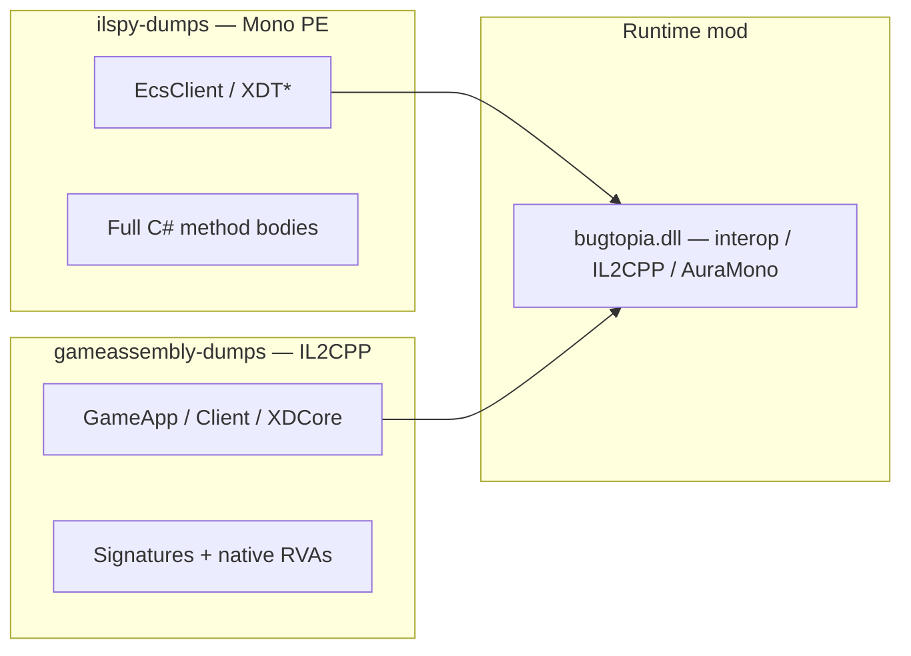

# Decompiled Source Map and Mod Interaction Reference

Detailed guide to offline decompilation folders and **every game type** that **Bugtopia** touches:

| Folder | Runtime | ILSpy bodies? |
|--------|---------|---------------|
| **`ilspy-dumps/`** | Embedded **Mono** (`EcsClient`, `XDT*`, …) | Yes |
| **`gameassembly-dumps/`** | **IL2CPP** (`GameAssembly.dll`) | No — `[Address(RVA)]` stubs only |

See [GAME_ASSEMBLIES_AND_TOOLS.md](./GAME_ASSEMBLIES_AND_TOOLS.md) § [GameAssembly decompilation](./GAME_ASSEMBLIES_AND_TOOLS.md#gameassembly-decompilation-il2cpp) for regeneration steps.

See also: [ARCHITECTURE.md](./ARCHITECTURE.md), [TYPE_RESOLUTION.md](./TYPE_RESOLUTION.md), [GAME_TYPES_AND_SERVICES.md](./GAME_TYPES_AND_SERVICES.md), [BACKPACK_AND_ITEMS.md](./BACKPACK_AND_ITEMS.md).

---

## Access method legend

| Code | Method | Description |
|------|--------|-------------|
| **I** | Interop | Direct reference in `buddy.csproj` (Unity, rarely game stubs). Harmony patches via `typeof(...)` |
| **R** | Reflection | `FindLoadedType` → `MethodInfo.Invoke` / fields / properties in loaded `AppDomain` |
| **N** | IL2CPP native | `TryFindIl2CppClass`, `IL2CPP.il2cpp_*`, `IL2CPP.GetIl2CppClass` — no managed stub |
| **A** | AuraMono | `mono_class_from_name`, `mono_runtime_invoke`, `FindAuraMonoImage("EcsClient")` |
| **H** | Harmony | Prefix/Postfix on a method after type resolve |
| **W** | Win32 / UI path | `SendInput`, `PostMessage`, `GameObject.Find`, uGUI clicks |
| **S** | SendCommand | `WebRequestUtility.SendCommand<T>` — generic invoke with command struct |
| **G** | GameObject scan | `FindObjectsOfType`, prefab name, radar hierarchy |

**Mod file:** `HC` = `HeartopiaComplete.cs`, otherwise the partial/farm file is listed.

---

## 1. Overview of offline dumps

### 1.0 Which folder to open



| Question | Open |
|----------|------|
| `ItemNetPair`, daily quest commands, backpack, birds | **`ilspy-dumps/EcsClient`**, **`XDTGameSystem`**, … |
| `GameApp`, launcher, hotfix bootstrap, `GetSession()` | **`gameassembly-dumps/GameApp`**, **`Client`**, **`XDCore`** |
| Type name for `FindLoadedType` at runtime | **`<Game>/BepInEx/interop/`** first, then Mono dump |
| Native implementation of an IL2CPP method | **`gameassembly-dumps`** RVA + **`tools/cpp2il_out/script.json`** → Ghidra/IDA |

Do **not** copy either dump folder into `BepInEx/interop`.

### 1.1 `ilspy-dumps/` (Mono)

Folder is in `.gitignore`; local copy of **Mono-side** game assembly decompilation.

#### Root assemblies

| Folder | ~`.cs` files | Purpose |
|--------|-------------|---------|
| **EcsClient** | 8170 | Tables (`Table*`), shared modules (`XDT.Scene.Shared.*`), command structs |
| **XDTLevelAndEntity** | 3602 | ECS world: `Entities`, components, interact, fishing, gathering |
| **XDTDataAndProtocol** | 2209 | Protocols, `WebRequestUtility`, events, component data |
| **XDTGameUI** | 3735 | UI panels, HUD, shops |
| **XDTGameSystem** | 910 | Gameplay modules: backpack, pet, cooking, tool, puzzle |
| **EcsSystem** | 879 | Client network managers |
| **XDTBaseService** | — | Texture cache, base services |
| **EngineWrapper, ScriptBridge, MonoShared, Plugins, DnsClient, MonoUniTask, MsgPackFormatters, XDTViewBase** | small | Infrastructure |

### 1.3 Typical path nesting (`ilspy-dumps/`)

Each game module is decompiled into its **own top-level folder** (one `ilspycmd -p -o ilspy-dumps/<AssemblyName>` per DLL). Namespace segments are **dot-separated directories** inside that folder:

```
ilspy-dumps/<AssemblyRoot>/<Namespace.With.Dots>/ClassName.cs
```

Examples:

```
ilspy-dumps/XDTLevelAndEntity/XDTLevelAndEntity.BaseSystem.EntitiesManager/Entities.cs
ilspy-dumps/EcsClient/XDT.Scene.Shared.Modules.Backpack/ItemNetPair.cs
ilspy-dumps/XDTDataAndProtocol/XDTDataAndProtocol.ProtocolService/WebRequestUtility.cs
```

Regeneration commands: [GAME_ASSEMBLIES_AND_TOOLS.md § Decompiling Mono PE to ilspy-dumps](./GAME_ASSEMBLIES_AND_TOOLS.md#decompiling-mono-pe-to-ilspy-dumps).

### 1.4 Namespace duplication (`ScriptsRefactory`)

Some types are duplicated under **`ScriptsRefactory.*`** (level/entity refactor). The mod searches **both** variants:

- `XDTLevelAndEntity.BaseSystem.EntitiesManager.Entities`
- `ScriptsRefactory.LevelAndEntity.BaseSystem.EntitiesManager.Entities`

Same for `BirdScannableComponent`, `LevelObjectManager`, `Entity`.

### 1.5 `gameassembly-dumps/` (IL2CPP)

Generated from `<Game>/GameAssembly.dll` + `xdt_Data/il2cpp_data/Metadata/global-metadata.dat`
via Il2CppDumper → ilspycmd. Also in `.gitignore`.

| Property | Value (example Steam build) |
|----------|----------------------------|
| Unity version | 2020.3.13 |
| Metadata version | 27.1 |
| DummyDll count | ~151 |
| Decompiled `.cs` files | ~10k |
| Solution | `gameassembly-dumps/gameassembly-dumps.sln` |

**Important:** IL2CPP decompilation is **not** a second copy of `EcsClient` / `XDT*`.
Those modules live in embedded Mono (`ilspy-dumps/`). IL2CPP holds bootstrap, engine,
launcher, and Unity-side code compiled to native.

#### Notable IL2CPP paths

| Path under `gameassembly-dumps/` | Types / topic |
|----------------------------------|---------------|
| `GameApp/XD.Unity.Game/GameApp.cs` | `IsNormalMode()`, hotfix entry, opening video |
| `GameApp/XD.BaseFramework/GameAppHelper.cs` | `GetSession()`, `GetGameApp()`, input/plot services |
| `XDCore/XD.BaseFramework/DebugCache.cs` | `Session`, `GetSessionRoot`, `GetSessionUIDir` (native-side; differs from `XDTGame.Core.DebugCache` in Mono) |
| `Client/Plugins.GameLauncher_Plugins.ScriptsGameLauncher/` | Launcher hotfix manager, tips |
| `Client/GameLauncherUILoadingView.cs`, `GameLauncherUIAlertView.cs` | Launcher UI |
| `Assembly-CSharp/` | Mixed IL2CPP gameplay (when not in Mono modules) |

Methods look like:

```csharp
[Address(RVA = "0x1944110", Offset = "0x1943310", VA = "0x181944110")]
public static string GetSession() { return null; }
```

Use **`tools/cpp2il_out/script.json`** with Il2CppDumper’s Ghidra/IDA scripts to jump to
the native body.

#### Raw IL2CPP artifacts (`tools/cpp2il_out/`)

| File | Use |
|------|-----|
| `DummyDll/*.dll` | Input to ilspycmd; also open directly in ILSpy |
| `dump.cs` | All IL2CPP types in one file — fast text search |
| `script.json` | Method/type addresses for disassemblers |
| `il2cpp.h` | C struct headers |
| `stringliteral.json` | String literal table |

---

## 2. Assembly navigation (where to look in ILSpy)

### 2.1 EcsClient

**Root:** `ilspy-dumps/EcsClient/`

| Area | Path / pattern | Contents |
|------|----------------|----------|
| All configs | `Table*.cs` (thousands at root) | Excel data: `TableFish`, `TableBird`, `TableNpc`, `TableTaskOrder`, … |
| Aggregator | `TableData.cs` | `TableData.GetXxx()`, static fields `TableNpcs`, `TableFish`, … |
| Shared modules | `XDT/Scene/Shared/Modules/**` | Command structs, backpack, pet, animal, bubble, cooking, bird watching |
| ItemNetPair | `XDT/Scene/Shared/Modules/Backpack/ItemNetPair.cs` | `{ uint NetId; int Count; }` for quest submit |
| EcsClient glue | `EcsClient/` | Client-specific types on top of shared |

**Mod uses EcsClient most often via:** `TableData`, `ItemNetPair`, `EStorageType`, `EntityType`, command structs in `XDT.Scene.Shared.Modules.*`.

### 2.2 XDTLevelAndEntity

**Project root:** `ilspy-dumps/XDTLevelAndEntity/XDTLevelAndEntity/`

| Subfolder | Key types |
|-----------|-----------|
| `BaseSystem/EntitiesManager/` | **`Entities`**, **`EntityUtil`** |
| `BaseSystem/InteractSystem/` | **`InteractSystem`**, **`SelectPriorityInfo`** |
| `Gameplay/Component/Gather/` | CollectableObject, CollectableBush, DynamicBush |
| `Gameplay/Component/Fish/` | **HandHoldFishingRod**, FloatComponent, PlayerFishAreaChecker |
| `Gameplay/Component/Equip/` | AxeChecker, HandholdCylinderChecker, tools |
| `Gameplay/Component/Player/` | LocalPlayerComponent, LocalPlayerLookInteractTarget |
| `Gameplay/Component/Bubble/` | BubbleComponent, BubbleMoveComponent |
| `Gameplay/Interaction/` | PlayerInteraction, BackpackBirdCamouflage, BirdCamouflageComponent |
| `GameplaySystem/` | **GameplayApi** (photo mode, fishing API) |
| `Game/GameMode/` | **Character**, GamePhotoMode |
| `EntityView/` | LevelEntityComponent |
| `Utils/` | **EntityHelper** |
| `Core/World/` | **Entity** |
| `XDTGUI.Module.Build/` *(non-`XDTLevelAndEntity` namespace, same assembly)* | **BuildModule** — Pad build hotkeys (§3.19) |
| `Gameplay/Component/Player/` (also) | PlayerStateBuildTps, CraftState |

**ScriptsRefactory** (same assembly or separate paths): `BirdComponent`, `BirdScannableComponent`, `LevelObjectManager`.

### 2.3 XDTDataAndProtocol

**Root:** `ilspy-dumps/XDTDataAndProtocol/XDTDataAndProtocol/`

| Path | Contents |
|------|----------|
| `ProtocolService/WebRequestUtility.cs` | **`SendCommand<T>`** — central outbound command entry |
| `ProtocolService/*/` | Domain managers (see §3) |
| `ComponentsData/` | JigsawPuzzleComponentData, DataCenter, serialized ECS data |
| `Events/` | Event bus |

**ProtocolService subfolders** (useful for search):

`Resource`, `Task`, `BackPack`, `Pet`, `WildAnimal`, `Meow`, `Bubble`, `ActivityEvent`, `Cooking`, `JigsawPuzzle`, `Insect`, `GamePlay/Bird`, `Login`, `Store`, `Player`, …

### 2.4 XDTGameSystem

**Root:** `ilspy-dumps/XDTGameSystem/XDTGameSystem/GameplaySystem/`

| Module | File / class | Mod |
|--------|--------------|-----|
| `BackPack/` | **BackPackSystem** | Bag, auto sell, daily quest, wild feed |
| `Tool/` | **ToolSystem** | Auto repair, equip rod/axe/net, fishing |
| `Pet/` | **PetSystem** | Pet feed |
| `WildAnimal/` | **WildAnimalSystem** | Wild animal feed |
| `Bird/` | BirdWatchingSystem, BirdManager | Bird farm |
| `Cooking/` | CookingSystem | Net cook (PrepareCooking) |
| `JigsawPuzzle/` | **JigsawPuzzleSystem** | Puzzle solver |
| `Insect/` | LevelInscetManager (typo in game) | Insect net farm |
| `SelfRoom/` | SelfRoomSystem | Join town / room helpers |
| `Shop/` | `ShopSystem`, `ShopItemData` | Auto buy (UI), **buy-all coin** (`ShopBuyAllFeature.cs`) |

### 2.5 XDTGameUI

**Root:** `ilspy-dumps/XDTGameUI/` (panels under `XDTGame.UI.Panel.*`)

| Panel | Mod |
|-------|-----|
| ScannerStatusPanel | Bird farm — scanner status |
| BagPanel | Warehouse bypass, bag automation |
| TrackingPanel / TrackingCatPlay | Cat play automation |
| CatPlayStatusPanel, DogPlayStatusPanel | Pet play |
| DressShopPanel, FaceShopPanel, ShopPanel, WeatherExchangeShopPanel | Force-open shop; **DressShopPanel** = clothing buy-all (`storeId` **5**) |
| BuildStatusPanel (+ `XDTGame.Auto/BuildStatusPanel_Auto`) | Pad build hotkeys — button→API mapping and node paths for the UI-click fallback (see §3.19) |

**UIManager:** `XDTGame.Core.UIManager` — AuraMono `GetView<T>()`.

### 2.6 EcsSystem

| Type | Mod |
|------|-----|
| `EcsSystem.World.XDTownClientNetworkManager` | Bird photo ACK probe, pet play |
| `EcsSystem.XD.GameGerm.Ecs.Boost.Client.ClientNetworkManager` | Fallback network manager |

---

## 3. Type catalog with mod interaction

Below: **only types the mod actually resolves or patches**. For each: dump path, feature, access method, members called.

---

### 3.1 Network and infrastructure

#### `WebRequestUtility`
- **Dump:** `XDTDataAndProtocol/.../ProtocolService/WebRequestUtility.cs`
- **Namespace:** `XDTDataAndProtocol.ProtocolService`
- **Runtime:** **embedded Mono only** — absent from IL2CPP interop on most builds
- **Features:** Bubble spawn, bird photo, net cook, homeland farm commands, **fishing Instant Catch (Reliable buoy)**
- **Access:** **R** (when AppDomain has type) + **H** + **S** (managed) + **A** (AuraMono inflate `SendCommand<T>` or protocol-manager invoke)
- **How (managed — when types load):**
  1. `FindHomelandFarmRuntimeType("WebRequestUtility", "XDTDataAndProtocol.ProtocolService")` or `ResolveHomelandFarmManagedType`
  2. Static generic `SendCommand` (3 parameters, include `NonPublic`) → `MakeGenericMethod(commandType)` → `Invoke`
- **How (AuraMono — default for Mono-only sessions):**
  1. `FindAuraMonoClassByFullName("XDTDataAndProtocol.ProtocolService.WebRequestUtility")`
  2. Inflate `SendCommand<T>` with command class from **EcsClient** image — see [TYPE_RESOLUTION.md](./TYPE_RESOLUTION.md) § Instant Catch
  3. Or call `*ProtocolManager` static method that wraps `SendCommand` internally (`DrawUploadFeature`, `FishingProtocolManager.UpdateFloatPosition`)
- **Harmony:** prefix on generic `SendCommand` — bubble location rewrite (`BubbleFeature.cs`)
- **Files:** `BubbleFeature.cs`, `HomelandFarmFeature.cs`, `HeartopiaComplete.Fishing.cs`, `DrawUploadFeature.cs`

#### `UpdateRodBuoyPositionNetworkCommand` (fishing buoy geometry)
- **Dump:** `EcsClient/.../XDT.Scene.Shared.GamePlay.Fishing/UpdateRodBuoyPositionNetworkCommand.cs`
- **Runtime:** struct in **EcsClient** Mono image — **not** resolvable via `FindLoadedType` alone
- **Features:** Instant Catch — re-send buoy geometry with collapsed `SuccessLength` on **Reliable** channel
- **Access:** **A** — `FindAuraMonoClassByFullName("XDT.Scene.Shared.GamePlay.Fishing.UpdateRodBuoyPositionNetworkCommand")` + AuraMono `SendCommand` inflate
- **Related:** `FishingProtocolManager.UpdateFloatPosition` / `NotifyFloatInWater` (same command, **Unreliable** — game default)
- **File:** `HeartopiaComplete.Fishing.cs`

#### `ChannelType`
- **Dump:** `XD.GameGerm.Network` (often in Client/EcsSystem assemblies)
- **Access:** **R**
- **How:** third argument to `SendCommand`; enum `Reliable`, etc.

#### `XDTownClientNetworkManager` / `ClientNetworkManager`
- **Dump:** `EcsSystem/...`
- **Features:** Bird farm server ACK, pet play
- **Access:** **R** — instance fields/methods via reflection

---

### 3.2 ECS — entities and interact

#### `Entities`
- **Dump:** `XDTLevelAndEntity/.../BaseSystem/EntitiesManager/Entities.cs`
- **Features:** Aura farm, radar, bird/insect scan, net cook entity enum, bubble entity query
- **Access:** **R**, **A**, **G**
- **How (R):**
  - `FindLoadedType` + shape check (`GetComponents`, `SphereQueryEntities`)
  - Static `GetComponents<T>()`, `SphereQueryEntities`, create/destroy — `Invoke`
- **How (A):**
  - `FindAuraMonoImage("XDTLevelAndEntity")` → class `Entities` → `get_Instance` → instance methods
  - Collection walk via `TryEnumerateAuraMonoCollectionItems` (HC)
- **Key methods (from dump):** entity factory, physics queries, VFX, `GetComponents` patterns

#### `EntityUtil`
- **Dump:** `.../EntityUtil.cs`
- **Features:** Bird farm, insect, radar metadata, player entity lookup
- **Access:** **R**, **A**
- **How:** static/instance `GetEntity`, `GetSelfPlayerEntity`, `GetLevelObject(netId)` — reflection or AuraMono hierarchy walk

#### `EntityHelper`
- **Dump:** `XDTLevelAndEntity/Utils/EntityHelper.cs`
- **Features:** Aura farm — interact target list
- **Access:** **R**, **A**
- **How:**
  - `GetPlayerInteractTargetList(...)` — managed Invoke
  - `GetLevelObjectOwner`, `GetLevelObject` — AuraMono `mono_runtime_invoke`
- **File:** `AuraFarm.cs`

#### `Entity`
- **Dump:** `XDTLevelAndEntity/Core/World/Entity.cs`
- **Features:** Bird/insect/puzzle component enumeration
- **Access:** **A**
- **How:** `GetAllComponents()`, `get_alived`, `get_spawned`, `GetNetId` / `get_netId` — AuraMono on each entity object

#### `InteractSystem`
- **Dump:** `.../InteractSystem/InteractSystem.cs`
- **Features:** Aura farm, foraging interact context
- **Access:** **R**, **A**
- **How:**
  - Instance: `get_Instance` / field `_instance`
  - Fields: `_currentSelectTarget`, `_focusLevelObjects`, `_selected`, `_selectPriorityInfoArray`, `interactCylinder`
  - `GetInteractTargetList`, `get_player`
  - AuraMono: same fields via `mono_field_get_value` / invoke
- **File:** `AuraFarm.cs`, `HC`

#### `SelectPriorityInfo`
- **Dump:** next to InteractSystem
- **Features:** Aura — interact target priority
- **Access:** **R**, **A**

#### `LevelObjectManager` / `LevelObjectTag`
- **Dump:** `ScriptsRefactory.LevelAndEntity.LevelObjectManager`, `EcsClient...LevelObjectTag`
- **Features:** Aura farm — resource owner netId
- **Access:** **R**

#### `CollectableObjectComponent` / `CollectableBushComponent` / `DynamicBushComponent`
- **Dump:** `Gameplay/Component/Gather/`
- **Features:** Aura farm, radar labels
- **Access:** **R** — `Entities.GetComponents` scan

#### `Cylinder` (scene query)
- **Dump:** `XDTGame.Core.SceneQuery.Cylinder` or `XDT.Physics.Cylinder`
- **Features:** Aura — interact overlap cylinder
- **Access:** **R**

---

### 3.3 Resources — aura / foraging / chop-mine

#### `ResourceProtocolManager`
- **Dump:** `XDTDataAndProtocol/.../ProtocolService/Resource/ResourceProtocolManager.cs`
- **Features:** **Aura farm** (gather, chop, mine)
- **Access:** **R**, **A**
- **How:**
  - **R:** `FindTypeByName` / `FindTypeBySignature` → static methods:
    - `SendPickBushCommand(uint ownerNetId)`
    - `SendAttackTreeCommand(uint ownerNetId, bool isCombo)`
    - `SendHitStoneCommand(uint ownerNetId, bool isCombo)` — stones and **meteor logic parents** (not view `ownerNetId`)
  - **A:** `mono_class_get_method_from_name(resourceClass, "SendPickBushCommand", 1)` → `mono_runtime_invoke(null, args)`
- **Flow:** AxeChecker / interact lists → resolve owner netId → classify (bush/tree/stone/meteor) → 20ms cooldown → send command (server authoritative)
- **File:** `AuraFarm.cs`

#### `AxeChecker` / `HandholdCylinderChecker`
- **Dump:** `Gameplay/Component/Equip/`
- **Features:** Aura — axe range check, primary target discovery (`PhysicalSelect` → level object shapes)
- **Access:** **A** (Mono class resolve)
- **File:** `AuraFarm.cs` — `TryCollectAuraOwnerTargetsViaMonoAxeChecker`

#### `CollectableMeteoriteViewComponent` / `CollectableMeteoriteLogicComponent` / `MeteoriteLogic`
- **Dump:** `Gameplay/Component/Gather/`
- **Features:** Aura farm — meteor parent resolution (`parentEntity`, `_viewEntity` links)
- **Access:** **A** (Mono entity/component walk), partial **R** (`DataCenter.TryGetComponentData` for `CollectableMeteoriteComponentData`)
- **Protocol:** `ResourceProtocolManager.SendHitStoneCommand(parentNetId)` — not pick bush / not F-interact
- **Scene props:** `p_rock_meteorite*` GameObjects — live position scan for classification

#### `LocalPlayerComponent` / `LocalPlayerLookInteractTarget`
- **Dump:** `Gameplay/Component/Player/`
- **Features:** Aura — local player and look-target
- **Access:** **A**

---

### 3.4 Fishing

#### `HandHoldFishingRod`
- **Dump:** `Gameplay/Component/Fish/HandHoldFishingRod.cs`
- **Features:** Auto fishing — rod state (indirectly via host)
- **Access:** **R**, **A** (component scan on player equip)
- **How:** HC finds handhold class name containing `HandHoldFishingRod`; reads motion/fish state via reflection/AuraMono on player components
- **Related in dump:** `FloatComponent`, `PlayerFishAreaChecker`, `FishLine`

#### `FishingSubState`
- **Dump:** `XDT.Scene.Shared.Creatures.FishingSubState` (enum, EcsClient/shared)
- **Features:** Auto fishing — `Waiting`, `Battle`, hook states
- **Access:** **R**, **N**
- **How:**
  - `FindLoadedType` + `Enum.Parse` for grace/recast logic
  - IL2CPP enum read when managed enum unavailable
- **Files:** `HC`, `AutoFishingFarm.cs` (via host)

#### `GameplayApi`
- **Dump:** `XDTLevelAndEntity/GameplaySystem/GameplayApi.cs`
- **Features:** Bird photo mode resolution (fallback path)
- **Access:** **R**
- **How:** static/instance `photoMode` property → `GamePhotoMode`

#### Fish shadows (world objects)
- **Dump:** prefab/components in level entity (no single class — scan by name/tag)
- **Features:** Auto fishing target selection
- **Access:** **G** + **R**
- **How:**
  - `GetCachedFishShadowTargetObjects()` — `FindObjectsOfType<GameObject>` + `ShouldTrackFishShadowObject`
  - Scoring by distance, visual priority, occupancy (`TryGetFishShadowOccupancy`)
- **File:** `HC` (~line 18191+)

#### `TrySetFishingPressed` (mod API on host, not a game type)
- **Game targets:** fishing UI button / motion state — resolved via **A** on player/fishing state objects
- **How:** `TrySetFishingPressedMono` → `TrySetFishingStateButtonPressedMono` — AuraMono bool pulse; **not** Harmony Input patches
- **File:** `HC` (~line 20000+), `AutoFishingFarm.cs`

#### `FishingProtocolManager` / Instant Catch
- **Dump:** `XDTDataAndProtocol/.../ProtocolService/Fishing/FishingProtocolManager.cs`
- **Features:** Cancel fishing (AuraMono); **Instant Catch** buoy geometry spoof
- **Access:** **A**
- **How:**
  - `UpdateFloatPosition` → `UpdateRodBuoyPositionNetworkCommand` via `SendCommand` (**Unreliable**) — used as fallback in `TryArmFishingInstantCatch`
  - Reliable path: AuraMono inflate `WebRequestUtility.SendCommand<UpdateRodBuoyPositionNetworkCommand>` with `ChannelType.Reliable` — see [TYPE_RESOLUTION.md](./TYPE_RESOLUTION.md) § 2b
  - Buoy position: `HandHoldFishingRod.GetFloatPosition()` (AuraMono on equipped handhold); player geometry from local position + `direction = player - buoy`
- **Files:** `HeartopiaComplete.Fishing.cs`, `AutoFishingFarm.cs` (`autoFishInstantCatch` config)

#### `ToolSystem`
- **Dump:** `XDTGameSystem/GameplaySystem/Tool/ToolSystem.cs`
- **Features:** Equip rod/axe/net, auto repair durability, fishing tool restore
- **Access:** **R**, **A**
- **How:**
  - **R:** `DataModule<ToolSystem>.Instance`, `GetCurrentTool()` → tool id, durability fields
  - **A:** `TryResolveAuraMonoModule("...ToolSystem")` → `GetCurrentTool` invoke
- **Files:** `HC`, farms

#### `EcsService`
- **Dump:** `XDTDataAndProtocol.ProtocolService/EcsService.cs`
- **Features:** Service locator for all `I*Service` / `ClientSystem.*` injects; Daily Claims sign-in, town guide, mail
- **Access:** **A** — `EcsService.TryGet<T>` via AuraMono generic inflation (managed `FindLoadedEcsServiceType` often null under BepInEx)
- **How:** `FindAuraMonoClassByFullName("XDTDataAndProtocol.ProtocolService.EcsService")` → inflate `TryGet` → invoke; see [GAME_TYPES_AND_SERVICES.md](./GAME_TYPES_AND_SERVICES.md)
- **Not:** `Managers._serviceDic` — services are **not** registered there

#### `IOperationActivityCenterService` / `OperationActivityCenterClientService`
- **Dump:** `XDTDataAndProtocol.../IOperationActivityCenterService.cs`, `EcsSystem/ClientSystem.OperationActivityCenter/OperationActivityCenterClientService.cs`
- **Features:** Daily Claims sign-in state (`GetAliveActivityIds`, `GetActivityNodeStateById`)
- **Access:** **A** via `EcsService.TryGet<IOperationActivityCenterService>`

#### `ITownGuidesService` / `TownGuidesClientService`
- **Dump:** `XDTDataAndProtocol.../ITownGuidesService.cs`, `EcsSystem/ClientSystem.TownGuides/TownGuidesClientService.cs`
- **Features:** Daily Claims town guide (`GetAllChapterInfo`, `GetChapterInfo`)
- **Access:** **A** via `EcsService.TryGet<ITownGuidesService>`

#### `IMailClientService` / `MailServiceClient`
- **Dump:** `XDTDataAndProtocol.../IMailClientService.cs`, `EcsSystem/ClientSystem.Mail/MailServiceClient.cs`
- **Features:** Daily Claims mail probe (`IsAnyRewardable`, `GetMails`)
- **Access:** **A** via `EcsService.TryGet<IMailClientService>`

#### `BattlePassSystem` / `BattlePassProtocolManager`
- **Dump:** `XDTGameSystem.../BattlePassSystem.cs`, `XDTDataAndProtocol.../BattlePassProtocolManager.cs`
- **Features:** Daily Claims mini BP + loop state; claim via protocol or `SendCommand`
- **Access:** **A** — `DataModule<BattlePassSystem>.Instance` + static protocol invoke

---

### 3.5 Birds

#### `BirdScannableComponent`
- **Dump:** `ScriptsRefactory/.../BirdScannableComponent.cs`
- **Features:** Bird farm, radar, vacuum
- **Access:** **R**, **A**
- **How:** `Entities.GetComponents<BirdScannableComponent>()` or AuraMono entity component walk

#### `BirdComponent`, `PerchBirdComponent`, `BirdCamouflageComponent`, `LevelEntityComponent`
- **Dump:** see §2.2
- **Features:** Bird scan filters, camouflage skip
- **Access:** **A** — `GetAllComponents` on entity

#### `BirdWatchingSystem` / `BirdManager`
- **Dump:** `XDTGameSystem/GameplaySystem/Bird/`
- **Features:** Bird farm runtime state
- **Access:** **R**

#### `ScannerStatusPanel`
- **Dump:** `XDTGameUI` — `XDTGame.UI.Panel.ScannerStatusPanel`
- **Features:** Bird farm — equipped scanner detection
- **Access:** **R** — UI instance fields

#### `TakingBirdPhotoCommand`
- **Dump:** `EcsClient/XDT/Scene/Shared/Modules/BirdWatching/` (command struct)
- **Features:** Bird photo send
- **Access:** **R** + **S** + shape validation `IsBirdPhotoCommandShape`
- **How:** `Activator.CreateInstance` → fill fields → `WebRequestUtility.SendCommand`

#### `BirdProtocolManager`
- **Dump:** `ProtocolService/GamePlay/Bird/BirdProtocolManager.cs`
- **Features:** Bird photo submit, multi-catch
- **Access:** **R**, **A**
- **How:** static method invoke OR AuraMono `FindAuraMonoClassByFullName`

#### `BirdPhotoDetailInfo`
- **Dump:** shared module bird watching
- **Features:** Perfect photo / exchange data
- **Access:** **A** — native struct alloc

#### `BirdPhotoExchangeData`
- **Dump:** `EcsClient/.../ItemExchange/BirdPhotoExchangeData.cs`
- **Features:** `BirdPhotoSubmitFeature`
- **Access:** **A**

#### `BackpackBirdCamouflage`
- **Dump:** `XDTLevelAndEntity/Gameplay/Interaction/BackpackBirdCamouflage.cs`
- **Features:** Bird vacuum / backpack camouflage interaction
- **Access:** **A**

#### `GamePhotoMode` / `Character`
- **Dump:** `Game/GameMode/`
- **Features:** Photo mode for bird camera
- **Access:** **R**, **A**
- **How:** `UpdateAllComponent` AuraMono on photo mode instance

---

### 3.6 Insects

#### `ServerInsectComponent` / `InsectAIStateComponent`
- **Dump:** `EcsClient/XDT/Scene/Shared/Modules/InsectCatching/`
- **Features:** Insect net farm — alived/spawned/state filter
- **Access:** **A** on entity components

#### `InsectProtocolManager`
- **Dump:** `ProtocolService/Insect/`
- **Features:** Catch commands (via host scan + protocol)
- **Access:** **A**, **R**

#### `LevelInscetManager` (game typo)
- **Dump:** `XDTLevelAndEntity/GameplaySystem/Insect/`
- **Features:** Insect farm bug dictionary — `FindInRangeBugs`, `GetCatchingInsects`
- **Access:** **R**, **A**
- **File:** `HC`, `InsectNetFarm.cs`

---

### 3.7 Bubbles

#### `BubbleComponent` / `BubbleMoveComponent`
- **Dump:** `Gameplay/Component/Bubble/`
- **Features:** Radar, ESP, spawn helpers
- **Access:** **R**, suffix scan `FindBubbleComponentRuntimeType`

#### `CreateBubbleNetworkCommand` / `CreateActivityEventPersonalRewardBubbleNetworkCommand`
- **Dump:** `EcsClient/XDT/Scene/Shared/Modules/Bubble/`
- **Features:** Bubble spawn at player
- **Access:** **S** + **H** (Harmony rewrites `location` on SendCommand)

#### `ActivityEventProtocolManager`
- **Dump:** `ProtocolService/ActivityEvent/`
- **Features:** `CreateActivityBubble` — fast bubble gen
- **Access:** **A** + native **H** (`BubbleMonoNativeHook` detour on method thunk)

#### `BubbleProtocolManager`
- **Dump:** `ProtocolService/Bubble/`
- **Features:** `CreateBubble(Vector3)`
- **Access:** **A** + native hook

#### `ActivityEventModule` (time counter field)
- **Features:** Fast bubble gen — field `ActivityEventTimeCounter` via AuraMono
- **Access:** **A**

#### `IBubbleService` / bubble client services
- **Features:** Radar GM list `GmGetAllBubble` (optional)
- **Access:** **R** — `FindLoadedBubbleServiceType`

---

### 3.8 Inventory, bag, auto sell

#### `BackPackSystem`
- **Dump:** `XDTGameSystem/GameplaySystem/BackPack/BackPackSystem.cs`
- **Features:** Bag tab, warehouse transfer, auto sell, daily quest, wild feed, auto eat
- **Access:** **R**, **A** (primary for enumeration)
- **How:**
  - **A:** `TryResolveAuraMonoModule("XDTGameSystem.GameplaySystem.BackPack.BackPackSystem")`
  - Methods: `GetAllItem(EStorageType)` arity 1 or 0; `CheckSubmitItem`, `CheckSubmitItems`; `GetItemPrice()`
  - `TryEnumerateAuraMonoCollectionItems` on returned `List<BackpackItem>`
  - **R:** managed `Instance` + same methods when Mono fails
- **Storage:** `EStorageType.Backpack = 1`, `Warehouse = 2`

#### `BackpackItem` / `BackpackItemData`
- **Dump:** `XDTGameSystem/UISystem/BackPack/`, internal `_itemData` in BackPackSystem
- **Features:** Stack fields: `netId`, `count`, `staticId`, `starRate`, lock flags
- **Access:** **R**, **A** field reads

#### `BackpackProtocolManager`
- **Dump:** `ProtocolService/BackPack/`
- **Features:** `MoveBatchBackpackItems(Dictionary<uint,int>, targetStorage)` — max 256 stacks
- **Access:** **R**, **A**, **S**

#### `ItemNetPair`
- **Dump:** `EcsClient/XDT/Scene/Shared/Modules/Backpack/ItemNetPair.cs`
- **Features:** Daily quest submit list
- **Access:** **A** (native list build), **N** (IL2CPP `GetIl2CppClass`), **R** (managed fallback)
- **How (A):** alloc struct pairs → `List<ItemNetPair>.Add` via Mono; **do not** use `mono_class_bind_generic_parameters`
- **File:** `DailyQuestSubmitFeature.cs`

#### `EStorageType`
- **Dump:** `EcsClient.XDT.Scene.Shared.Data.StaticPartial.EStorageType`
- **Access:** **R**, **A** enum box

#### `TableData` (inventory-related)
- **Methods used:** `GetItemPrice` context via items; `GetGameTask`; table row lookups for food/pet/sell filters
- **Access:** **R**, **A**, **N**

#### `BagPanel` / bag UI modules
- **Features:** Warehouse bypass, bulk selector, Win32 click automation
- **Access:** **A** (`UIManager.GetView`), **W**, **H** (sprite postfix on `Image.set_sprite` for bulk selector)

---

### 3.9 Quests and tasks

#### `TaskProtocolManager`
- **Dump:** `ProtocolService/Task/TaskProtocolManager.cs`
- **Features:** Daily quest item delivery
- **Access:** **A** (primary), **R**
- **Methods:**
  - `ClientSubmitNpcTaskItem(taskId, npcId, List<ItemNetPair>)` — arity variants probed
  - `ClientSubmitTaskItem` — fallback
- **File:** `DailyQuestSubmitFeature.cs`

#### Submit target tables
- **Dump:** `TableTaskOrder`, `TableSubmitTargetItem`, `TableGameTask` via `TableData`
- **Access:** **A** `GetGameTask(taskId)`, **R**

---

### 3.10 Pets

#### `PetSystem`
- **Dump:** `XDTGameSystem/GameplaySystem/Pet/PetSystem.cs`
- **Features:** Feed all pets
- **Access:** **R**, **A**
- **How:** enumerate pets by staticId → build `List<uint>` netIds → protocol feed

#### `PetProtocolManager`
- **Dump:** `ProtocolService/Pet/`
- **Features:** Feed, dog tease QTE
- **Access:** **R**, **A**
- **Methods:** feed batch; `TeaseQte` (PetPlay)

#### `MeowProtocolManager`
- **Dump:** `ProtocolService/Meow/`
- **Features:** Cat tease QTE
- **Access:** **R**, **A**

#### `PetType`, `EntityType`
- **Dump:** shared modules / EcsClient
- **Features:** Filter cats/dogs
- **Access:** **R**, **A**

#### `TableData.GetDogLearningMotion` / `GetDogmotion`
- **Features:** Dog train automation
- **Access:** **A**, **R**
- **File:** `PetPlayFeature.cs`

#### UI: `TrackingCatPlay`, `CatPlayStatusPanel`, `DogPlayStatusPanel`
- **Features:** Auto cat play / dog train
- **Access:** **A** — `UIManager.GetView`, enumerate question cells, `RemoveQuestionCell`

---

### 3.11 Wild animals

#### `WildAnimalSystem`
- **Dump:** `XDTGameSystem/GameplaySystem/WildAnimal/WildAnimalSystem.cs`
- **Features:** Trough feed plans
- **Access:** **R**, **A**
- **How:** get animal groups collection → fullness ratio → feed command

#### `WildAnimalProtocolManager`
- **Dump:** `ProtocolService/WildAnimal/WildAnimalProtocolManager.cs`
- **Feed:** `List<uint>` food net ids per group — **File:** `WildAnimalFeedFeature.cs`
- **Gifts (mod):**
  - `HaveGift()` → `IWildAnimalService.HaveGift()` — pending `AnimalGroup` list (red dots)
  - `HaveGift(EcsEntity)` — `AnimalGiftComponent` + visit daily limits
  - `SpawnGift(EcsEntity, AnimalGroup)` — creates level entity with interact 31 + `WildAnimalGiftComponentData`
- **Access:** **A** (AuraMono invoke in `WildAnimalGiftFeature`)
- **Not used by mod:** managed `EcsService.TryGet<IWildAnimalService>` (BepInEx interop gap)

#### `IWildAnimalService`
- **Dump:** `ProtocolService/WildAnimal/IWildAnimalService.cs`
- **Vanilla gift enumeration:** `GetGifts()`, `GetAnimals(AnimalGroup)`, `HaveGift()`
- **Mod:** reference only — implementation not called; mod uses ECS entity scan + `AnimalUtil` instead

#### `AnimalUtil`
- **Dump:** `EcsClient/XDT/Scene/Shared/Modules/Animal/AnimalUtil.cs`
- **Gift scan:** `IsGiftBox(EcsEntity)`, `GetGroup(EcsEntity)` → `GiftBoxGroupProperty.Group` or animal group
- **Access:** **A**
- **File:** `WildAnimalGiftFeature.cs` (entity scan primary path)

#### `AnimalProtocolManager`
- **Dump:** `ProtocolService/Animal/AnimalProtocolManager.cs`
- **Gifts:** `GetNetworkEntity(uint)`, `TakeGift(uint)` → `AnimalGiftTakeNetworkCommand`
- **Access:** **A**
- **File:** `WildAnimalGiftFeature.cs`

#### `WildAnimalGiftCommand`
- **Dump:** `XDTLevelAndEntity/Gameplay/Interaction/Command/WildAnimalGiftCommand.cs`
- **Interact id:** 31
- **IsDisplayable:** `DataCenter` `WildAnimalGiftComponentData.value` or `WildAnimalComponentData.haveGift`
- **OnExecute:** `AnimalProtocolManager.TakeGift(ownerNetId)`
- **Mod:** not hooked — mod replicates claimability via `AnimalUtil` + `HaveGift(entity)` on network entities

#### `GiftBoxGroupProperty`
- **Dump:** `EcsClient/.../GiftBoxGroupProperty.cs` (struct, field `AnimalGroup Group`)
- **Mod:** read indirectly via `AnimalUtil.GetGroup` on gift box entities

#### `AnimalGroup`
- **Dump:** `XDT.Scene.Shared.Modules.Animal.AnimalGroup`
- **Features:** Group id / name for feed plans
- **Access:** **R**, **A**

#### `TableAnimalGroup`, `TableAnimalFoodThough`, etc.
- **Features:** Feed eligibility via `TableData`
- **Access:** **R**, **A**

---

### 3.12 Cooking (net cook / mass cook)

#### `CookingSystem`
- **Dump:** `XDTGameSystem/GameplaySystem/Cooking/`
- **Features:** Mass cook at stoves
- **Access:** **A**, **R**
- **Methods:** `PrepareCooking(cookerNetId, recipeId, materials...)` — AuraMono primary
- **Recipe ingredient model** (`CookingRecipeDetail` / `MaterialSlot` / `GetMaterialSlotData`):
  - `TableCookingRecipe.ingredients` is a flat `int[]`, **one entry per required unit** (no per-slot count); `materialSlots.Length == ingredients.Length`, and `CookPanel` renders one slot per entry.
  - Entry **≥ 100** → `SlotType.Specific`, `slot.materialId` = concrete item id. Entry **< 100** → `SlotType.MaterialType`, `slot.materialType = (FoodMaterialType)id` with `materialId == 0` (the **"any &lt;category&gt;"** slot, e.g. "any fish").
  - `FoodMaterialType`: Vegetable=0, Fruit=1, AquaticProducts=2, Meat=3, Fish=4, Dairy=5.
  - Category match = `CookingSystem.CheckFoodTypeSatisfied(itemStaticId, type)` → `TableData.GetIngredients(id).foodMaterial.Contains((int)type) && canBeCooked` (`TableIngredients { id, int[] foodMaterial, bool canBeCooked }`).
  - Mod move/max-quantity (`HeartopiaComplete.NetCook.cs`): `NetCookIngredientRequirement{IsCategory,MaterialType}`, `BuildNetCookDemands`, `NetCookItemMatchesCategory` (cached `CheckFoodTypeSatisfied` via AuraMono). Earlier code keyed only on `materialId`, so category slots (id 0) were dropped → "any fish" never moved and category-repeated units undercounted.

#### Remote-cook status channels (QTE at distance)

Status flows **server → ECS `CookingStatusComponent` → `CookingSyncSystem.On<ComponentUpdated<…>>` → `CookingProtocolManager.OnUpdateCookerStatus` → DataCenter (`CookBuildComponentData.cookBurnerData[lo]`) → view `CookingComponent` → `UpdateCookingStatusEvent`**. The view event (and view-component reads) die when the stove streams out (~17–85 m); managed `FindLoadedType("…DataCenter"/"CookBuildComponentData"/"NetId")` returns null on this IL2CPP build (AuraMono-only types), and `DataCenter.UpdateComponentData` dispatches no global event — so the data layer has no managed read and no event at distance.

- **`CookingProtocolManager.OnUpdateCookerStatus(uint cookerNetId, ulong levelObjectNetId, CookingStatus, bool, DateTime, int, int, float, int, int, uint)`** — static, the one chokepoint hit for every server status update regardless of view. Hooked with a MonoMod `NativeDetour` (`EnsureNetCookOnUpdateCookerStatusDetour`); ABI: enum→int, bool→byte, DateTime→long (forwarded verbatim), float on stack; install + forward on the Unity main thread (the bridge dispatches there). Confirmed delivering `Danger`/`Cooking`/`Failed` at 85 m+ with the view streamed out. Body is allocation-free → ring → main-thread drain → `netCookStatusByLevelObject[lo]`. `cookerNetId` here == owner == `low32(levelObjectNetId)` (the worldCooker, not the synthetic burner id). **Cook commands ignore `cookerNetId`** — every `*NetworkCommand` serializes only `LevelObjectNetId`, so cooking works with stale/remote view netIds.
- **`CookResultEvent`** (global, 24 B: cookerNetId@0, levelObjectNetId@8, `CookingInteraction` interaction@16; `TakeFood=0`, `Relief=1`) — the post-collect Idle reset goes through `ComponentRemoved<CookingStatusComponent>` (NOT `OnUpdateCookerStatus`), so the lo-cache never sees it remotely. The mod hooks `CookResultEvent` (functional, in `EnsureNetCookEventHooks`) and on `TakeFood` seeds the lo-cache to Idle + flags the target collected so drain removes it at distance.
- **Permanent Stove Memory:** `netCookRememberStoves` toggle reuses the in-memory registry `netCookRegisteredTargets`, bypassing the distance/position culls (`RemoveOutOfRangeNetCookTargets`, world-position refresh) so a remote restart cooks the full remembered set. `Reset Capture` clears the registry. Registry is session-only (netIds reassigned across restarts).

#### `PrepareCookingNetworkCommand`
- **Dump:** `XDT.Scene.Shared.Modules.Cooking/`
- **Features:** Fallback direct SendCommand
- **Access:** **S**, **R**

#### World cooker registration
- **Features:** Harmony patch on cooker registration (dynamic `EnsureNetCookWorldCookerRegistrationPatch`)
- **Access:** **H** — intercept when player captures stove targets

#### `TableCookingRecipe` / recipe cache
- **Features:** Recipe list in UI, material validation
- **Access:** **R**, **N** on `TableData`

---

### 3.13 Puzzle

#### `JigsawPuzzleSystem`
- **Dump:** `XDTGameSystem/GameplaySystem/JigsawPuzzle/`
- **Features:** Auto puzzle solver
- **Access:** **R**, **A**
- **Methods:** `GetBag`, `GetDraft` on board netId

#### `JigsawPuzzleProtocolManager`
- **Dump:** `ProtocolService/JigsawPuzzle/` (alt namespace `MiniGame`)
- **Methods:** `JoinJigsawPuzzle`, `LockJigsawPuzzlePiece`, `MoveJigsawPuzzlePiecePos`, `SetJigsawPuzzlePieceBingo`
- **Access:** **R** Invoke, **A** mono_runtime_invoke
- **File:** `PuzzleNetFeature.cs`

#### `JigsawPuzzleComponentData`, `DataCenter`, `NetId`
- **Dump:** `ComponentsData/`
- **Features:** Board/piece component lookup via `DataCenter.TryGetComponent`
- **Access:** **R**

#### `LevelObjectManager.GetLevelObject`
- **Features:** Resolve puzzle board entity
- **Access:** **R**, **A**

---

### 3.14 Teleport, NPC, tables

#### `TableData` (general)
- **Dump:** `EcsClient/TableData.cs` (~36k lines)
- **Features:** NPC teleport map, item names, prices, pets, tasks, recipes, teleports
- **Access:** **R**, **A**, **N**
- **Key members:**
  - Static `TableNpcs` — NPC teleport id map (**A** field enumerate, **R** reflection)
  - `GetGameTask`, `GetDogLearningMotion`, `GetDogmotion`, row getters
- **IL2CPP:** `TryFindIl2CppClass("TableData", "EcsClient", ...)` when interop missing

#### `TableTeleportation`, `TableNpc`, …
- **Features:** Teleport tab locations
- **Access:** via TableData static dictionaries

#### `SelfRoomSystem` / `SelfRoomProtocolManager`
- **Dump:** GameplaySystem/SelfRoom, ProtocolService/Login
- **Features:** Join my town / room helpers
- **Access:** **A** module resolve + protocol invoke

---

### 3.15 UI and shops

#### `UIManager`
- **Dump:** `XDTGame.Core.UIManager` (XDTGameUI / XDTGame)
- **Features:** GetView for panels; warehouse bypass
- **Access:** **A** — `get_Instance`, `GetView(Type)`

#### `Managers._serviceDic`
- **Features:** Fallback find UIManager from service dictionary
- **Access:** **A**

#### `LocalTextureCacheUtility` / `ImageEnum`
- **Dump:** `XDTBaseService/Services/Texture/`
- **Features:** Pet feed UI icons
- **Access:** **R**

#### Shop panels (`DressShopPanel`, `FaceShopPanel`, `ShopPanel`, `WeatherExchangeShopPanel`)
- **Features:** Force open shop from mod menu
- **Access:** **A** — AuraMono static invoke (`Open`, `OpenAvatarPanelShop`, `OpenShopPanel`, `OpenWeatherExchangePanel`). **Not** Harmony / `FindLoadedType` on this build.
- **Dialogue:** `DialogueNodeBranch.ProcessUiFunction` — case **1** = `ShopPanel`, case **10** = `WeatherExchangeShopPanel` (`UIParam` = `storeId`)
- **Docs:** [TYPE_RESOLUTION.md § UI panels, hooks, and IL2CPP](./TYPE_RESOLUTION.md#ui-panels-hooks-and-il2cpp-worked-example-weather-exchange-shop)

#### Shop buy-all (Coin) — `ShopBuyAllFeature.cs`
- **Dump:** `XDTGameSystem/.../ShopSystem.cs`, `ShopItemData.cs`; `XDTDataAndProtocol/.../ShopShelfProtocolManager.cs`; `EcsClient/.../ClothesStoreEntry.cs`, `ClothesStoreBuyItemsCommand.cs`; `XDTGameUI/.../DressShopPanel.cs` (listing pattern: `GetShopSlotData(5)` + `GetGroupGoodsData`)
- **Features:** **BUY ALL (COIN)** — buy every unlocked Coin-priced item in the Force Open Shop dropdown; skips owned / sold-out
- **Listing:** `ShopSystem.GetStoreGoodsData(storeId)` — **R** (managed) then **A** (AuraMono on `DataModule<ShopSystem>`); aura reads struct **fields only**
- **Normal buy:** `ShopShelfProtocolManager.BuyItem` → `BuyStoreItemCommand` — **A** (primary on IL2CPP), optional **R** `ShopSystem.BuyItem(uint netId, count)`
- **Clothing buy (`storeId` 5):** `ShopShelfProtocolManager.BuyClothes` → `ClothesStoreBuyItemsCommand` — **A** only (`List<ClothesStoreEntry>` built via `Type.GetType` + `List.Add`); not `BuyItem`
- **Ownership checks:** `PlayerServiceSystem.GetItemCount` (**A**), `ShopSystem.CheckIfAvatarHasObtain` (**A**), `ShopItemData.isObtained` (**R** when listing is managed), `boughtCount` / `_leftCount` fields
- **Balance:** `PlayerServiceSystem.GetCurrencyCount(CurrencyType.Coin)` — **A**
- **UI:** `HeartopiaComplete.cs` — shares `forceOpenShopSelectedIndex` / `TryResolveForceOpenShopStoreId`
- **Docs:** [FEATURES.md § Buy All (Coin)](./FEATURES.md#buy-all-coin--selected-shop)

---

### 3.16 Movement, Unity (interop)

| Unity type | Harmony patch | Feature |
|------------|---------------|---------|
| `CharacterController.Move` | Prefix | Noclip, teleport override |
| `Transform.position` setter | Prefix | Block snap-back |
| `Transform.rotation` setter | Prefix (×2) | Rotation guard |
| `Input.GetKey*` / `GetKeyDown` / `GetKeyUp` | Postfix | F-key simulation (legacy; registered at startup) |
| `UnityEngine.UI.Image.set_sprite` | Postfix | Bulk item selector |

**Access:** **I** + **H** — the only game-adjacent types with direct compile-time interop.

---

### 3.17 Miscellaneous

#### `BunnyHopFeature`
- **Game types:** Player state / move component — AuraMono `OnJumpButton`, `SetJumpInput` pulse
- **Access:** **A**
- **Dump:** player components under `Gameplay/Component/Player/`

#### `MovementInputFeature` (Analog Move bridge)
- **Game types:** `MonoInputManager.SendMoveValueToControl(Vector2)` (`XDTGameSystem`),
  `LocalPlayerComponent.OnLeftJoystickPerformed(Vector2)` / `OnLeftJoystickCanceled()`,
  `PlayerMoveComponent.SetMoveJoystick` / `_joystick`, `CameraComponent.ToCameraSpaceJoystick`,
  `InputEvent.Move == 0` (`ScriptsRefactory.BaseService.Input`)
- **Access:** **A** (AuraMono inject) + **W** (Win32 **XInput** `XInputGetState` for the gamepad stick —
  the stick is unbound in the new Input System, legacy `Input.GetAxis` returns 0)
- **Dump:** `Gameplay/Component/Player/{LocalPlayerComponent,PlayerMoveComponent,CameraComponent}.cs`,
  `XDTGameSystem/MonoInputManager.cs`, `XDTGameUI/.../JoyStickBase.cs`
- **Notes:** raw joystick-space axis (game applies camera yaw); see **[TECHNICAL.md § Analog movement bridge](./TECHNICAL.md)**, `memory/analog-move-injection.md`

#### `LodSettingsFeature` / `HideJumpButtonFeature`
- **Access:** **R** / **H** on Unity or UI types (minimal game namespace)

#### `WarehouseBypassFeature`
- **Access:** **W** + **A** on bag panel tab bar (`GetChildAt`, `SetInteractable` on tab widgets)
- **Paths:** hard-coded relative UI paths under bag panel

#### `AnimalCareFeature`
- **Wiring only** — delegates to `WildAnimalFeedFeature` / `WildAnimalGiftFeature`

#### `HomelandFarmFeature`
- **Sow all:** `CropProtocolManager.CropSeeding` → `GrowCropNetworkCommand`; `CropPlantPoint` must match `SeedBagCommand` / `GenSimpleConfirmOption` — see **[HOMELAND_SOW_ALIGNMENT.md](./HOMELAND_SOW_ALIGNMENT.md)**
- **Game types:** `SeedBagCommand`, `BuildSingle.GenSimpleConfirmOption`, `CraftMode_Multiple`, `CropComponent.UpdateManureEffect`, `LevelObjectManager.GetLevelObject`, `FieldComponent.buildWorld`
- **Access:** **A** (Aura mono: fieldSystem, buildWorld matrices, putZone rectMatrix, native `CropSeeding`); partial **R** for managed fallback
- **Files:** `HomelandFarmFeature.cs`, `tools/parse_grow_packet.py`

---

### 3.18 Snow sculpting

#### `SnowSculpturePanel`
- **Dump:** `XDTGameUI/.../SnowSculpturePanel.cs`
- **Features:** Auto QTE — `OnPressDown(int)` on lit buttons in **Round** state (`_state`, `_lightButtons`)
- **Access:** **A** — `UIManager.GetView<SnowSculpturePanel>`
- **File:** `SnowSculptureFeature.cs`

#### `SnowSculptureProtocolManager`
- **Dump:** `XDTDataAndProtocol/ProtocolService/Snow/SnowSculptureProtocolManager.cs`
- **Features:** `ReportSculptingScore(baseNetId, score)` when panel path unavailable; score fallback only
- **Access:** **A** (primary), **R**, **S** (`SnowSculptingReportQteScoreNetworkCommand`)

#### `PlayerInteraction` / `InteractSystem`
- **Dump:** `XDTLevelAndEntity/.../PlayerInteraction.cs`, `InteractTrackCellModel.TriggerOnClickByView`
- **Features:** **Auto Click Icon** — `ConfirmExecuteHasTargetCommand` then `ExecuteHasTargetCommand(levelObjectId, commandId)`
- **Interact commands:** **14** `PutSnowBallCommand`, **15** `SnowSculptingCommand`, **16** `GatherSnowSculptureCommand` (`[InteractSetting(n)]` in command classes)
- **Access:** **A**, **R**

#### Snowball warehouse → bag
- **Types:** `BackPackSystem.GetAllItem(Warehouse)`, `BackpackProtocolManager.MoveBatchBackpackItems` → bag (**1**)
- **Filter:** `BackpackItem.staticId == 5100` only
- **File:** `SnowSculptureFeature.cs` (send helpers in `HeartopiaComplete.cs`)

### 3.19 Homeland building (Pad)

#### `BuildModule`
- **Dump:** `XDTLevelAndEntity/XDTGUI.Module.Build/BuildModule.cs` — ⚠ namespace `XDTGUI.Module.Build`, but the class is compiled into the **XDTLevelAndEntity** assembly (namespace ≠ assembly)
- **Features:** Pad build hotkeys — `ConfirmPlacing(bool)`, `CancelPlacing()`, `RotateAround()`, `InteractExecuteMove()`, `InteractExecutePickup()` (pack furniture = furniture delete), `InteractExecuteDelete()` (wreck, god mode); state read via `SubState` (`CraftState`: Null=0, Free=1, **Focus=2**) and `InGodMode`
- **Access:** **A** — instance via `Managers.GetModule(Type)` (class from `FindAuraMonoClassInImages`, `Type` from `mono_type_get_object`); managed tier dormant (no interop stub); UI-click fallback
- **File:** `PadBuildHotkeyFeature.cs`

#### `Managers`
- **Dump:** `XDTBaseService/XDTGame.Framework/Managers.cs`
- **Detail:** `_moduleDic` is `Dictionary<Type, ModuleObject>` (values are **wrappers**; module = `wrapper.module`); resolve instances only via `GetModule<T>()` / `internal static GetModule(Type)`. `_moduleDic.Values` does not enumerate via AuraMono.
- **Access:** **A** (pinned to `XDTGame.Framework` in the `XDTBaseService` image), **R** (`TryGetManagedModule`)

#### `BuildStatusPanel` / `BuildStatusPanel_Auto`
- **Dump:** `XDTGameUI/XDTGame.UI.Panel/BuildStatusPanel.cs`, `XDTGameUI/XDTGame.Auto/BuildStatusPanel_Auto.cs`
- **Features:** button→API mapping (`HoldUpConfirm`, `ClickCancel`, `InputFixed1`=rotate, `InputMain`=move, `InputThird`=pack, `InputDelete`=wreck) and exact node paths (`AniRoot@ani@queueanimation/Bottom/…`) for the UI-click fallback
- **Access:** **G** (fallback tier only)

#### `PlayerStateBuildTps` / `CraftMode_Placing`
- **Dump:** `XDTLevelAndEntity/XDTLevelAndEntity.Gameplay.Component.Player/PlayerStateBuildTps.cs`, `…GameplaySystem.CraftingSystem/CraftMode_Placing.cs`
- **Detail:** internal chain behind the BuildModule calls in homeland Pad mode (`BuildControl = BuildState.mode`); reference only — the mod invokes `BuildModule`, not these directly

---

## 4. Matrix: Feature → types → mod file

| Feature | Key game types | Mod file(s) | Dominant access |
|---------|----------------|-------------|-----------------|
| Aura farm | ResourceProtocolManager, InteractSystem, Entities, EntityHelper, HandholdCylinderChecker, CollectableMeteorite*, MeteoriteLogic, gather components | AuraFarm.cs | R + A |
| Auto fishing | HandHoldFishingRod, FishingSubState, ToolSystem, fish shadow GOs, FishingProtocolManager, UpdateRodBuoyPositionNetworkCommand (Instant Catch) | AutoFishingFarm.cs, HC | R + A + G |
| Insect farm | LevelInscetManager, InsectProtocolManager, ServerInsectComponent | InsectNetFarm.cs, HC | R + A + G |
| Bird farm | BirdScannableComponent, TakingBirdPhotoCommand, BirdProtocolManager, ScannerStatusPanel | BirdNetFarm.cs, HC | R + A + S |
| Bubble | WebRequestUtility, Create*Bubble*Command, ActivityEvent/Bubble protocol | BubbleFeature.cs | H + S + A |
| Radar / ESP | Entities, resource components, BubbleComponent | HC, HeartopiaResourceVisualEsp.cs | R + G |
| Bag / transfer | BackPackSystem, BackpackProtocolManager, EStorageType | HC, DailyQuestSubmitFeature, SnowSculptureFeature | A + R |
| Snow sculpting | SnowSculpturePanel, SnowSculptureProtocolManager, PlayerInteraction, InteractSystem, snow interact commands 14–16 | SnowSculptureFeature.cs | A (+ R) |
| Pad build hotkeys | BuildModule, Managers (GetModule), BuildStatusPanel (UI fallback) | PadBuildHotkeyFeature.cs | A (+ R dormant, G fallback) |
| Daily quest submit | BackPackSystem, TaskProtocolManager, ItemNetPair, TableData | DailyQuestSubmitFeature.cs | A (+ N) |
| Daily claims | EcsService, IOperationActivityCenterService, ITownGuidesService, IMailClientService, BattlePassSystem, *ProtocolManager | DailyClaimsFeature.cs | A + S |
| Auto sell | BackPackSystem, TableData, sell protocol (HC) | HC | A + R + N |
| Net cook | CookingSystem, PrepareCookingNetworkCommand, Entities | HC | A + S + H |
| Pet feed | PetSystem, PetProtocolManager, TableData | PetFeedFeature.cs | A + R |
| Pet play | Meow/PetProtocolManager, TrackingCatPlay, TableDogLearningMotion | PetPlayFeature.cs | A + R |
| Wild animal feed | WildAnimalSystem, WildAnimalProtocolManager, BackPackSystem | WildAnimalFeedFeature.cs | R + A |
| Wild animal gifts | WildAnimalProtocolManager.HaveGift, AnimalUtil, AnimalProtocolManager.TakeGift | WildAnimalGiftFeature.cs | A |
| Shop buy-all coin | ShopSystem, ShopItemData, ShopShelfProtocolManager, BuyStoreItemCommand, ClothesStoreEntry, ClothesStoreBuyItemsCommand, PlayerServiceSystem | ShopBuyAllFeature.cs | A (+ R listing/buy fallback) |
| Homeland sow/fertilize | CropProtocolManager, GrowCropNetworkCommand, SeedBagCommand, BuildSingle, CropComponent | HomelandFarmFeature.cs | A + R |
| Puzzle | JigsawPuzzleSystem, JigsawPuzzleProtocolManager, DataCenter | PuzzleNetFeature.cs | R + A |
| NPC teleport | TableData.TableNpcs | HC | A + R + N |
| Noclip / TP | Unity CharacterController, Transform | *Patch.cs | I + H |
| Bunny hop | Player move/state components | BunnyHopFeature.cs | A |
| Analog move (gamepad) | MonoInputManager.SendMoveValueToControl, LocalPlayerComponent.OnLeftJoystickPerformed, PlayerMoveComponent.SetMoveJoystick, CameraComponent.ToCameraSpaceJoystick | MovementInputFeature.cs | A + W (XInput) |
| Auto repair / eat | ToolSystem, BackPackSystem, EcsService | HC | R + A |
| Warehouse bypass | BagPanel UI hierarchy | WarehouseBypassFeature.cs | W + A |

---

## 5. Workflow: from dump to mod fix

1. Enable the feature in-game → read the log (`auraLastError`, `[BubbleFeature]`, `[AutoFishing]`).
2. Find the type:
   - Gameplay / ECS / protocol → **`ilspy-dumps`** (§3 namespaces).
   - Bootstrap / launcher / `GameApp` → **`gameassembly-dumps`** (§1.5).
   - Runtime hook → **`<Game>/BepInEx/interop/`** or live log assembly list.
3. Verify **method name and arity** against the mod source (`FindAuraMonoMethodOnHierarchy(..., "GetAllItem", 1)`).
4. Add aliases to `FindLoadedType` if the namespace changed (`Gameplay` vs `GamePlay`, `Il2Cpp` prefix).
5. Pick the channel: server action → **S**; client read → **R**/**A**; Unity motion → **H**.
6. For IL2CPP-only APIs with empty bodies, use RVA + `script.json` in a disassembler.
7. Test **in town**, not on the main menu.

---

## 6. Related documentation

| Document | Contents |
|----------|----------|
| [ARCHITECTURE.md](./ARCHITECTURE.md) | Overall game + mod architecture |
| [TYPE_RESOLUTION.md](./TYPE_RESOLUTION.md) | FindLoadedType, miss cache, shape checks |
| [GAME_TYPES_AND_SERVICES.md](./GAME_TYPES_AND_SERVICES.md) | EcsService, ClientSystem, DataModule, Daily Claims type table |
| [GAME_ASSEMBLIES_AND_TOOLS.md](./GAME_ASSEMBLIES_AND_TOOLS.md) | Interop vs MonoDump vs IL2CPP dumps; regeneration commands |
| [BACKPACK_AND_ITEMS.md](./BACKPACK_AND_ITEMS.md) | Three inventory pipelines |
| [FEATURES.md](./FEATURES.md) | User-facing menu features |
| [HOMELAND_SOW_ALIGNMENT.md](./HOMELAND_SOW_ALIGNMENT.md) | Homeland sow wire vs UI, manure visual root cause, mod algorithm |
