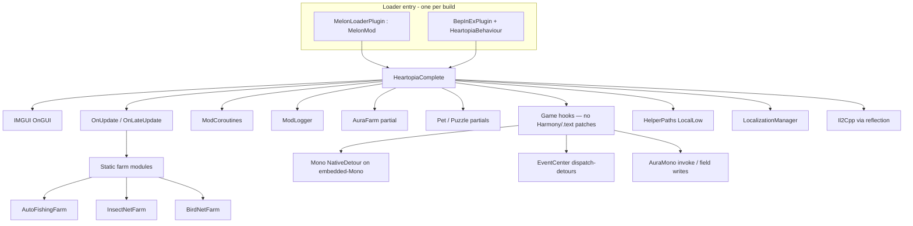

# Technical Architecture

Deep technical reference for **Bugtopia**. For maintainers updating after game patches or extending features.

---

## High-Level Architecture



### Design pattern

- **Unified build:** One `bugtopia.dll` for both loaders — both `[MelonInfo]` and `[BepInPlugin]` entry points in one assembly, runtime dispatch via `ModLoaderInfo.IsMelonLoader` (no per-loader `#if`).
- **Loader-agnostic core:** `HeartopiaComplete` is a plain class; plugins forward lifecycle hooks.
- **Shared abstractions:** `ModLogger` / `ModCoroutines` hide loader-specific APIs.
- **Monolithic core:** ~59,000 lines in `HeartopiaComplete.cs`.
- **Partial classes:** Farms and features split across files, merged at compile time.
- **Static farm controllers:** Ticked from `HeartopiaComplete.OnUpdate`.
- **Runtime reflection:** Game types resolved by name after load (see [TYPE_RESOLUTION.md](./TYPE_RESOLUTION.md)).

---

## Entry Point and Lifecycle

### MelonLoader (`MelonLoaderPlugin.cs`)

```csharp
#if MELONLOADER
[assembly: MelonInfo(typeof(HeartopiaMelonPlugin), "Bugtopia", "1.0.0", "HeartopiaMod")]
public class HeartopiaMelonPlugin : MelonMod
{
    private HeartopiaComplete _mod;
    public override void OnInitializeMelon() { _mod = new HeartopiaComplete(); _mod.OnInitializeMelon(); }
    public override void OnUpdate() => _mod?.OnUpdate();
    // OnLateUpdate, OnGUI, OnDeinitializeMelon ...
}
#endif
```

### BepInEx (`BepInExPlugin.cs`)

```csharp
#if BEPINEX
[BepInPlugin(...)]
public class HeartopiaBepInPlugin : BasePlugin
{
    public override void Load()
    {
        ModLogger.Init(Log);
        AddComponent<HeartopiaBehaviour>();  // survives scene cleanup
    }
}

public class HeartopiaBehaviour : MonoBehaviour
{
    private void Awake()
    {
        ModCoroutines.SetHost(this);
        _mod = new HeartopiaComplete();
        _mod.OnInitializeMelon();
    }
    // Update, LateUpdate, OnGUI, OnDestroy → _mod hooks
}
#endif
```

### `HeartopiaComplete`

```csharp
public partial class HeartopiaComplete  // NOT MelonMod
{
    public void OnInitializeMelon() { ... }
    public void OnUpdate() { ... }
    public void OnLateUpdate() { ... }
    public void OnGUI() { ... }
    public void OnDeinitializeMelon() { ... }
}
```

### `OnInitializeMelon` sequence

1. `ApplyMasterConsoleVisibility()` (MelonLoader console hide flag).
2. `Instance = this`.
3. Load config: localization, radar icons, teleports, keybinds, theme, patrols, radar, bird farm.
4. Log legacy auto-fish disabled message.
5. `ModCoroutines.Start(NetCookCoroutineWarmupRoutine())`.

The mod installs **no** Harmony / IL2CPP `.text` patches — game code is reached via Mono
`NativeDetour`, AuraMono, EventCenter dispatch-detours, and `SendCommand`. Do not add new
`[HarmonyPatch]` / `harmony.Patch(...)` on IL2CPP methods (Themis integrity-hashes module `.text`);
see [TYPE_RESOLUTION.md §Integration strategies](./TYPE_RESOLUTION.md#integration-strategies-after-type-is-found).

### Logging (`ModLogger.cs`)

| Loader | Output |
|--------|--------|
| MelonLoader | `MelonLogger.Msg` / `Warning` |
| BepInEx | BepInEx log + append `{Game}/UserData/bugtopia.log` |

All mod code uses `ModLogger.Msg(...)` — never call loader APIs directly.

### Coroutines (`ModCoroutines.cs`)

| Loader | Backend |
|--------|---------|
| MelonLoader | `MelonCoroutines.Start/Stop` |
| BepInEx | `MonoBehaviour.StartCoroutine` on `HeartopiaBehaviour` via `WrapToIl2Cpp()` |

BepInEx requires `ModCoroutines.SetHost(this)` in `HeartopiaBehaviour.Awake` before any `Start()` call.

### Frame loops

| Callback | Responsibilities |
|----------|------------------|
| `OnUpdate` | Hotkeys, farms (`AutoFishingFarm.Update`, insect/bird ticks), aura farm, auto eat/repair triggers, noclip movement, game speed, pet play tick, puzzle tick, radar refresh, bag automation state machines |
| `OnLateUpdate` | Mouse-look camera, position monitor debug, camera override frames, custom FOV |
| `OnGUI` | Full mod menu, radar overlay, resource ESP, notifications, status overlay |

---

## Hooking game code (no Harmony patches)

**The mod installs ZERO Harmony / IL2CPP `.text` patches.** Do **not** add new
`[HarmonyPatch]` / `harmony.Patch(...)` on IL2CPP methods (`GameAssembly` / `UnityPlayer` /
Il2Cpp-interop) — a Harmony detour rewrites the target module's `.text`, which the native **Themis**
anti-cheat can integrity-hash. Hook game behaviour with a Mono `NativeDetour` (embedded-Mono
methods), AuraMono invoke/read, or an EventCenter dispatch-detour instead. See the hard rule in
[AGENTS.md](../AGENTS.md) and the channel table in
[TYPE_RESOLUTION.md §Integration strategies](./TYPE_RESOLUTION.md#integration-strategies-after-type-is-found).

Every patch this section used to list was deleted or migrated during the anti-cheat surface cleanup:

| Former Harmony patch (IL2CPP `.text`) | Replaced by |
|---------------------------------------|-------------|
| `Transform.position` / `Transform.rotation` setters (teleport / noclip / camera) | Teleport → game warp `EntityHelper.AutoMoveTransfer` (AuraMono) + a short direct-write hold on `OverridePosition`; noclip → the game's `PlayerMoveComponent`; camera → `XDTCameraManager` controller axis |
| `CharacterController.Move` (menu input block) | `MonoInputManager.DisableInput(InputEvent.Move)` via AuraMono (refcounted) |
| `Input.GetKey*` ×6 (F-sim interact) | Click the game's interact button directly (`DirectClickInteractButton`) |
| `Image.sprite` setter (bulk-selector discovery) | removed |
| Building overlap bypass | Mono `NativeDetour` on the embedded-Mono craft collision gate (`BuildingFreeRotateFeature.cs`) |
| BirdFarm max-photo detect | EventCenter dispatch-detour on `TakingBirdPhotoResultEvent` |

Remaining native hooks are all **Mono `NativeDetour` + `mono_compile_method`** on embedded-Mono
methods (e.g. building bypasses, bubble spawn/collect, name/profile surfaces, fishing) — the Mono
JIT heap, not a module `.text`, so off the Themis integrity-hash surface. `EnsureBirdPhotoRuntimeProbePatch`
is an AuraMono discovery probe, not a Harmony patch.

---

## Movement and Teleport Model

### Static flags on `HeartopiaComplete`

```csharp
public static bool OverridePlayerPosition;
public static Vector3 OverridePosition;
public static int teleportFramesRemaining;

public static bool OverrideCameraPosition;
public static Vector3 CameraOverridePos;
public static Quaternion CameraOverrideRot;
public static int cameraOverrideFramesRemaining;
```

### Flow

1. Teleport calls the game's own warp first (`EntityHelper.AutoMoveTransfer`, AuraMono), then sets `OverridePosition` + a short frame count (~10 frames).
2. During those frames the mod re-writes the player transform toward `OverridePosition` — a plain transform write, **not** a Harmony patch — so the server/client controller can't immediately snap it back.
3. If the game warp is unavailable, only the direct-write hold applies.

Noclip uses the same override-position hold with continuous updates from WASD logic in `OnUpdate`, driving the game's `PlayerMoveComponent`.

### Analog movement bridge (`MovementInputFeature.cs`)

Unlike teleport/noclip (which override the transform), this injects an **analog move axis** so the
character walks "as from the joystick", through the genuine move component. Pipeline (decompiled):

```
gamepad stick / WASD  →  raw joystick-space Vector2 (x=right, y=forward, |v| 0..1)
  →  LocalPlayerComponent.OnLeftJoystickPerformed(axis)        [primary, deterministic]
       or MonoInputManager.SendMoveValueToControl(axis)        [fallback, InputSystem virtual control]
  →  _joystickQueue → _TickProcessJoystick:
        moveDir = cameraComponent.ToCameraSpaceJoystick(axis)   ← camera yaw applied by the GAME
  →  PlayerMoveComponent.SetMoveJoystick(joystick, moveDir)
  →  SendSignal(StandMoveInput)                                 ← real velocity + server sync
```

Key points:

- **Raw axis only** — the mod must NOT pre-rotate; `ToCameraSpaceJoystick` (yaw-only) does the
  camera-relative transform downstream. (Contrast noclip, which builds its own world vector.)
- **Gamepad gotcha:** movement is driven by the new **Input System** action map (`InputEvent.Move == 0`),
  where the controller stick is unbound, so native stick movement does nothing, and legacy
  `Input.GetAxis("Horizontal"/"Vertical")` returns 0 under "Input System (New)". The stick is therefore
  read directly via **Win32 XInput** (`XInputGetState`, `xinput1_4.dll` → `xinput9_1_0.dll`, radial
  deadzone 7849/32767). The gamepad is **not** treated as "physical input to yield to" (only the
  on-screen touch joystick is) — otherwise the bridge would refuse to inject the very stick it reads.
- **AuraMono resolution:** `MonoInputManager` via `TryGetAuraMonoManagerFromServiceDic("MonoInputManager")`;
  player via `TryGetAuraMonoLocalPlayerObject`. Methods cached as class-`IntPtr`, manager object via
  `AuraMonoObjectCache`; `Vector2` args passed by pointer through `auraMonoRuntimeInvoke`.
- **Vehicles:** while driving, movement runs through the **vehicle controller**, not the player move
  component — so the axis is routed to `SelfVehicleController.OnLeftJoystickPerformed` (sets
  `_inputData.moveAxis`) instead. The driven controller is resolved via NoclipFeature's
  `TryGetSelfEntityVehicleComponentMono` → `controller`; method IntPtrs are re-resolved if the controller
  class changes. On foot this returns false and the player path is used.
- **Gating:** respects `ShouldBlockGameplayInput()` / `menuMoveInputDisabled` (the same `IsInputDisabled(Move)`
  state `UpdateMenuMovementInputBlock` toggles); per-frame tick wrapped in a `FeatureBreakerState`.
- **Anti-cheat:** legitimate speed via the real move component (passes server `MovementAntiCheating`); the
  inject path leaves no `InputCheatManager` touch trace. See `memory/analog-move-injection.md`.

### Win32 input

For bag automation and some interactions, the mod uses:

- `SendInput`, `keybd_event`, `mouse_event`
- `PostMessage` with `WM_KEYDOWN` / `WM_LBUTTONDOWN` for targeted window messages
- `VK_F` (0x46) for interact key simulation where UI paths are unavailable

The mod no longer installs Harmony `Input` patches — this Win32 `VK_F` path and
`DirectClickInteractButton` (clicking the game's own interact button) are the interact mechanisms now.

---

## Auto Fishing (`AutoFishingFarm`)

### Architecture

Static state machine in `AutoFishingFarm.cs`; UI in `DrawSection`; tick via `AutoFishingFarm.Update(HeartopiaComplete host)`.

### Key game integration (on host)

Reflection / Il2Cpp calls on `HeartopiaComplete` (representative):

- Resolve fishing rod tool state
- Find fish shadow entities in range
- `TrySetFishingPressed(bool)` — primary reel/cast control
- Read fishing state enum/strings: `Battle`, `FishingOnHook`, `FishingFail`, `BattleFailSlack`, etc.
- Track bait netId / battle bait for lost-bait recovery

### Reel logic

- Maintains `lastRequestedPressed` vs tension thresholds.
- `BattlePressCooldown` 80 ms between press updates.
- Grace periods: post-hook, post-battle, post-lost-bait, post-cast idle, stale idle.

### Tool management

- Saves `previousToolEquipType` before equipping rod.
- `RestorePreviousTool` on disable.
- Retry equip every 3.25 s if rod missing.

### Instant Catch (optional toggle)

- Menu toggle + config key `autoFishInstantCatch`.
- Does **not** move the player. Re-sends buoy geometry to the server with collapsed `successLength` so the battle resolves quickly once the fish bites.
- Type resolution: **AuraMono** `WebRequestUtility.SendCommand<UpdateRodBuoyPositionNetworkCommand>` on **Reliable** channel (managed `FindLoadedType` fails — see [TYPE_RESOLUTION.md](./TYPE_RESOLUTION.md) § 2b).
- Implementation: `HeartopiaComplete.Fishing.cs` (`TryArmFishingInstantCatch`), tick from `AutoFishingFarm.cs`. Verbose log: `[InstantCatch]` (`MasterLogInstantCatch`).

---

## Aura Farm (`AuraFarm.cs` partial)

### Method resolution

Uses the Aura-specific pipeline documented in [TYPE_RESOLUTION.md](./TYPE_RESOLUTION.md): `FindTypeByName` → `FindTypeBySignature` → optional **Mono** `mono_runtime_invoke`.

Preferred assembly name fragments: `Assembly-CSharp`, `Il2CppAssembly-CSharp`, `XDT`, `Game`. Excluded: Unity, System, MelonLoader, Harmony, etc.

Caches `MethodInfo` / `FieldInfo` for:

- `SendPickBushCommand`, `SendAttackTreeCommand`, `SendHitStoneCommand`
- `InteractSystem` instance / player / target list
- `EntityHelper`, `Entities.GetEntity` (preferred over `EntityUtil.GetEntity` for meteor entity lookup)
- Collectable / bush / level object components

Managed spatial fallbacks (`AuraUseManagedSpatialFallbackScans`) and generic mono target fallbacks (`AuraUseMonoTargetFallbacks`) are **off** by default; AxeChecker + throttled mono fallback paths are the active discovery pipeline.

### Tick

`UpdateAuraFarm()` when enabled:

1. Throttled scan interval **80 ms** (`AuraScanInterval`).
2. `CollectAuraOwnerTargets` — managed select priority, throttled mono fallbacks, **Mono AxeChecker** (`HandholdCylinderChecker.PhysicalSelect`).
3. Per tick: `RefreshAuraMeteorObjectPositionsThrottled` when mining meteors.
4. For each `ownerNetId`: classify target → `InvokeAuraCommandForAllResources` or meteor-specific `InvokeAuraHitStone`.
5. Per-owner cooldown **20 ms** (`AuraPerTargetCooldown`).

Failure sets `auraLastError`; UI can surface via status helpers. Verbose trace: `MasterLogAuraFarm` on `HeartopiaComplete`.

### Meteorite pipeline

| Step | Implementation |
|------|----------------|
| Live rock detection | `GameObject.FindObjectsOfType` filter `name.StartsWith("p_rock_meteorite")` → `auraMeteorObjectPositions` (1 s scan) |
| Classify as meteor | `IsAuraPositionNearLiveMeteor` / `IsAuraTargetMeteor` — position within 3 m of a live prop |
| Register target | `TryRegisterAuraTargetFromMonoLevelObjectShape` from AxeChecker shape (`ownerNetId`, optional `resourceID`) |
| Resolve hit netId | `TryGetAuraMeteorHitNetId` → `LevelResourceId` / `ResourceNetId` / `TryResolveAuraMeteorParentNetId` |
| Parent resolution | View→parent cache (`auraMeteorViewToParentCache`); scan `MeteoriteLogic` components for `_viewEntity` link; mono component walk; optional `DataCenter.TryGetComponentData` (`CollectableMeteoriteComponentData`, …) |
| Command | `InvokeAuraHitStone(parentNetId, isCombo: false)` after `TryEnsureAuraMeteorAxeEquipped` |
| Multi-meteor | `RefreshAuraMeteorTargetsNearPlayer` — force AxeChecker refresh, prune dead owners, invalidate stale caches; meteor targets skip rock node cooldown stamps |

**Entity lookup safety:** UInt32 scalar reads use `TrySafeGetMonoUInt32ScalarMember` (value-type unbox only). Reference-type members (`*Entity`, `parentEntity`) use `TryGetAuraMonoEntityNetId` — never unbox managed entity objects as scalars.

**Foraging mutex:** `ShouldRunMeteorAutoInteract()` returns `false` when `auraFarmEnabled`. `SetAuraFarmEnabled(true)` calls `StopMeteorAutoInteractSequence()`.

---

## Insect / Bird Farms

### Common patterns

Both static modules share design with fishing:

- Enable/disable with tool restore
- Session counters, cooldowns, status strings for overlay
- Config loaded from unified `KeybindConfigData` / `BirdFarmConfigData`

### Insect-specific

- Hard-coded patrol route (50+ `Vector3` waypoints) for empty-area teleport rotation.
- Batch size and scan range from config.
- Recent netId dedup dictionaries.

### Bird-specific

- Multi-catch burst with pending confirmation window (500 ms delay, 8 s timeout).
- `_pendingConfirmNetIds` tracks server ACKs.
- Safety stop, stationary throttle, runtime recycle every 180 s.
- Crash trace log path:
  - MelonLoader: `{Game}/MelonLoader/Logs/birdfarm-crashtrace.log`
  - BepInEx: `{Game}/BepInEx/birdfarm-crashtrace.log`

---

## Radar System

### Scanner

Periodic world scan builds hierarchy under internal `radarContainer` GameObject. Markers created/destroyed as resources spawn/despawn.

### Metadata

`RadarMarkerMetadata` per marker:

- Canonical label, icon key, cooldown flag
- Optional `ResourceVisualEspIconTexture`

### Species icon index

Cached text file: `%LocalLow%/Bugtopia/Cache/radar_species_icons.txt`

### Visual ESP

`HeartopiaResourceVisualEsp.cs`:

- Projects marker world positions to screen
- Sorts by priority (e.g. Bubble first)
- Collision avoidance for label rects (`resourceVisualEspPlacedRects`)
- Styles: beacon glow, card panel, minimal dot

---

## Bulk Selector

`sprite` setter postfix filters sprites containing `ui_item_normal`.

Maps sprite name → list of UI `Transform` slots in `slotCache`.

Enables clicking matching slots without manual item ID entry.

**Bag / Warehouse tab** no longer depends on this hook for listing stacks — it calls `BackPackSystem.GetAllItem` directly (AuraMono). See [BACKPACK_AND_ITEMS.md](./BACKPACK_AND_ITEMS.md).

---

## Hotkey guards (`InstrumentHotkeyGuardFeature.cs`)

Every mod hotkey is read through the central chokepoint `TryGetModHotkeyDown` /
`TryGetModHotkeyHeld`, so guards that suppress hotkeys live here once and apply everywhere.

**Instrument guard** — when an instrument panel is open, the keys bound to that instrument's note
layout are removed from `Input.GetKeyDown` so playing a song doesn't trigger mod features. Resolved
via a throttled `UIManager.GetView` poll (managed first, AuraMono fallback); detail in
[GAME_EVENTS.md](./GAME_EVENTS.md).

**Text-input guard** — when a game text field is focused (chat, rename, search, mail, …), every mod
hotkey is swallowed *except* the menu toggle (`keyToggleMenu`), so typed letters never fire
features and the menu can still be closed. Detection is pure Unity-side and build-independent:

```
EventSystem.current.currentSelectedGameObject
  → GetComponent<UnityEngine.UI.InputField>()
  → .isFocused
```

The game's input widgets are all legacy uGUI `InputField`s driven by the `EventSystem` (see ilspy
`HudChatWidget` / `InputFieldLimitWidget`), so this single check covers them all — no AuraMono, no
game-UI types that drift between patches, no native-AV exposure. The result is cached per frame
(`Time.frameCount`) so the ~50 keybind checks per frame dedupe to one `EventSystem` lookup. Checking
the `InputField` component *and* `isFocused` (not merely "something is selected") avoids false
blocks when a button/toggle holds selection. Exposed as the static
`IsModHotkeyBlockedByTextInput()` alongside `IsModHotkeyBlockedByInstrument(KeyCode)`.

If a TMP (`TMPro.TMP_InputField`) field ever appears in-game, extend `ResolveGameTextInputFocused`
with a second component check — currently unused because all observed fields are legacy uGUI.

---

## Pad Build Hotkeys (`PadBuildHotkeyFeature.cs`)

Keyboard control of the building pad: confirm / cancel / rotate / move / delete, all rebindable
(default `None`), processed in `ProcessPadBuildHotkeysOnUpdate` from `OnUpdate` via
`TryGetModHotkeyDown` (respects the instrument + text-input hotkey guards and rebind capture).

**Action mapping (panel parity, gated on `BuildModule.SubState == CraftState.Focus`):**

- confirm → `BuildModule.ConfirmPlacing(false)`; cancel → `CancelPlacing()`; rotate →
  `RotateAround()` (250 ms debounce)
- move → `InteractExecuteMove()`; no-op in god mode (grabbing is a click there)
- delete → Pad mode `InteractExecutePickup()` (pack furniture to backpack); god mode
  `InteractExecuteDelete()` (wreck)
- not focused (simple Pad free-roam) → silent no-op for all five

**`BuildModule` instance — three tiers** (full detail in
[TYPE_RESOLUTION.md](./TYPE_RESOLUTION.md#resolving-module-instances-managersgetmodule--worked-example-buildmodule)):

1. Managed `FindLoadedType` + `TryGetManagedModule` — dormant (interop has no `BuildModule` stub),
   self-heals after an interop regen.
2. **AuraMono (active):** class via `FindAuraMonoClassInImages("XDTGUI.Module.Build", "BuildModule",
   [XDTLevelAndEntity, …])` → `mono_type_get_object` → invoke `Managers.GetModule(Type)`. Module
   object cached, dropped on any invoke exception (stale after GC/level switch), resolve throttled 5 s.
3. UI fallback — clicks `BuildStatusPanel` buttons by `GameObject.Find` paths from
   `BuildStatusPanel_Auto.cs`.

Known traps (never retry): `Type.GetType(string)` via `mono_runtime_invoke` crashes the runtime;
`Managers._moduleDic.Values` does not enumerate via AuraMono (and values are `ModuleObject`
wrappers); `FindAuraMonoClassByFullName` probes only the first loaded image (namespace
`XDTGUI.Module.Build` ≠ assembly `XDTLevelAndEntity`). Debug log flag: `MasterLogPadBuild`.

---

## Configuration System

### Primary store

**Path:** `%LocalLow%/Bugtopia/Config.xml`

Despite the `.xml` extension, serialization uses `System.Xml.Serialization.XmlSerializer` on `UnifiedConfigData` — file content is XML.

### `UnifiedConfigData` schema (top level)

| Field | Type | Contents |
|-------|------|----------|
| `Keybinds` | `KeybindConfigData` | All key codes + gameplay tuning floats |
| `UiTheme` | `UiThemeConfigData` | RGB + alpha for UI layers, scale |
| `Radar` | `RadarConfigData` | Marker style, distance, ESP options, priorities |
| `BirdFarm` | `BirdFarmConfigData` | Photo modes, cooldown, scan range, multi-catch |
| `Patrol` | `PatrolData` | Foraging teleport patrol points |
| `TreeFarmPatrol` | `TreeFarmPatrolData` | Chop/mine patrol with rotation |
| `CookingPatrolSaves` | List | Named mass-cook routes |
| `CustomTeleports` | List | User teleport entries |
| `Language` | string | `en`, `es`, `zh-CN`, `pt-BR` |

### `KeybindConfigData` (selected fields)

Integer fields store `(int)KeyCode` values (one per rebindable action — e.g. `keyEquipPad`,
`keyPadConfirm` / `keyPadCancel` / `keyPadRotate` / `keyPadMove` / `keyPadDelete`).

Notable floats:

- `noclipSpeed`, `noclipBoostMultiplier`
- `areaLoadDelay`, `auraCollectWaitTimeout`, `resourceTeleportCooldown`, `resourceClickDuration`
- `gameSpeed`, `cameraFOV`, snow/cook intervals
- `autoFish*` tuning (legacy keys still serialized)
- `insect*` tuning
- Auto sell / eat / repair booleans and thresholds (`autoSellScanSource`, `autoSellSkipFiveStar`, `dailyQuestSubmitSkipFiveStar`, …)

### Secondary / legacy files

| File | Location | Notes |
|------|----------|-------|
| `keybinds.json` | Bugtopia | Legacy; migration reads some lines |
| `ui_theme.json` | Bugtopia | Legacy parallel to unified theme |
| `radar_settings.json` | Bugtopia | Legacy radar |
| `patrol_points.json` | Bugtopia | Foraging patrol |
| `tree_farm_patrol_points.json` | Bugtopia | Tree farm |
| `custom_teleports.json` | Bugtopia | Custom TP list |
| `cooking_patrol_saves/` | Bugtopia directory | Named saves |

`HelperPaths.TryMigrateLegacyHelperSettings()` copies `%LocalLow%/HelperSettings/**` → `Bugtopia` once if the legacy folder exists. `HelperPaths.TryMigrateLegacyUserData(gameBaseDir)` copies `{Game}/UserData/**` → `Bugtopia` once if present.

### Path resolution

Uses Windows known folder GUID `A520A1A4-1780-4FF6-BD18-167343C5AF16` (LocalLow) via `SHGetKnownFolderPath`, with fallback to `%AppData%/LocalLow`.

---

## Localization

`LocalizationManager.cs`:

- Built-in English defaults dictionary (translation keys = English strings).
- External JSON overrides expected at `Localization/*.json` (csproj `CopyToOutputDirectory`) — folder may be empty; defaults still work.
- Languages: en, es, zh-CN, pt-BR.
- `HeartopiaComplete.L("key")` / `LF("format", args)` at UI sites.

---

## Debug ESP

`HeartopiaDebugEsp.cs`:

- Gated by owner check (`IsVisualDebugEspOwnerAllowed`) — restricted debug surface.
- Static API: `DebugEspUpsert`, `DebugEspTrack`, `DebugEspRemove`, `DebugEspClearGroup`.
- Used by internal features for visualizing scan targets (not end-user menu by default).

---

## Il2Cpp Interop Notes

- References `Il2CppInterop.Runtime` for Il2Cpp arrays/types where needed.
- Aliases in `HeartopiaComplete.cs`: `Il2CppType`, `Il2CppMethodInfo`, etc.
- Game objects often accessed via `GameObject.Find` with full hierarchy paths — fragile across patches.
- Player object frequently resolved as `p_player_skeleton(Clone)`.

**Type and method resolution** (`FindLoadedType`, network commands, Harmony targets, Mono fallback, pitfalls): see **[TYPE_RESOLUTION.md](./TYPE_RESOLUTION.md)**.

---

## UI Implementation

- Custom IMGUI skin generated at runtime (`DrawExentriSectionPanel`, accent sliders, switch toggles).
- Theme colors stored as float RGB + alpha; HSV picker generates textures cached in `themeTextures`.
- Menu blocks game UI optionally via `ShouldBlockGameplayInput()` feeding movement patch.
- Scroll views compute dynamic content height per tab/sub-tab.

---

## Coroutines

All async flows use **`ModCoroutines.Start/Stop`**:

- Mass cook patrol
- Bag open/use/close sequences
- Pet feed/play routines
- Net cook warmup
- Teleport-farm flows
- Puzzle solve routine

Loader-specific implementation is hidden in `ModCoroutines.cs`.

---

## Embedded Assets

| Asset | Use |
|-------|-----|
| `Assets/tree.png` | Radar / ESP tree marker |
| `Assets/rare_tree.png` | Rare tree marker |

Loaded from manifest resources at runtime.

---

## Orphan / Legacy Files (not compiled)

These exist under `buddy/` but are **excluded** from `buddy.csproj` (`EnableDefaultCompileItems=false`):

```
MonoEcsCapture.cs, MonoEcsLoadHook.cs, RuntimeDump.cs Experimental dump tooling
FishingAutoDump.cs                                    (if present) debug capture
```

(The legacy fishing input-sim files `AutoFishLogic.cs` / `AutoFishFarm.cs` / `AutoFishGet*.cs` and `InsectFarm.cs` were deleted — fishing/insect ship as net-based `AutoFishingFarm.cs` / `InsectNetFarm.cs`.)

Extended fishing debug / ECS work may live on the **`test`** git branch.

---

## Build System Summary

| Property | Value |
|----------|-------|
| SDK | `Microsoft.NET.Sdk` |
| TFM | `net6.0`, x64 |
| Assembly | `bugtopia.dll` |
| Output | `bin/<Loader>/<Configuration>/` |
| Script | `build-all.bat` |
| Config | `Directory.Build.props` → `HeartopiaDir` |

---

## Known Quirks

| Topic | Detail |
|-------|--------|
| Startup log | `AutoFish subsystem disabled` refers to legacy `AutoFishLogic`, not `AutoFishingFarm` |
| Plugin version | Metadata `1.0.0` may differ from git release tag |
| One loader only | Do not run MelonLoader + BepInEx on the same install |

---

## Updating After Game Patches

Recommended workflow:

1. Launch game with your loader; check the log for hook / type-resolution failures (Mono `NativeDetour` installs, AuraMono resolves, EventCenter hooks) — the mod uses no Harmony patches.
2. Regenerate interop (MelonLoader Il2CppAssemblies or BepInEx interop) after game updates.
3. Rebuild: `build-all.bat` (or `dotnet build buddy.csproj -c Release`) — one unified DLL for both loaders.
4. For aura/fish/insect/bird: enable `MasterLog*` flags; fix type names per [TYPE_RESOLUTION.md](./TYPE_RESOLUTION.md).
5. For bag/UI automation: verify UI hierarchy paths still exist.
6. Test in a private town, one feature at a time.

---

## Security / Stability Considerations

- Reflection invokes private game methods — can throw if signatures change; most paths wrapped in try/catch with status string fallback.
- Bird farm includes intentional GC pressure reduction (reused lists) after crash investigations.
- `AllowUnsafeBlocks` enabled in csproj (unsafe code may exist in partial classes).
- No network encryption bypass — mod operates as client automation layer.

---

## Related Documentation

- [BUILD_AND_RUN.md](./BUILD_AND_RUN.md)
- [FEATURES.md](./FEATURES.md)
- [TYPE_RESOLUTION.md](./TYPE_RESOLUTION.md) — how the mod finds game types at runtime
- [GAME_ASSEMBLIES_AND_TOOLS.md](./GAME_ASSEMBLIES_AND_TOOLS.md) — EcsClient, interop, LocalLow dumps, tools
