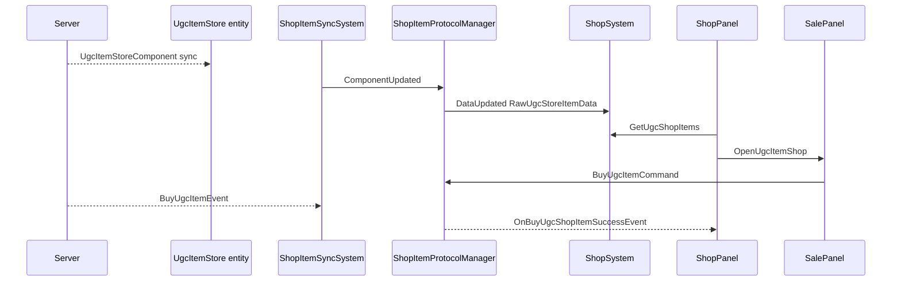

# UGC-магазин — справочник по декомпиляциям

Документ описивает клиентскую реализацию **UGC-магазина** (покупка пользовательских книг и музыкальных пластинок) по `ilspy-dumps/`.

Связанные документы: [UGC_SYSTEM.md](./UGC_SYSTEM.md) (записи, книги, общая UGC-инфраструктура), [TYPE_RESOLUTION.md](./TYPE_RESOLUTION.md) (открытие UI через AuraMono).

---

## 1. Суть

UGC-магазин — **не отдельная панель**, а секция внутри обычного `ShopPanel`. Если у `storeId` в `TableStoreInfo` поле `UgcItemType != 0`, внизу списка товаров появляется блок UGC-товаров соответствующего типа.

Покупка идёт **отдельной** сетевой командой `BuyUgcItemCommand`, не через `ShopSystem.BuyItem` / `ShopShelfProtocolManager.BuyItem`.

---

## 2. Точки входа

| storeId | `PlayerUgcType` | Как открывается |
|---------|-----------------|-----------------|
| **147** | `Book` (1) | `OpenBookShopCommand` → `NpcShopOpenRequestedEvent { storeId = 147 }` |
| **148** | `Record` (2) | `ShopPanel.OpenShopPanel(148)` (напр. кнопка в `SeaLanternFestivalActivityWidget`) |

Мост UI (`XDTGame.UI.UIEventBridge`):

```csharp
private static void OnNpcShopOpenRequested(NpcShopOpenRequestedEvent evt)
{
    ShopPanel.OpenShopPanel(evt.storeId, evt.slotId);
}
```

`OpenBookShopCommand` (`XDTLevelAndEntity.Gameplay.Interaction.Command`, interact id **928**):

```csharp
NpcShopOpenRequestedEvent @event = new NpcShopOpenRequestedEvent { storeId = 147 };
EventCenter.DispatchEvent(in @event);
```

**Открытие панели из мода:** AuraMono invoke `XDTGame.UI.Panel.ShopPanel.OpenShopPanel(int storeId, int slotId = 0)` — тот же паттерн, что Force Open Shop в [TYPE_RESOLUTION.md](./TYPE_RESOLUTION.md).

---

## 3. Архитектура потока данных

```
Server
  │ sync UgcItemStoreComponent (+ Type, Info) на ECS-сущность витрины
  ▼
ShopItemSyncSystem
  │ ComponentUpdated/Removed<UgcItemStoreComponent>
  │ NetworkEvent<BuyUgcItemEvent>
  ▼
ShopItemProtocolManager
  │ UpdateUgcItem / RemoveUgcItem → DataUpdated/Removed<RawUgcStoreItemData>
  │ BuyUgcItemResponse → OnBuyUgcShopItemSuccessEvent
  ▼
ShopSystem._ugcItemDatas (кэш по Guid)
  ▼
ShopPanel.RenderItems → GoodsWidget (UgcGoodScrollData)
  ▼
SalePanel.OpenUgcItemShop → BuyUgcItemCommand
```



---

## 4. ECS-компоненты (`XDT.Scene.Shared.Modules.UgcItemStore`)

Сборка: **EcsClient**.

| Компонент | Поля / назначение |
|-----------|-------------------|
| `UgcItemStoreComponent` | `Guid UgcItemGuid` — идентификатор UGC-контента; ключ группы ECS |
| `UgcItemStoreTypeComponent` | `PlayerUgcType UgcType` — Book / Record |
| `UgcItemInfoComponent` | `int BaughtCount` — сколько раз **текущий игрок** купил этот UGC |
| `UgcItemDetailComponent` | `ItemName`, `Extra`, `ExtraEx`, `SyncExtraEx` |
| `UgcItemStoreBuyLockComponent` | маркер блокировки покупки (пустой struct) |
| `UgcItemStoreOwnerOfflineComponent` | владелец офлайн |
| `QueriedFriendsUgcItemsComponent` | `Dictionary<Guid, Dictionary<PlayerUgcType, bool>> QueriedFriends` |
| `PlayerSearchFriendsUgcItemsLock` | лок поиска UGC друзей |

**После покупки** предмет в рюкзаке (`XDT.Scene.Shared.Modules.Backpack`):

| Компонент | Поля |
|-----------|------|
| `UgcItemIdComponent` | `Guid UgcId` |
| `UgcItemTypeComponent` | `PlayerUgcType UgcType` |

Persistent-ключи: `"uiic"`, `"uitc"`.

---

## 5. Сетевые типы

### 5.1 `BuyUgcItemCommand` (`[NetworkCommand]`)

```csharp
public uint ItemNetId;  // netId ECS-сущности на витрине, НЕ Guid UGC
public int Count;
```

Отправка: `WebRequestUtility.SendCommand(new BuyUgcItemCommand { ... })`.

### 5.2 `BuyUgcItemEvent` (`[NetworkEvent]`)

```csharp
public ErrorCode ErrorCode;
```

### 5.3 `ShopItemProtocolManager` (`XDTDataAndProtocol.ProtocolService.ShopShelf`)

| Метод | Назначение |
|-------|------------|
| `UpdateUgcItem(in EcsEntity item)` | `DataUpdated<RawUgcStoreItemData>` |
| `RemoveUgcItem(in EcsEntity item)` | `DataRemoved<RawUgcStoreItemData>` + `UgcItemRemoveEvent` |
| `BuyUgcItemCommand(uint shopItemNetId, int count = 1)` | отправка покупки |
| `BuyUgcItemResponse(BuyUgcItemEvent evt)` | успех → `OnBuyUgcShopItemSuccessEvent`; ошибка → `ErrorCodeToast` |

### 5.4 `ShopItemSyncSystem` (`EcsSystem.ClientSystem.Store.ShopShelf`)

Подписки в `Init()`:
- `ComponentUpdated<UgcItemStoreComponent>` → `UpdateUgcItem`
- `ComponentRemoved<UgcItemStoreComponent>` → `RemoveUgcItem`
- `NetworkEvent<BuyUgcItemEvent>` → `BuyUgcItemResponse`

---

## 6. Сервисы и кэш

### 6.1 `StoreService` (`EcsSystem.ClientSystem.Store`)

Реализует `IStoreService` + `IIterateService<RawUgcStoreItemData>`.

```csharp
bool TryGetUgcItemTypeComponent(Guid itemGuid, out UgcItemStoreTypeComponent component)
bool TryGetUgcItemBuyCountComponent(Guid itemGuid, out UgcItemInfoComponent component)
void IterateAllData(IIterateDataCallback<RawUgcStoreItemData> callback)
```

Фильтры: `EcsGroupedFilter<UgcItemStoreComponent, GuidKey>`, `EcsFilter<UgcItemStoreComponent>`.

### 6.2 `ShopSystem` (`XDTGameSystem.GameplaySystem.Shop`)

```csharp
Dictionary<Guid, RawUgcStoreItemData> _ugcItemDatas;

// OnCreate: IterateServiceUtility.GetAllIterateData<IStoreService, RawUgcStoreItemData>
// Слушает DataUpdated/Removed<RawUgcStoreItemData>

void GetUgcShopRawItems(PlayerUgcType ugcType, ref List<RawUgcStoreItemData> ugcItems)
void GetUgcShopItems(in List<RawUgcStoreItemData> raw, ref List<UgcShopItemData> ugcShopItems)
PlayerUgcType GetUgcType(Guid itemId)
int GetUgcItemBaughtCount(Guid itemId)
void GetUgcItemDetailInfo(PlayerUgcType itemType, Guid itemId,
    out string textureId, out string name, out string introduce)
```

### 6.3 `RawUgcStoreItemData`

```csharp
public uint itemNetId;
public UgcItemStoreComponent UgcItemStoreComponent;
```

### 6.4 `UgcShopItemData` — DTO для UI

| Поле | Источник |
|------|----------|
| `itemNetId` | `raw.itemNetId` |
| `itemId` | `UgcItemStoreComponent.UgcItemGuid` |
| `itemType` | `GetUgcType(itemId)` |
| `price`, `currencyType`, `limitBuy` | `TableData.GetUgcItemPrice((int)itemType)` |
| `leftCount` | `buyLimitEachItem - GetUgcItemBaughtCount(itemId)` или `int.MaxValue` |
| `name`, `introduce`, `textureId` | `GetUgcItemDetailInfo` |
| `staticId` | Record → **13500**, Book → **200159999** |
| `canBuy` | `leftCount > 0` |

**`GetUgcItemDetailInfo` по типу:**

| `PlayerUgcType` | Источник метаданных |
|-----------------|---------------------|
| `Record` | `RecordDataSystem.GetRecordDetailDataByGuid` → `PhotoId`, `SongName`, `Brief` |
| `Book` | `BookSystem.TryGetUgcBookSummaryComponent` → `BookCover`, `BookName`, `BookDesc` |

---

## 7. Таблицы

### 7.1 `TableStoreInfo`

```csharp
public int UgcItemType => _UgcItemType;  // byte в бинарнике
```

Если `UgcItemType == 0` — магазин без UGC-секции. Иначе значение = `(int)PlayerUgcType`.

### 7.2 `TableUgcItemPrice`

Ключ словаря `TableData.TableUgcItemPrices`: **`id` = PlayerUgcType** (1 Book, 2 Record).

| Поле | Смысл |
|------|-------|
| `cost[]` | `TableCostItem[]` — тип валюты (`rewardType`) и сумма (`value`) |
| `staticId` | иконка награды |
| `buyLimitEachItem` | лимит покупок одного UGC-guid на игрока (0 = без лимита) |
| `shopLabelName` | locId заголовка секции в скролле `ShopPanel` |
| `refreshCondition` | `Expression` — условие обновления ассортимента |

---

## 8. UI

### 8.1 `ShopPanel` (`XDTGame.UI.Panel`)

**Открытие:** `ShopPanel.OpenShopPanel(int storeId, int slotId = 0)`

**UGC-рендер** (`RenderItems`):

```csharp
int ugcItemType = TableData.GetStoreInfo(_storeId).UgcItemType;
if (ugcItemType != 0)
{
    DataModule<ShopSystem>.Instance.GetUgcShopRawItems((PlayerUgcType)ugcItemType, ref ugcItems);
    DataModule<ShopSystem>.Instance.GetUgcShopItems(in ugcItems, ref ugcShopItems);
    // CellHolderWidget — заголовок из TableUgcItemPrice.shopLabelName
    // GoodsWidget.UgcGoodScrollData для каждого UgcShopItemData
}
```

**События:**
| Событие | Действие |
|---------|----------|
| `OnBuyUgcShopItemSuccessEvent` | `RefreshUgcShopList` → перерисовка |
| `UgcItemRemoveEvent` | `RefreshShopList` → перерисовка |

**Особенность `storeId == 148`:** виджет бесплатной награды (`freeReward_widget`, группа товаров **8716**).

### 8.2 `GoodsWidget` — клик по UGC-товару

Проверки перед `SalePanel.OpenUgcItemShop(data)`:

1. `leftCount <= 0` → toast loc **10045** (распродано)
2. `IUgcManagerService.IsIllegalUgcItem(itemNetId)` → toast **94648**
3. Иначе — открытие `SalePanel`

Иконка: `UgcIconBinder` + `UgcItemUtility.GetUgcShopItemTextureType()`.

### 8.3 `UgcItemUtility` / `UgcShopItemTextureType`

```csharp
enum UgcShopItemTextureType { empty, draw, photo, officialCover }
```

**Record:** `DrawManual` → draw; `official` → officialCover; иначе photo.

**Book / прочее:** разбор `textureId` по префиксу `painting_`, `photo_`, `official_`.

### 8.4 `SalePanel` — покупка UGC

**Открытие:**

```csharp
public static void OpenUgcItemShop(UgcShopItemData ugcShopItemData, Action<bool> callback = null)
```

Intent: `"ugcShopItemData"`, `"callback"`.

**Покупка** (`OnClickBuy`):

```csharp
ShopItemProtocolManager.BuyUgcItemCommand(ugcShopItemData.itemNetId, _viewModel.BuyCount);
```

**Превью** (`OnOpenPreview`):
| Тип | Панель |
|-----|--------|
| `Record` | `PreviewRecordInfoPanel.Open(itemId, 0L, itemNetId)` |
| `Book` | `BookInfoPanel.OpenShopUgcBook(itemId, itemNetId)` |

**Книги в SalePanel:** кнопка перевода, `UgcBookTranslateDoneEvent`, лимиты через `BookModule` / `BookUtility.GetTranslateLimitNum`.

**Снятие с витрины:** `UgcItemRemoveEvent` с `guid == itemId` → toast **94597**, закрытие панели.

### 8.5 `SalePanelViewModel.InitializeUgcShopItem`

- `ShowPreview = true` для Record и Book
- `ShowCount` + текст владения: Record (рюкзак+склад через `RecordDataSystem`), Book (`BackPackSystem.GetUgcItemCount`)
- `CanBuy` по валюте и `price * BuyCount`
- обложка через `GetUgcShopItemTextureType` → `DisplayData.TextureId`

---

## 9. События

| Событие | Namespace | Когда |
|---------|-----------|-------|
| `OnBuyUgcShopItemSuccessEvent` | `XDTDataAndProtocol.Events` | Успешный `BuyUgcItemEvent` (пустой struct) |
| `UgcItemRemoveEvent` | `XDTDataAndProtocol.Events` | UGC снят с витрины (`guid`) |
| `DataUpdated<RawUgcStoreItemData>` | protocol layer | товар добавлен/обновлён |
| `DataRemoved<RawUgcStoreItemData>` | protocol layer | товар удалён с витрины |
| `NpcShopOpenRequestedEvent` | `XDTGameSystem.UI` | запрос открыть NPC-магазин (в т.ч. 147) |

---

## 10. Модерация — `IUgcManagerService`

Namespace: `XDTDataAndProtocol.ProtocolService.UgcRichTextMedias`  
Реализация: `UgcManagerClientService` (`EcsSystem`).

```csharp
bool IsIllegalUgcItem(uint itemNetId);   // блок в GoodsWidget
bool IsBlockUgcItem(uint itemNetId);
bool CanPackUgcItem(uint itemNetId);
bool CanPackUgcItem(int staticId, Guid guid);
bool CheckUgcItem(uint itemNetId);
bool CheckSendGift(uint giftNetId);
bool IsBackGiftPaperWhenOpenGift(long openPlayerId, uint giftNetId);
```

---

## 11. `PlayerUgcType`

```csharp
public enum PlayerUgcType
{
    Invalid = 0,
    Book = 1,
    Record = 2,
    Contest = 3,
    ContestCurrent = 4,
    Max
}
```

В магазине используются **Book** и **Record**.

---

## 12. Награда после покупки

`RewardItemExtensions.FillUgcInfo` заполняет extra-поля награды:

```csharp
rewardItem.extra[RewardExtraType.UgcItemType] = (int)ugcType;
rewardItem.syncExtraEx[RewardExtraType.UgcItemId] = ugcItemGuid.ToString();
// опционально UgcDrawManualArtwork = photoId
```

Для пластинок также `RewardExtraType.UgcSongRecord` с `RecordId`.

---

## 13. Статистика UGC-операций

`UgcItemOperationType` (flags): `Buy`, `Use`, `Like`, `ViewCount`, письма о нарушениях и др.

`PlayerLikeUgcItemRecordService` — big records лайков UGC (до 128 слотов), смежная подсистема.

---

## 14. UGC-магазин vs обычный магазин

| | Обычный товар | UGC-товар |
|--|---------------|-----------|
| Команда покупки | `ShopShelfProtocolManager.BuyItem` | **`BuyUgcItemCommand`** |
| Ключ покупки | `netId` слота `StoreItemRecordComponent` | **`itemNetId`** сущности `UgcItemStoreComponent` |
| Цена | `ShopItemData` | **`TableUgcItemPrice`** |
| Лимит | `ShopItemData.leftCount` / `reserve` | **`UgcItemInfoComponent.BaughtCount`** + `buyLimitEachItem` |
| UI покупки | `SalePanel.Open(ShopItemData)` | **`SalePanel.OpenUgcItemShop`** |
| Результат | предмет по `staticId` | UGC с `UgcItemIdComponent` |

---

## 15. Интеграция в мод (Bugtopia)

| Задача | Канал | API |
|--------|-------|-----|
| Открыть магазин книг | **A** AuraMono | `ShopPanel.OpenShopPanel(147)` |
| Открыть магазин пластинок | **A** AuraMono | `ShopPanel.OpenShopPanel(148)` |
| Список UGC-товаров | **A** / managed | `DataModule<ShopSystem>.GetUgcShopRawItems` + `GetUgcShopItems` |
| Купить без UI | **S** SendCommand | `BuyUgcItemCommand { ItemNetId, Count }` |
| Проверка модерации | **A** | `EcsService.TryGet<IUgcManagerService>` → `IsIllegalUgcItem` |
| Открыть карточку покупки | **A** | `SalePanel.OpenUgcItemShop(UgcShopItemData)` |

**Алиасы `FindLoadedType`:**

```csharp
"XDT.Scene.Shared.Modules.UgcItemStore.BuyUgcItemCommand"
"XDTDataAndProtocol.ProtocolService.ShopShelf.ShopItemProtocolManager"
"XDTGameSystem.GameplaySystem.Shop.ShopSystem"
"XDTGameSystem.GameplaySystem.Shop.UgcShopItemData"
"XDTGame.UI.Panel.ShopPanel"
"XDTGame.UI.Panel.SalePanel"
"XDTDataAndProtocol.ProtocolService.UgcRichTextMedias.IUgcManagerService"
```

---

## 16. Пути в `ilspy-dumps/`

```
EcsClient/XDT.Scene.Shared.Modules.UgcItemStore/
  BuyUgcItemCommand.cs, BuyUgcItemEvent.cs
  UgcItemStoreComponent.cs, UgcItemStoreTypeComponent.cs
  UgcItemInfoComponent.cs, UgcItemDetailComponent.cs
  ...

EcsClient/XDT.Scene.Shared.Modules.Backpack/
  UgcItemIdComponent.cs, UgcItemTypeComponent.cs

EcsClient/TableUgcItemPrice.cs, TableStoreInfo.cs (поле UgcItemType)

XDTDataAndProtocol/XDTDataAndProtocol.ProtocolService.ShopShelf/
  ShopItemProtocolManager.cs, RawUgcStoreItemData.cs

XDTDataAndProtocol/XDTDataAndProtocol.Events/
  OnBuyUgcShopItemSuccessEvent.cs, UgcItemRemoveEvent.cs

XDTGameSystem/XDTGameSystem.GameplaySystem.Shop/
  ShopSystem.cs, UgcShopItemData.cs, UgcItemUtility.cs, UgcShopItemTextureType.cs

EcsSystem/ClientSystem.Store/StoreService.cs
EcsSystem/EcsSystem.ClientSystem.Store.ShopShelf/ShopItemSyncSystem.cs
EcsSystem/UgcManagerClientService.cs

XDTGameUI/XDTGame.UI.Panel/ShopPanel.cs, SalePanel.cs, SalePanelViewModel.cs
XDTGameUI/XDTGame.UI.Widget/GoodsWidget.cs

XDTLevelAndEntity/.../OpenBookShopCommand.cs
```

---

## 17. Не покрыто клиентской декомпиляцией

- Серверная логика **выставления** UGC на витрину (публикация → появление `UgcItemStoreComponent`)
- UI/команды запроса UGC **друзей** (`QueriedFriendsUgcItemsComponent` — только структура данных)
- Конкретные значения `TableUgcItemPrice` (цена, валюта, лимит) — в бинарных таблицах игры

---

*Источник: `ilspy-dumps/`. Мод `buddy/` UGC-магазин пока не реализует.*
