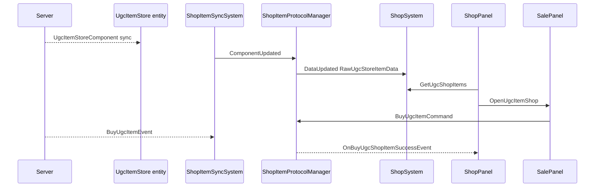

# The UGC shop — a reference built from the decompilations

This document describes the client-side implementation of the **UGC shop** (buying player-made books and music records) as read from `ilspy-dumps/`.

Related documents: [UGC_SYSTEM.md](./UGC_SYSTEM.md) (records, books, the shared UGC infrastructure) and [TYPE_RESOLUTION.md](./TYPE_RESOLUTION.md) (opening UI through AuraMono).

---

## 1. In short

The UGC shop is **not a separate panel** but a section inside the ordinary `ShopPanel`. When a `storeId`'s `TableStoreInfo` has `UgcItemType != 0`, a block of UGC goods of that type appears at the bottom of the item list.

Buying goes through a **separate** network command, `BuyUgcItemCommand`, and not through `ShopSystem.BuyItem` / `ShopShelfProtocolManager.BuyItem`.

---

## 2. Entry points

| storeId | `PlayerUgcType` | How it opens |
|---------|-----------------|-----------------|
| **147** | `Book` (1) | `OpenBookShopCommand` → `NpcShopOpenRequestedEvent { storeId = 147 }` |
| **148** | `Record` (2) | `ShopPanel.OpenShopPanel(148)` (e.g. a button in `SeaLanternFestivalActivityWidget`) |

The UI bridge (`XDTGame.UI.UIEventBridge`):

```csharp
private static void OnNpcShopOpenRequested(NpcShopOpenRequestedEvent evt)
{
    ShopPanel.OpenShopPanel(evt.storeId, evt.slotId);
}
```

`OpenBookShopCommand` (`XDTLevelAndEntity.Gameplay.Interaction.Command`, interact id **928**):

```csharp
NpcShopOpenRequestedEvent @event = new NpcShopOpenRequestedEvent { storeId = 147 };
EventCenter.DispatchEvent(in @event);
```

**Opening the panel from the mod:** an AuraMono invoke of `XDTGame.UI.Panel.ShopPanel.OpenShopPanel(int storeId, int slotId = 0)` — the same pattern as Force Open Shop in [TYPE_RESOLUTION.md](./TYPE_RESOLUTION.md).

---

## 3. The data flow

```
Server
  │ sync UgcItemStoreComponent (+ Type, Info) onto the shelf's ECS entity
  ▼
ShopItemSyncSystem
  │ ComponentUpdated/Removed<UgcItemStoreComponent>
  │ NetworkEvent<BuyUgcItemEvent>
  ▼
ShopItemProtocolManager
  │ UpdateUgcItem / RemoveUgcItem → DataUpdated/Removed<RawUgcStoreItemData>
  │ BuyUgcItemResponse → OnBuyUgcShopItemSuccessEvent
  ▼
ShopSystem._ugcItemDatas (cached by Guid)
  ▼
ShopPanel.RenderItems → GoodsWidget (UgcGoodScrollData)
  ▼
SalePanel.OpenUgcItemShop → BuyUgcItemCommand
```


```mermaid
sequenceDiagram
    participant Server
    participant ECS as UgcItemStore entity
    participant Sync as ShopItemSyncSystem
    participant Proto as ShopItemProtocolManager
    participant Shop as ShopSystem
    participant UI as ShopPanel
    participant Sale as SalePanel

    Server-->>ECS: UgcItemStoreComponent sync
    Sync->>Proto: ComponentUpdated
    Proto->>Shop: DataUpdated RawUgcStoreItemData
    UI->>Shop: GetUgcShopItems
    UI->>Sale: OpenUgcItemShop
    Sale->>Proto: BuyUgcItemCommand
    Server-->>Sync: BuyUgcItemEvent
    Proto-->>UI: OnBuyUgcShopItemSuccessEvent
```

---

## 4. ECS components (`XDT.Scene.Shared.Modules.UgcItemStore`)

Assembly: **EcsClient**.

| Component | Fields / purpose |
|-----------|-------------------|
| `UgcItemStoreComponent` | `Guid UgcItemGuid` — the UGC content's identifier; the ECS group key |
| `UgcItemStoreTypeComponent` | `PlayerUgcType UgcType` — Book / Record |
| `UgcItemInfoComponent` | `int BaughtCount` — how many times **the current player** has bought this UGC |
| `UgcItemDetailComponent` | `ItemName`, `Extra`, `ExtraEx`, `SyncExtraEx` |
| `UgcItemStoreBuyLockComponent` | a purchase-lock marker (an empty struct) |
| `UgcItemStoreOwnerOfflineComponent` | the owner is offline |
| `QueriedFriendsUgcItemsComponent` | `Dictionary<Guid, Dictionary<PlayerUgcType, bool>> QueriedFriends` |
| `PlayerSearchFriendsUgcItemsLock` | a lock on searching friends' UGC |

**After a purchase** the item in the backpack (`XDT.Scene.Shared.Modules.Backpack`):

| Component | Fields |
|-----------|------|
| `UgcItemIdComponent` | `Guid UgcId` |
| `UgcItemTypeComponent` | `PlayerUgcType UgcType` |

Persistent keys: `"uiic"`, `"uitc"`.

---

## 5. Network types

### 5.1 `BuyUgcItemCommand` (`[NetworkCommand]`)

```csharp
public uint ItemNetId;  // the netId of the ECS entity on the shelf, NOT the UGC Guid
public int Count;
```

Sending: `WebRequestUtility.SendCommand(new BuyUgcItemCommand { ... })`.

### 5.2 `BuyUgcItemEvent` (`[NetworkEvent]`)

```csharp
public ErrorCode ErrorCode;
```

### 5.3 `ShopItemProtocolManager` (`XDTDataAndProtocol.ProtocolService.ShopShelf`)

| Method | Purpose |
|-------|------------|
| `UpdateUgcItem(in EcsEntity item)` | `DataUpdated<RawUgcStoreItemData>` |
| `RemoveUgcItem(in EcsEntity item)` | `DataRemoved<RawUgcStoreItemData>` + `UgcItemRemoveEvent` |
| `BuyUgcItemCommand(uint shopItemNetId, int count = 1)` | sends the purchase |
| `BuyUgcItemResponse(BuyUgcItemEvent evt)` | success → `OnBuyUgcShopItemSuccessEvent`; failure → `ErrorCodeToast` |

### 5.4 `ShopItemSyncSystem` (`EcsSystem.ClientSystem.Store.ShopShelf`)

Subscriptions in `Init()`:
- `ComponentUpdated<UgcItemStoreComponent>` → `UpdateUgcItem`
- `ComponentRemoved<UgcItemStoreComponent>` → `RemoveUgcItem`
- `NetworkEvent<BuyUgcItemEvent>` → `BuyUgcItemResponse`

---

## 6. Services and caching

### 6.1 `StoreService` (`EcsSystem.ClientSystem.Store`)

Implements `IStoreService` and `IIterateService<RawUgcStoreItemData>`.

```csharp
bool TryGetUgcItemTypeComponent(Guid itemGuid, out UgcItemStoreTypeComponent component)
bool TryGetUgcItemBuyCountComponent(Guid itemGuid, out UgcItemInfoComponent component)
void IterateAllData(IIterateDataCallback<RawUgcStoreItemData> callback)
```

Filters: `EcsGroupedFilter<UgcItemStoreComponent, GuidKey>`, `EcsFilter<UgcItemStoreComponent>`.

### 6.2 `ShopSystem` (`XDTGameSystem.GameplaySystem.Shop`)

```csharp
Dictionary<Guid, RawUgcStoreItemData> _ugcItemDatas;

// OnCreate: IterateServiceUtility.GetAllIterateData<IStoreService, RawUgcStoreItemData>
// Listens to DataUpdated/Removed<RawUgcStoreItemData>

void GetUgcShopRawItems(PlayerUgcType ugcType, ref List<RawUgcStoreItemData> ugcItems)
void GetUgcShopItems(in List<RawUgcStoreItemData> raw, ref List<UgcShopItemData> ugcShopItems)
PlayerUgcType GetUgcType(Guid itemId)
int GetUgcItemBaughtCount(Guid itemId)
void GetUgcItemDetailInfo(PlayerUgcType itemType, Guid itemId,
    out string textureId, out string name, out string introduce)
```

### 6.3 `RawUgcStoreItemData`

```csharp
public uint itemNetId;
public UgcItemStoreComponent UgcItemStoreComponent;
```

### 6.4 `UgcShopItemData` — the DTO for the UI

| Field | Source |
|------|----------|
| `itemNetId` | `raw.itemNetId` |
| `itemId` | `UgcItemStoreComponent.UgcItemGuid` |
| `itemType` | `GetUgcType(itemId)` |
| `price`, `currencyType`, `limitBuy` | `TableData.GetUgcItemPrice((int)itemType)` |
| `leftCount` | `buyLimitEachItem - GetUgcItemBaughtCount(itemId)`, or `int.MaxValue` |
| `name`, `introduce`, `textureId` | `GetUgcItemDetailInfo` |
| `staticId` | Record → **13500**, Book → **200159999** |
| `canBuy` | `leftCount > 0` |

**`GetUgcItemDetailInfo` by type:**

| `PlayerUgcType` | Metadata source |
|-----------------|---------------------|
| `Record` | `RecordDataSystem.GetRecordDetailDataByGuid` → `PhotoId`, `SongName`, `Brief` |
| `Book` | `BookSystem.TryGetUgcBookSummaryComponent` → `BookCover`, `BookName`, `BookDesc` |

---

## 7. Tables

### 7.1 `TableStoreInfo`

```csharp
public int UgcItemType => _UgcItemType;  // a byte in the binary
```

`UgcItemType == 0` means a shop with no UGC section. Otherwise the value is `(int)PlayerUgcType`.

### 7.2 `TableUgcItemPrice`

The key of the `TableData.TableUgcItemPrices` dictionary: **`id` = PlayerUgcType** (1 Book, 2 Record).

| Field | Meaning |
|------|-------|
| `cost[]` | `TableCostItem[]` — the currency type (`rewardType`) and the amount (`value`) |
| `staticId` | the reward icon |
| `buyLimitEachItem` | the purchase limit for one UGC guid per player (0 = no limit) |
| `shopLabelName` | the locId of the section header in the `ShopPanel` scroll |
| `refreshCondition` | `Expression` — the condition for refreshing the assortment |

---

## 8. UI

### 8.1 `ShopPanel` (`XDTGame.UI.Panel`)

**Opening:** `ShopPanel.OpenShopPanel(int storeId, int slotId = 0)`

**UGC rendering** (`RenderItems`):

```csharp
int ugcItemType = TableData.GetStoreInfo(_storeId).UgcItemType;
if (ugcItemType != 0)
{
    DataModule<ShopSystem>.Instance.GetUgcShopRawItems((PlayerUgcType)ugcItemType, ref ugcItems);
    DataModule<ShopSystem>.Instance.GetUgcShopItems(in ugcItems, ref ugcShopItems);
    // CellHolderWidget — the header from TableUgcItemPrice.shopLabelName
    // GoodsWidget.UgcGoodScrollData for every UgcShopItemData
}
```

**Events:**
| Event | Action |
|---------|----------|
| `OnBuyUgcShopItemSuccessEvent` | `RefreshUgcShopList` → redraw |
| `UgcItemRemoveEvent` | `RefreshShopList` → redraw |

**A quirk of `storeId == 148`:** a free-reward widget (`freeReward_widget`, goods group **8716**).

### 8.2 `GoodsWidget` — clicking a UGC item

Checks before `SalePanel.OpenUgcItemShop(data)`:

1. `leftCount <= 0` → toast loc **10045** (sold out)
2. `IUgcManagerService.IsIllegalUgcItem(itemNetId)` → toast **94648**
3. Otherwise open the `SalePanel`

The icon: `UgcIconBinder` plus `UgcItemUtility.GetUgcShopItemTextureType()`.

### 8.3 `UgcItemUtility` / `UgcShopItemTextureType`

```csharp
enum UgcShopItemTextureType { empty, draw, photo, officialCover }
```

**Record:** `DrawManual` → draw; `official` → officialCover; otherwise photo.

**Book and the rest:** parse `textureId` by the prefixes `painting_`, `photo_`, `official_`.

### 8.4 `SalePanel` — buying UGC

**Opening:**

```csharp
public static void OpenUgcItemShop(UgcShopItemData ugcShopItemData, Action<bool> callback = null)
```

Intent: `"ugcShopItemData"`, `"callback"`.

**Buying** (`OnClickBuy`):

```csharp
ShopItemProtocolManager.BuyUgcItemCommand(ugcShopItemData.itemNetId, _viewModel.BuyCount);
```

**Preview** (`OnOpenPreview`):
| Type | Panel |
|-----|--------|
| `Record` | `PreviewRecordInfoPanel.Open(itemId, 0L, itemNetId)` |
| `Book` | `BookInfoPanel.OpenShopUgcBook(itemId, itemNetId)` |

**Books in the SalePanel:** a translate button, `UgcBookTranslateDoneEvent`, and limits through `BookModule` / `BookUtility.GetTranslateLimitNum`.

**Removal from the shelf:** `UgcItemRemoveEvent` with `guid == itemId` → toast **94597**, and the panel closes.

### 8.5 `SalePanelViewModel.InitializeUgcShopItem`

- `ShowPreview = true` for Record and Book
- `ShowCount` plus ownership text: Record (backpack and storage through `RecordDataSystem`), Book (`BackPackSystem.GetUgcItemCount`)
- `CanBuy` from the currency and `price * BuyCount`
- the cover through `GetUgcShopItemTextureType` → `DisplayData.TextureId`

---

## 9. Events

| Event | Namespace | When |
|---------|-----------|-------|
| `OnBuyUgcShopItemSuccessEvent` | `XDTDataAndProtocol.Events` | a successful `BuyUgcItemEvent` (an empty struct) |
| `UgcItemRemoveEvent` | `XDTDataAndProtocol.Events` | UGC removed from the shelf (`guid`) |
| `DataUpdated<RawUgcStoreItemData>` | protocol layer | an item was added or updated |
| `DataRemoved<RawUgcStoreItemData>` | protocol layer | an item was removed from the shelf |
| `NpcShopOpenRequestedEvent` | `XDTGameSystem.UI` | a request to open an NPC shop (including 147) |

---

## 10. Moderation — `IUgcManagerService`

Namespace: `XDTDataAndProtocol.ProtocolService.UgcRichTextMedias`  
Implementation: `UgcManagerClientService` (`EcsSystem`).

```csharp
bool IsIllegalUgcItem(uint itemNetId);   // the block in GoodsWidget
bool IsBlockUgcItem(uint itemNetId);
bool CanPackUgcItem(uint itemNetId);
bool CanPackUgcItem(int staticId, Guid guid);
bool CheckUgcItem(uint itemNetId);
bool CheckSendGift(uint giftNetId);
bool IsBackGiftPaperWhenOpenGift(long openPlayerId, uint giftNetId);
```

---

## 11. `PlayerUgcType`

```csharp
public enum PlayerUgcType
{
    Invalid = 0,
    Book = 1,
    Record = 2,
    Contest = 3,
    ContestCurrent = 4,
    Max
}
```

The shop uses **Book** and **Record**.

---

## 12. The reward after a purchase

`RewardItemExtensions.FillUgcInfo` fills in the reward's extra fields:

```csharp
rewardItem.extra[RewardExtraType.UgcItemType] = (int)ugcType;
rewardItem.syncExtraEx[RewardExtraType.UgcItemId] = ugcItemGuid.ToString();
// optionally UgcDrawManualArtwork = photoId
```

Records also get `RewardExtraType.UgcSongRecord` with `RecordId`.

---

## 13. UGC operation statistics

`UgcItemOperationType` (flags): `Buy`, `Use`, `Like`, `ViewCount`, violation mails and others.

`PlayerLikeUgcItemRecordService` — big records of UGC likes (up to 128 slots), an adjacent subsystem.

---

## 14. The UGC shop against an ordinary shop

| | Ordinary item | UGC item |
|--|---------------|-----------|
| Purchase command | `ShopShelfProtocolManager.BuyItem` | **`BuyUgcItemCommand`** |
| Purchase key | the `netId` of a `StoreItemRecordComponent` slot | the **`itemNetId`** of a `UgcItemStoreComponent` entity |
| Price | `ShopItemData` | **`TableUgcItemPrice`** |
| Limit | `ShopItemData.leftCount` / `reserve` | **`UgcItemInfoComponent.BaughtCount`** plus `buyLimitEachItem` |
| Purchase UI | `SalePanel.Open(ShopItemData)` | **`SalePanel.OpenUgcItemShop`** |
| Result | an item by `staticId` | UGC with a `UgcItemIdComponent` |

---

## 15. Integrating this into the mod (Bugtopia)

| Task | Channel | API |
|--------|-------|-----|
| Open the book shop | **A** AuraMono | `ShopPanel.OpenShopPanel(147)` |
| Open the record shop | **A** AuraMono | `ShopPanel.OpenShopPanel(148)` |
| List the UGC goods | **A** / managed | `DataModule<ShopSystem>.GetUgcShopRawItems` + `GetUgcShopItems` |
| Buy without the UI | **S** SendCommand | `BuyUgcItemCommand { ItemNetId, Count }` |
| Check moderation | **A** | `EcsService.TryGet<IUgcManagerService>` → `IsIllegalUgcItem` |
| Open the purchase card | **A** | `SalePanel.OpenUgcItemShop(UgcShopItemData)` |

**`FindLoadedType` aliases:**

```csharp
"XDT.Scene.Shared.Modules.UgcItemStore.BuyUgcItemCommand"
"XDTDataAndProtocol.ProtocolService.ShopShelf.ShopItemProtocolManager"
"XDTGameSystem.GameplaySystem.Shop.ShopSystem"
"XDTGameSystem.GameplaySystem.Shop.UgcShopItemData"
"XDTGame.UI.Panel.ShopPanel"
"XDTGame.UI.Panel.SalePanel"
"XDTDataAndProtocol.ProtocolService.UgcRichTextMedias.IUgcManagerService"
```

---

## 16. Paths in `ilspy-dumps/`

```
EcsClient/XDT.Scene.Shared.Modules.UgcItemStore/
  BuyUgcItemCommand.cs, BuyUgcItemEvent.cs
  UgcItemStoreComponent.cs, UgcItemStoreTypeComponent.cs
  UgcItemInfoComponent.cs, UgcItemDetailComponent.cs
  ...

EcsClient/XDT.Scene.Shared.Modules.Backpack/
  UgcItemIdComponent.cs, UgcItemTypeComponent.cs

EcsClient/TableUgcItemPrice.cs, TableStoreInfo.cs (the UgcItemType field)

XDTDataAndProtocol/XDTDataAndProtocol.ProtocolService.ShopShelf/
  ShopItemProtocolManager.cs, RawUgcStoreItemData.cs

XDTDataAndProtocol/XDTDataAndProtocol.Events/
  OnBuyUgcShopItemSuccessEvent.cs, UgcItemRemoveEvent.cs

XDTGameSystem/XDTGameSystem.GameplaySystem.Shop/
  ShopSystem.cs, UgcShopItemData.cs, UgcItemUtility.cs, UgcShopItemTextureType.cs

EcsSystem/ClientSystem.Store/StoreService.cs
EcsSystem/EcsSystem.ClientSystem.Store.ShopShelf/ShopItemSyncSystem.cs
EcsSystem/UgcManagerClientService.cs

XDTGameUI/XDTGame.UI.Panel/ShopPanel.cs, SalePanel.cs, SalePanelViewModel.cs
XDTGameUI/XDTGame.UI.Widget/GoodsWidget.cs

XDTLevelAndEntity/.../OpenBookShopCommand.cs
```

---

## 17. Not covered by the client decompilation

- The server-side logic for **listing** UGC on a shelf (publication → a `UgcItemStoreComponent` appearing)
- The UI and commands for querying **friends'** UGC (`QueriedFriendsUgcItemsComponent` is only the data structure)
- The concrete values in `TableUgcItemPrice` (price, currency, limit) — they live in the game's binary tables

---

*Source: `ilspy-dumps/`. The `buddy/` mod does not implement the UGC shop yet.*
