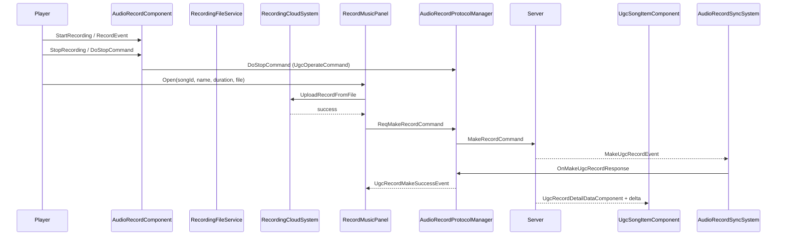

# UGC в Heartopia — справочник по декомпиляциям

Документ описывает все известные методы работы с **UGC (User Generated Content)** в игре Heartopia на основе локальных исследовательских дампов (`.research-record/`) и индекса событий (`docs/GAME_EVENTS_LIST.md`).

**См. также:** [UGC_SHOP.md](./UGC_SHOP.md) (магазин), **[UGC_BUILD_MECHANISMS.md](./UGC_BUILD_MECHANISMS.md)** (пружинные плиты, переключатели, `UgcOperateCommand`).

**Ограничение:** полные тела части UGC-книг / конкурсов могут отсутствовать в `.research-record/` — build-механизмы и магазин верифицированы по `ilspy-dumps/`.

---

## 1. Обзор доменов UGC

| Домен | Назначение | Локальные дампы |
|-------|------------|-----------------|
| **Музыкальные записи** | Запись инструментов → облако → «изготовление» UGC-пластинки → публикация, лайки, удаление | Полный пайплайн |
| **Книги (UgcBook)** | Создание, редактирование, публикация, лайки пользовательских книг | Только имена событий |
| **UGC-магазин** | Покупка UGC-книг и пластинок в `ShopPanel` | Полный клиентский пайплайн — см. **[UGC_SHOP.md](./UGC_SHOP.md)** |
| **UGC build-механизмы** | Пружинные плиты, переключатели, батуты, UGC-скиллы на мебели | **[UGC_BUILD_MECHANISMS.md](./UGC_BUILD_MECHANISMS.md)** |
| **Конкурсы (UgcContest)** | Награждённые работы друзей/города | Только 2 события |
| **Rich Text / медиа** | Модерация и проверка UGC-контента | Только `IUgcManagerService` |
| **Operate Switch** | Универсальный переключатель UGC-операций (стоп записи и др.) | Только вызов из `AudioRecordProtocolManager` |
| **Структуры** | UGC для построек | Только `StructureUgcEvent` |

---

## 2. Архитектура (слои)

```
┌─────────────────────────────────────────────────────────────────┐
│ UI (XDTGame.UI.Panel)                                           │
│  RecordMusicPanel, MusicPlayerPanel, RecordCoverEditPanel, …     │
└───────────────────────────┬─────────────────────────────────────┘
                            │ EventCenter / DataModule
┌───────────────────────────▼─────────────────────────────────────┐
│ Gameplay DataModules (XDTGameSystem)                            │
│  RecorderSystem, RecordDataSystem, RecordingCloudSystem         │
└───────────────────────────┬─────────────────────────────────────┘
                            │ EcsService.TryGet<IMusicService>
                            │ EcsService.TryGet<IUgcManagerService>
┌───────────────────────────▼─────────────────────────────────────┐
│ Protocol Managers (XDTDataAndProtocol)                          │
│  AudioRecordProtocolManager → WebRequestUtility.SendCommand     │
│  UGCProtocolManager.DoCommand (operate switch)                  │
└───────────────────────────┬─────────────────────────────────────┘
                            │ NetworkCommand structs
┌───────────────────────────▼─────────────────────────────────────┐
│ ECS Components (EcsClient — XDT.Scene.Shared.Modules.Ugc)       │
│  UgcSongComponent, UgcRecordDetailDataComponent, …              │
└───────────────────────────┬─────────────────────────────────────┘
                            │ Sync / Persistent
┌───────────────────────────▼─────────────────────────────────────┐
│ Client Sync (EcsSystem.ClientSystem.Music.AudioRecordSyncSystem)│
│  NetworkEvent → ProtocolManager → EventCenter                   │
└─────────────────────────────────────────────────────────────────┘
```

**Сборка образов (Mono):**

| Сборка | UGC-содержимое |
|--------|----------------|
| `EcsClient` | `XDT.Scene.Shared.Modules.Ugc.*` — компоненты и команды |
| `XDTDataAndProtocol` | Protocol managers, события, `UGCProtocolManager` |
| `XDTGameSystem` | `RecorderSystem`, `RecordDataSystem`, UI events |
| `EcsSystem` | `AudioRecordSyncSystem` |
| `XDTGameUI` | `RecordMusicPanel`, `MusicPlayerPanel` |
| `XDTLevelAndEntity` | `AudioPlaybackComponent`, `AudioRecordComponent`, `UgcContest` |

---

## 3. Ядро UGC (инфраструктура)

Типы **не дампированы локально**, но используются из кода:

### 3.1 `UGCProtocolManager`

Центральный диспетчер UGC-операций через `DoCommand(in UgcOperateCommand)`.

**Единственный известный вызов** — остановка записи:

```csharp
UgcOperateCommand command = new UgcOperateCommand
{
    Type = UgcType.OperateSwitch,
    NetId = entity.netId,
    OperateMethod = (UgcOperateMethod)100200010u
};
UGCProtocolManager.DoCommand(in command);
```

Источник: `AudioRecordProtocolManager.DoStopCommand` (`.research-record/XDTDataAndProtocol_ProtocolService_DisplayBox_AudioRecordProtocolManager.cs`).

### 3.2 `UgcOperateCommand`

| Поле | Тип | Пример |
|------|-----|--------|
| `Type` | `UgcType` | `UgcType.OperateSwitch` |
| `NetId` | `uint` | netId сущности записи |
| `OperateMethod` | `UgcOperateMethod` | `100200010` — стоп записи |

### 3.3 `IUgcManagerService`

Сервис ECS, доступ через `EcsService.TryGet<IUgcManagerService>`.

**Известный API:**

```csharp
bool IsIllegalUgcItem(uint itemNetId)
```

Используется в:
- `RecordDataSystem.CheckRecordIllegal`
- `AudioPlaybackComponent` — блокировка воспроизведения нелегального UGC на граммофоне

Namespace импорта rich-text: `XDTDataAndProtocol.ProtocolService.UgcRichTextMedias` (тела не дампированы).

### 3.4 `PlayerUgcType`

Enum в `XDT.Scene.Shared.Modules.Ugc`. Локальный файл пуст; из кода известно значение **`Record`** — список Guid собственных музыкальных записей в `PlayerUgcBriefDataComponent`.

### 3.5 `PlayerHiddenUgcDataComponent`

Компонент «скрытого» (удалённого) UGC. Поле `UgcId` (`Guid`). При добавлении компонента `AudioRecordSyncSystem` диспатчит `OnUgcRecordDeleteEvent`.

---

## 4. ECS-компоненты (`XDT.Scene.Shared.Modules.Ugc`)

Сборка: **EcsClient**. Namespace: `XDT.Scene.Shared.Modules.Ugc`.

### 4.1 `UgcSongComponent`

Коллекция песен игрока (облачные «избранные» записи).

| Поле | Тип | Описание |
|------|-----|----------|
| `SongId` | `ulong` | ID записи (timestamp файла) |
| `SongName` | `string` | Название |
| `SongSeconds` | `float` | Длительность |

Атрибуты: `[Sync(OwnerOnly)]`, `[Persistent("UgSCom")]`, `IGroupKeyMap<ULongKey>`.

### 4.2 `UgcSongItemComponent`

Предмет-пластинка в рюкзаке (связь записи с Guid).

| Поле | Тип |
|------|-----|
| `SongId` | `ulong` |
| `SongName` | `string` |
| `SongSeconds` | `float` |
| `RecordId` | `Guid` |
| `PhotoId` | `string` |

Атрибуты: `[Sync]`, `[Persistent("UgSICom")]`, ключ — `RecordId`.

### 4.3 `UgcRecordDetailDataComponent`

Статические метаданные UGC-записи (пластинки).

| Поле | Тип |
|------|-----|
| `RecordId` | `Guid` |
| `SongId` | `ulong` |
| `SongName` | `string` |
| `SongSeconds` | `float` |
| `PhotoId` | `string` |
| `OfficialPhotoId` | `int` |
| `Brief` | `string` |
| `Describe` | `string` |
| `PublishShowDate` | `string` |
| `Publisher` | `string` (shortId владельца) |
| `OwnerId` | `Guid` |
| `Players` | `List<string>` |

### 4.4 `UgcRecordDetailDeltaDataComponent`

Динамические/социальные данные записи.

| Поле | Тип |
|------|-----|
| `IsPublic` | `bool` |
| `SetPublicDate` | `ulong` |
| `StartPublicDate` | `DateTime` |
| `EndPublicDate` | `DateTime` |
| `LikeCount` | `int` |
| `BuyTimes` | `int` |
| `PlayTimes` | `int` |

### 4.5 `PlayerUgcBriefDataComponent`

Индекс UGC-объектов игрока по типу.

| Поле | Тип |
|------|-----|
| `UgcIds` | `Dictionary<PlayerUgcType, List<Guid>>` |

**Методы:**

```csharp
List<Guid> GetIds(PlayerUgcType ugcType)
void AddId(PlayerUgcType ugcType, Guid id)
void DelId(PlayerUgcType ugcType, Guid id)
bool IsHave(PlayerUgcType ugcType, Guid id)
```

Атрибуты: `[Sync(OwnerOnly)]`, `[FireAddedEvent]`, `[FireUpdatedEvent]`.

---

## 5. Сетевые команды (`[NetworkCommand]`)

Все отправляются через `WebRequestUtility.SendCommand<T>`.

### 5.1 Дампированные команды

#### `CollectSongCommand`

Добавить локальную запись в облачную коллекцию.

| Поле | Тип |
|------|-----|
| `SongId` | `ulong` |
| `SongName` | `string` |
| `SongSeconds` | `float` |
| `SongUrl` | `string` |

#### `MakeRecordCommand`

«Изготовить» UGC-пластинку из записанного трека.

| Поле | Тип | Примечание |
|------|-----|------------|
| `SongId` | `ulong` | |
| `SongName` | `string` | |
| `SongSeconds` | `float` | |
| `PhotoId` | `string` | обложка (OBS URL или official path) |
| `OfficialPhotoId` | `int` | 1 = официальная обложка |
| `Brief` | `string` | краткое описание |
| `Describe` | `string` | полное описание |
| `PublishShowData` | `string` | дата публикации для отображения |
| `IsPublish` | `bool` | публиковать сразу |
| `Players` | `List<string>` | max 30; формат `shortId\|инструмент1,инструмент2` |

### 5.2 Команды по ссылкам (тела не дампированы)

| Команда | Вызов из | Поля (из вызова) |
|---------|----------|------------------|
| `ChangeCollectSongNameCommand` | `ReqChangeCollectSongNameCommand` | `SongId`, `SongName` |
| `DeleteCollectSongCommand` | `ReqDeleteCollectSongCommand` | `SongId` |
| `EditMetronomeCommand` | `ReqEditMetronomeCommand` | `Bpm`, `RhythmType`, `NetId` |
| `MakeOneMoreRecordCommand` | `OnMakeMoreRecord` | `NetId` |
| `UgcRecordLikeCommand` | `UgcRecordLikeCommand` | `RecordId` (Guid), `Type` (int) |
| `PublishUgcRecordCommand` | `SendPublishRecordCommand` | `IsPublish`, `NetId` |
| `DelUgcRecordDataCommand` | `DeleteUgcRecordCommand` | `UgcId` (Guid) |
| `GetPlaceOnMicroHomeRecordCountCommand` | `GetPlaceOnMicroHomeRecordCountCommand` | `UgcId` (Guid) |
| `UgcOperateCommand` | `DoStopCommand` | `Type`, `NetId`, `OperateMethod` |

---

## 6. `AudioRecordProtocolManager`

**Namespace:** `XDTDataAndProtocol.ProtocolService.DisplayBox`  
**Сборка:** `XDTDataAndProtocol`

Статический класс — единая точка клиентских UGC-операций с музыкальными записями.

### 6.1 Отправка команд

| Метод | Команда | Назначение |
|-------|---------|------------|
| `ReqCollectSongCommand(SongId, SongName, SongSeconds, SongUrl)` | `CollectSongCommand` | Добавить в коллекцию |
| `ReqChangeCollectSongNameCommand(SongId, SongName)` | `ChangeCollectSongNameCommand` | Переименовать |
| `ReqDeleteCollectSongCommand(SongId, SongUrl)` | `DeleteCollectSongCommand` | Удалить из коллекции |
| `ReqMakeRecordCommand(...)` | `MakeRecordCommand` | Создать UGC-пластинку |
| `ReqEditMetronomeCommand(netId, bpm, rhythmType)` | `EditMetronomeCommand` | Сохранить метроном |
| `DoStopCommand(Entity entity)` | `UgcOperateCommand` | Остановить запись (operate switch) |
| `OnMakeMoreRecord(uint netId)` | `MakeOneMoreRecordCommand` | Создать ещё одну копию пластинки |
| `UgcRecordLikeCommand(Guid recordId, int type)` | `UgcRecordLikeCommand` | Лайк |
| `SendPublishRecordCommand(uint netId, bool publish)` | `PublishUgcRecordCommand` | Публикация/снятие |
| `GetPlaceOnMicroHomeRecordCountCommand(Guid ugcId)` | `GetPlaceOnMicroHomeRecordCountCommand` | Счётчик в микродоме |
| `DeleteUgcRecordCommand(Guid recordId)` | `DelUgcRecordDataCommand` | Удалить UGC-запись |

### 6.2 Обработка ответов сервера

| Метод | Событие ответа | Клиентское событие |
|-------|----------------|-------------------|
| `OnSaveMetronomeResponse` | `EditMetronomeEvent` | Toast при успехе |
| `OnMakeMoreRecordResponse` | `MakeOneMoreRecordEvent` | `ErrorCodeToast` при ошибке |
| `OnUgcRecordLikeResponse` | `UgcRecordLikeEvent` | `OnUgcRecordLikeChangedEvent` |
| `OnPublishRecordResponse` | `PublishUgcRecordEvent` | `OnUgcRecordPublishChangeEvent` |
| `OnMakeUgcRecordResponse` | `MakeUgcRecordEvent` | `UgcRecordMakeSuccessEvent` + `FlauntActionEvent` |
| `OnGetPlaceOnMicroHomeRecordCountResponse` | `GetPlaceOnMicroHomeRecordCountEvent` | `OnGetRecordCountInMicorhomelandEvent` |
| `OnDeleteUgcRecordResponse` | `DelUgcRecordDataEvent` | `ErrorCodeToast` при ошибке |

`OnSelfRecordItemAdd` / `OnSelfRecordItemUpdate` — пустые заглушки.

---

## 7. `AudioRecordSyncSystem`

**Namespace:** `EcsSystem.ClientSystem.Music`  
Подписывается на сетевые и ECS-события в `Init()`.

### 7.1 Цепочка синхронизации

```
Server NetworkEvent          →  ProtocolManager handler  →  EventCenter (UI)
─────────────────────────────────────────────────────────────────────────
CollectSongEvent             →  SongCollectOrDeleteEvent (isCollect=true)
DeleteCollectSongEvent       →  SongCollectOrDeleteEvent (isCollect=false)
MakeUgcRecordEvent           →  OnMakeUgcRecordResponse
PublishUgcRecordEvent        →  OnPublishRecordResponse
UgcRecordLikeEvent           →  OnUgcRecordLikeResponse
DelUgcRecordDataEvent        →  OnDeleteUgcRecordResponse
GetPlaceOnMicroHomeRecordCountEvent → OnGetPlaceOnMicroHomeRecordCountResponse
EditMetronomeEvent           →  OnSaveMetronomeResponse
MakeOneMoreRecordEvent       →  OnMakeMoreRecordResponse

ComponentAdded/Updated/Removed<UgcSongComponent>  →  SongListUpdateEvent
ComponentAdded/Updated<PlayerUgcBriefDataComponent> → OnSelfRecordItemUpdateEvent
ComponentAdded<PlayerHiddenUgcDataComponent>        → OnUgcRecordDeleteEvent
```

---

## 8. DataModules

### 8.1 `RecorderSystem`

**Namespace:** `XDTGameSystem.GameplaySystem.Music`  
**Scope:** `GameLevel_Main`

Кэш UGC-данных игрока для UI.

| Член | Описание |
|------|----------|
| `collectedSongs` | `List<UgcSongComponent>` — облачная коллекция |
| `textureId`, `textureType`, `officialCoverId` | Временные данные обложки при создании записи |
| `TryGetUgcRecordNetId(Guid, out uint)` | Guid → netId через `IMusicService` |
| `GetSelfRecordComponentData(...)` | Список своих записей (detail + delta), фильтр удалённых |
| `IsSongCollected(ulong)` | Проверка коллекции |
| `TryGetCollectedSong(ulong, out UgcSongComponent)` | Поиск в коллекции |

**Инициализация (`OnCreate`):** через `IMusicService` + `IIterateService<T>`:
- `GetAllCollectSongs`
- `GetAllSelfRecordBriefData`
- `GetAllHiddenUgcData`

**События:** `SongListUpdateEvent`, `OnSelfRecordItemUpdateEvent`, `OnUgcRecordDeleteEvent`.

### 8.2 `RecordDataSystem`

**Namespace:** `XDTGameSystem.GameplaySystem.Record`

| Метод | Описание |
|-------|----------|
| `CheckRecordIllegal(uint itemNetId)` | `IUgcManagerService.IsIllegalUgcItem` |
| `GetRecordDetailDataByNetId(uint, out detail, out delta)` | По netId предмета рюкзака |
| `TryGetGuidByNetId(uint, out Guid)` | `IMusicService.GetUgcSongGuid` |
| `GetRecordDetailDataByGuid(Guid, out detail)` | Метаданные по Guid |
| `GetRecordCountInHomelandCount(Guid)` | Записи в доме + микродоме |
| `GetRecordCount(EStorageType, Guid)` | Копии пластинок в рюкзаке/складе |

### 8.3 `RecordingCloudSystem`

**Namespace:** `XDTLevelAndEntity.BaseSystem.Instrument`  
OBS-хранилище (`ObsClientType.Recording`).

| Метод | Назначение |
|-------|------------|
| `UploadRecordFromFile(baseName, onSuccess, onFailure)` | `{playerShortId}/{songId}.bin` |
| `UploadRecordFromMemory(objectId, data, ...)` | Потоковая загрузка |
| `DownloadRecordToFile(shortId, SongName, SongId, ...)` | Локальный файл |
| `DownloadRecordToMemory(shortId, SongId, ...)` | Байты для граммофона |

**Порядок при создании пластинки (`RecordMusicPanel`):**
1. Загрузка обложки (если фото) → цензура
2. `UploadRecordFromFile` → при успехе
3. `AudioRecordProtocolManager.ReqMakeRecordCommand`

---

## 9. UI-панели

### 9.1 `RecordMusicPanel`

**Открытие:** `RecordMusicPanel.Open(songId, songName, duration, baseFileName)`

Поток создания UGC-пластинки:
1. Ввод названия, описания, обложки, даты публикации
2. Проверка валюты (`CostRecordSongItemId` / `UgcSongRecordCurrency`)
3. Загрузка файла в облако
4. `ReqMakeRecordCommand`
5. Ожидание `UgcRecordMakeSuccessEvent`

### 9.2 `MusicPlayerPanel`

**Открытие:** `MusicPlayerPanel.Open(recorderNetId)`

Три вкладки:
| Tab | Содержимое | UGC-операции |
|-----|------------|--------------|
| 0 | Все локальные записи | play, rename, delete, collect |
| 1 | Коллекция (`UgcSongComponent`) | uncollect, rename |
| 2 | Изготовленные UGC-записи | publish/unpublish, delete, make more, instrumentalist list |

**UGC-действия на вкладке 2:**
- `SendPublishRecordCommand` — публикация (cooldown 6 дней после снятия)
- `DeleteUgcRecordCommand` — удаление
- `OnMakeMoreRecord` — дубликат пластинки (платная валюта)
- `GetPlaceOnMicroHomeRecordCountCommand` — счётчик в микродоме
- Red point: `RedPointEnum.UgcRecordCensorPassedTab`

---

## 10. Компоненты мира

### 10.1 `AudioRecordComponent`

Запись на фонографе/инструменте в доме.

- Слушает `UgcOperateErrorEvent` (по `entity.netId`)
- `DoStopCommand()` → `AudioRecordProtocolManager.DoStopCommand`
- Анимации: `UGC_GramoPhone02_On` / `UGC_GramoPhone02_Off`

### 10.2 `AudioPlaybackComponent`

Граммофон в доме (`XDTLevelAndEntity.Gameplay.Component.Homeland`).

- При `SongId != 0`: скачивание из облака по `Publisher` shortId
- `IUgcManagerService.IsIllegalUgcItem` — блок воспроизведения
- `IBuildPlacingListener` — пересчёт позиции при размещении
- Связь с `UgcRecordDetailDataComponent` через `RecordDataSystem`

---

## 11. Сервис `IMusicService` (инференс из вызовов)

Не дампирован; используется через `EcsService.TryGet<IMusicService>`.

```csharp
bool TryGetUgcRecordNetId(Guid recordId, out uint netId)
bool TryGetUgcRecordDetailData(Guid, out UgcRecordDetailDataComponent, out UgcRecordDetailDeltaDataComponent)
Guid GetUgcSongGuid(uint netId)
int GetHomeAndMicroHomeRecordCount(Guid guid)

// IIterateService<T>:
void GetAllCollectSongs(List<UgcSongComponent>)
void GetAllSelfRecordBriefData(List<PlayerUgcBriefDataComponent>)
void GetAllHiddenUgcData(List<PlayerHiddenUgcDataComponent>)
```

---

## 12. Каталог событий UGC

### 12.1 Музыкальные записи (есть в дампах)

| Событие | Namespace | Когда |
|---------|-----------|-------|
| `UgcRecordMakeSuccessEvent` | `XDTDataAndProtocol.Events` | Успех/неудача `MakeRecordCommand` |
| `UgcRecordRefreshUIEvent` | | Обновить список после удаления |
| `OnUgcRecordDeleteEvent` | | `PlayerHiddenUgcDataComponent` добавлен |
| `OnUgcRecordLikeChangedEvent` | | Успешный лайк |
| `OnUgcRecordPublishChangeEvent` | | Смена статуса публикации |
| `OnSelfRecordItemUpdateEvent` | | Sync `PlayerUgcBriefDataComponent` |
| `OnGetRecordCountInMicorhomelandEvent` | | Ответ счётчика микродома |
| `OnStopRecordEvent` | | Перед `UgcOperateCommand` stop |
| `UgcOperateErrorEvent` | | Ошибка operate switch |
| `SongListUpdateEvent` | | Изменение `UgcSongComponent` |
| `SongCollectOrDeleteEvent` | | Collect/delete song |

### 12.2 Только в `GAME_EVENTS_LIST.md`

**Записи:**
- `OnUgcRecordStatusChangeEvent`

**Книги (`UgcBook*`):**
- `UgcBookCreateEvent`, `UgcBookDeleteEvent`, `UgcBookEndEditEvent`
- `UgcBookPublishSuccessEvent`, `UgcBookPublishResultEvent`, `UgcBookPublishIllegalEvent`
- `UgcBookLikeEvent`, `UgcBookCancelLikeEvent`, `UgcBookCancelPublishEvent`
- `UgcBookChangeNameEvent`, `UgcBookGotEvent`, `UgcBookInvalidEvent`
- `UgcBookShowOffEvent`, `UgcBookTranslateDoneEvent`
- `UgcPublishedBookDeleteEvent`, `UgcSetOpenFailEvent`

**Магазин:**
- `OnBuyUgcShopItemSuccessEvent`

**Operate switch / настройки:**
- `UGCOperateSwitchUpdateEvent`
- `UgcOperateSwitchOpenEvent`
- `UgcIconCaptureOpenRequestedEvent`, `UgcIconCaptureCloseRequestedEvent`
- `UgcSettingPanelOpenEvent`

**Структуры:**
- `StructureUgcEvent`, `UgcItemRemoveEvent`

**Конкурсы (`XDTLevelAndEntity.Game.Module.UgcContest`):**
- `FriendAwardedWorksChangedEvent`
- `TownAwardedWorksChangedEvent`

---

## 13. Полный пайплайн: запись → UGC-пластинка



### Пайплайн: коллекция песен

```
Локальный файл → UploadRecordFromFile → ReqCollectSongCommand
→ CollectSongEvent → UgcSongComponent на сервере
→ AudioRecordSyncSystem → SongListUpdateEvent → RecorderSystem
```

### Пайплайн: воспроизведение на граммофоне

```
AudioPlaybackComponentData.SongId изменён
→ RecordDataSystem.GetRecordDetailDataByGuid
→ IUgcManagerService.IsIllegalUgcItem (gate)
→ RecordingCloudSystem.DownloadRecordToMemory(publisher, songId)
→ StartPlaybackFromMemory (loop)
```

---

## 14. Домены без локальных дампов

### 14.1 UGC-книги

По событиям предполагается полный CRUD + публикация + лайки + перевод. Типы команд, protocol manager и UI **требуют декомпиляции** из:
```
ilspy-dumps/XDTDataAndProtocol/.../UgcBook*
ilspy-dumps/XDTGameUI/.../UgcBook*
ilspy-dumps/EcsClient/.../XDT.Scene.Shared.Modules.Ugc/*Book*
```

### 14.2 UGC-магазин

Подробный разбор: **[UGC_SHOP.md](./UGC_SHOP.md)**.

Кратко: секция в `ShopPanel` при `TableStoreInfo.UgcItemType != 0`; storeId **147** (Book), **148** (Record); покупка через `BuyUgcItemCommand` / `ShopItemProtocolManager.BuyUgcItemCommand`.

### 14.3 UgcContest

Модуль: `XDTLevelAndEntity.Game.Module.UgcContest`. События наград друзей/города — без тел классов.

### 14.4 Rich Text / модерация

`IUgcManagerService.IsIllegalUgcItem` + namespace `UgcRichTextMedias`. Используется для блокировки контента на клиенте после серверной модерации.

---

## 15. Рекомендации для мода (Bugtopia)

| Задача | Канал | Типы |
|--------|-------|------|
| Создать пластинку | **S** SendCommand | `MakeRecordCommand` |
| Опубликовать/снять | **S** | `PublishUgcRecordCommand` (нужен netId) |
| Удалить запись | **S** | `DelUgcRecordDataCommand` |
| Лайк | **S** | `UgcRecordLikeCommand` |
| Коллекция песен | **A** / managed | `Entities.GetComponents<UgcSongComponent>` или `IMusicService` |
| Список своих записей | **A** | `PlayerUgcBriefDataComponent` + `TryGetUgcRecordDetailData` |
| Проверка легальности | **A** | `EcsService.TryGet<IUgcManagerService>` |
| Остановить запись | **S** или invoke | `UGCProtocolManager.DoCommand` / `AudioRecordProtocolManager.DoStopCommand` |
| Открыть UI создания | **A** | `RecordMusicPanel.Open` via `mono_runtime_invoke` |
| UGC-магазин (купить) | **S** / **A** | `BuyUgcItemCommand`; UI: `ShopPanel.OpenShopPanel(147\|148)` — [UGC_SHOP.md](./UGC_SHOP.md) |

**Алиасы для `FindLoadedType`:**
```csharp
"XDT.Scene.Shared.Modules.Ugc.UgcSongComponent"
"Il2CppXDT.Scene.Shared.Modules.Ugc.UgcSongComponent"
"XDTDataAndProtocol.ProtocolService.DisplayBox.AudioRecordProtocolManager"
"XDTGameSystem.GameplaySystem.Music.RecorderSystem"
```

---

## 16. Локальные файлы-источники

| Файл | Содержимое |
|------|------------|
| `.research-record/XDT_Scene_Shared_Modules_Ugc_*.cs` | ECS-компоненты |
| `.research-record/MakeRecordCommand.cs` | Команда создания |
| `.research-record/CollectSongCommand.cs` | Команда коллекции |
| `.research-record/XDTDataAndProtocol_ProtocolService_DisplayBox_AudioRecordProtocolManager.cs` | Protocol manager |
| `.research-record/AudioRecordSyncSystem.cs/...` | Sync system |
| `.research-record/RecorderSystem.cs` | Data module |
| `.research-record/XDTGameSystem_GameplaySystem_Record_RecordDataSystem.cs` | Record data |
| `.research-record/XDTGame_UI_Panel_RecordMusicPanel.cs` | UI создания |
| `.research-record/MusicPlayerPanel.cs` | UI плеера |
| `.research-record/XDTLevelAndEntity_Gameplay_Component_Homeland_AudioPlaybackComponent.cs` | Граммофон |
| `.research-record/AudioRecordComponent.cs` | Запись |
| `.research-record/RecordingCloudSystem.cs` | OBS upload/download |
| `docs/GAME_EVENTS_LIST.md` | Полный индекс событий |

---

## 17. Пробелы — что декомпилировать дальше

1. ~~`UGCProtocolManager`, `UgcOperateCommand`, `UgcType`, `UgcOperateMethod`~~ → [UGC_BUILD_MECHANISMS.md](./UGC_BUILD_MECHANISMS.md)
2. `PlayerUgcType` — полный enum (Book, Record, …)
3. `PlayerHiddenUgcDataComponent` — определение
4. Все `UgcBook*` commands / managers / UI
5. ~~UGC shop protocol + UI~~ → см. [UGC_SHOP.md](./UGC_SHOP.md)
6. ~~UGC build-механизмы (`UgcType`, PressurePad)~~ → см. [UGC_BUILD_MECHANISMS.md](./UGC_BUILD_MECHANISMS.md)
7. `UgcContest` module
8. `UgcRichTextMedias` namespace
9. `StructureUgcEvent` handler chain
10. Серверные response-структуры: `MakeUgcRecordEvent`, `PublishUgcRecordEvent`, и др.

После генерации `ilspy-dumps/` (см. [GAME_ASSEMBLIES_AND_TOOLS.md](./GAME_ASSEMBLIES_AND_TOOLS.md)) — обновить этот документ и [DECOMPILED_SOURCE_MAP.md](./DECOMPILED_SOURCE_MAP.md).

---

*Составлено по `.research-record/` и `docs/GAME_EVENTS_LIST.md`. Мод `buddy/` UGC пока не реализует.*
