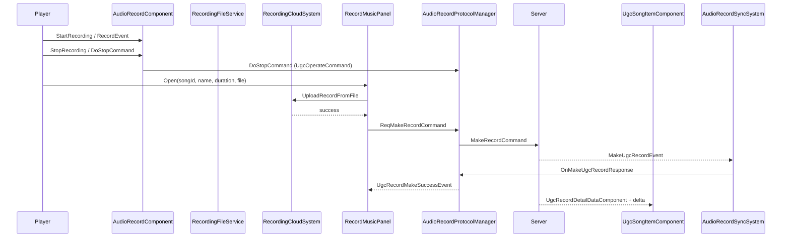

# UGC in Heartopia — a reference built from the decompilations

This document covers every known way of working with **UGC (User Generated Content)** in Heartopia, based on the local research dumps (`.research-record/`) and the event index (`docs/GAME_EVENTS_LIST.md`).

**See also:** [UGC_SHOP.md](./UGC_SHOP.md) (the shop) and **[UGC_BUILD_MECHANISMS.md](./UGC_BUILD_MECHANISMS.md)** (pressure pads, switches, `UgcOperateCommand`).

**Caveat:** the full bodies of some UGC book and contest types may be missing from `.research-record/` — the build mechanisms and the shop were verified against `ilspy-dumps/`.

---

## 1. The UGC domains at a glance

| Domain | Purpose | Local dumps |
|-------|------------|-----------------|
| **Music records** | Record instruments → cloud → "press" a UGC record → publish, likes, deletion | The full pipeline |
| **Books (UgcBook)** | Creating, editing, publishing and liking player-made books | Event names only |
| **The UGC shop** | Buying UGC books and records in `ShopPanel` | The full client pipeline — see **[UGC_SHOP.md](./UGC_SHOP.md)** |
| **UGC build mechanisms** | Pressure pads, switches, trampolines, UGC skills on furniture | **[UGC_BUILD_MECHANISMS.md](./UGC_BUILD_MECHANISMS.md)** |
| **Contests (UgcContest)** | Award-winning works by friends and the city | Two events only |
| **Rich text / media** | Moderating and checking UGC content | `IUgcManagerService` only |
| **Operate switch** | The universal switch for UGC operations (stopping a recording and so on) | Only the call from `AudioRecordProtocolManager` |
| **Structures** | UGC for buildings | `StructureUgcEvent` only |

---

## 2. The architecture, in layers

```
┌─────────────────────────────────────────────────────────────────┐
│ UI (XDTGame.UI.Panel)                                           │
│  RecordMusicPanel, MusicPlayerPanel, RecordCoverEditPanel, …     │
└───────────────────────────┬─────────────────────────────────────┘
                            │ EventCenter / DataModule
┌───────────────────────────▼─────────────────────────────────────┐
│ Gameplay DataModules (XDTGameSystem)                            │
│  RecorderSystem, RecordDataSystem, RecordingCloudSystem         │
└───────────────────────────┬─────────────────────────────────────┘
                            │ EcsService.TryGet<IMusicService>
                            │ EcsService.TryGet<IUgcManagerService>
┌───────────────────────────▼─────────────────────────────────────┐
│ Protocol Managers (XDTDataAndProtocol)                          │
│  AudioRecordProtocolManager → WebRequestUtility.SendCommand     │
│  UGCProtocolManager.DoCommand (operate switch)                  │
└───────────────────────────┬─────────────────────────────────────┘
                            │ NetworkCommand structs
┌───────────────────────────▼─────────────────────────────────────┐
│ ECS Components (EcsClient — XDT.Scene.Shared.Modules.Ugc)       │
│  UgcSongComponent, UgcRecordDetailDataComponent, …              │
└───────────────────────────┬─────────────────────────────────────┘
                            │ Sync / Persistent
┌───────────────────────────▼─────────────────────────────────────┐
│ Client Sync (EcsSystem.ClientSystem.Music.AudioRecordSyncSystem)│
│  NetworkEvent → ProtocolManager → EventCenter                   │
└─────────────────────────────────────────────────────────────────┘
```

**Assembly images (Mono):**

| Assembly | UGC content |
|--------|----------------|
| `EcsClient` | `XDT.Scene.Shared.Modules.Ugc.*` — components and commands |
| `XDTDataAndProtocol` | protocol managers, events, `UGCProtocolManager` |
| `XDTGameSystem` | `RecorderSystem`, `RecordDataSystem`, UI events |
| `EcsSystem` | `AudioRecordSyncSystem` |
| `XDTGameUI` | `RecordMusicPanel`, `MusicPlayerPanel` |
| `XDTLevelAndEntity` | `AudioPlaybackComponent`, `AudioRecordComponent`, `UgcContest` |

---

## 3. The UGC core (infrastructure)

These types are **not dumped locally** but are used from code:

### 3.1 `UGCProtocolManager`

The central dispatcher for UGC operations, through `DoCommand(in UgcOperateCommand)`.

**The only known call** stops a recording:

```csharp
UgcOperateCommand command = new UgcOperateCommand
{
    Type = UgcType.OperateSwitch,
    NetId = entity.netId,
    OperateMethod = (UgcOperateMethod)100200010u
};
UGCProtocolManager.DoCommand(in command);
```

Source: `AudioRecordProtocolManager.DoStopCommand` (`.research-record/XDTDataAndProtocol_ProtocolService_DisplayBox_AudioRecordProtocolManager.cs`).

### 3.2 `UgcOperateCommand`

| Field | Type | Example |
|------|-----|--------|
| `Type` | `UgcType` | `UgcType.OperateSwitch` |
| `NetId` | `uint` | the netId of the recording entity |
| `OperateMethod` | `UgcOperateMethod` | `100200010` — stop recording |

### 3.3 `IUgcManagerService`

An ECS service, reached through `EcsService.TryGet<IUgcManagerService>`.

**The known API:**

```csharp
bool IsIllegalUgcItem(uint itemNetId)
```

Used in:
- `RecordDataSystem.CheckRecordIllegal`
- `AudioPlaybackComponent` — blocking playback of illegal UGC on a gramophone

The rich-text import namespace is `XDTDataAndProtocol.ProtocolService.UgcRichTextMedias` (bodies not dumped).

### 3.4 `PlayerUgcType`

An enum in `XDT.Scene.Shared.Modules.Ugc`. The local file is empty; from code the value **`Record`** is known — the list of Guids of one's own music records in `PlayerUgcBriefDataComponent`.

### 3.5 `PlayerHiddenUgcDataComponent`

The component for "hidden" (deleted) UGC. Field `UgcId` (`Guid`). When the component is added, `AudioRecordSyncSystem` dispatches `OnUgcRecordDeleteEvent`.

---

## 4. ECS components (`XDT.Scene.Shared.Modules.Ugc`)

Assembly: **EcsClient**. Namespace: `XDT.Scene.Shared.Modules.Ugc`.

### 4.1 `UgcSongComponent`

The player's song collection (cloud "favourite" recordings).

| Field | Type | Description |
|------|-----|----------|
| `SongId` | `ulong` | the recording's id (the file's timestamp) |
| `SongName` | `string` | the title |
| `SongSeconds` | `float` | the duration |

Attributes: `[Sync(OwnerOnly)]`, `[Persistent("UgSCom")]`, `IGroupKeyMap<ULongKey>`.

### 4.2 `UgcSongItemComponent`

The record item in the backpack (linking a recording to a Guid).

| Field | Type |
|------|-----|
| `SongId` | `ulong` |
| `SongName` | `string` |
| `SongSeconds` | `float` |
| `RecordId` | `Guid` |
| `PhotoId` | `string` |

Attributes: `[Sync]`, `[Persistent("UgSICom")]`, keyed by `RecordId`.

### 4.3 `UgcRecordDetailDataComponent`

Static metadata for a UGC recording (a record).

| Field | Type |
|------|-----|
| `RecordId` | `Guid` |
| `SongId` | `ulong` |
| `SongName` | `string` |
| `SongSeconds` | `float` |
| `PhotoId` | `string` |
| `OfficialPhotoId` | `int` |
| `Brief` | `string` |
| `Describe` | `string` |
| `PublishShowDate` | `string` |
| `Publisher` | `string` (the owner's shortId) |
| `OwnerId` | `Guid` |
| `Players` | `List<string>` |

### 4.4 `UgcRecordDetailDeltaDataComponent`

A recording's dynamic and social data.

| Field | Type |
|------|-----|
| `IsPublic` | `bool` |
| `SetPublicDate` | `ulong` |
| `StartPublicDate` | `DateTime` |
| `EndPublicDate` | `DateTime` |
| `LikeCount` | `int` |
| `BuyTimes` | `int` |
| `PlayTimes` | `int` |

### 4.5 `PlayerUgcBriefDataComponent`

An index of the player's UGC objects by type.

| Field | Type |
|------|-----|
| `UgcIds` | `Dictionary<PlayerUgcType, List<Guid>>` |

**Methods:**

```csharp
List<Guid> GetIds(PlayerUgcType ugcType)
void AddId(PlayerUgcType ugcType, Guid id)
void DelId(PlayerUgcType ugcType, Guid id)
bool IsHave(PlayerUgcType ugcType, Guid id)
```

Attributes: `[Sync(OwnerOnly)]`, `[FireAddedEvent]`, `[FireUpdatedEvent]`.

---

## 5. Network commands (`[NetworkCommand]`)

All of them are sent through `WebRequestUtility.SendCommand<T>`.

### 5.1 Commands that are dumped

#### `CollectSongCommand`

Add a local recording to the cloud collection.

| Field | Type |
|------|-----|
| `SongId` | `ulong` |
| `SongName` | `string` |
| `SongSeconds` | `float` |
| `SongUrl` | `string` |

#### `MakeRecordCommand`

"Press" a UGC record from a recorded track.

| Field | Type | Note |
|------|-----|------------|
| `SongId` | `ulong` | |
| `SongName` | `string` | |
| `SongSeconds` | `float` | |
| `PhotoId` | `string` | the cover (an OBS URL or an official path) |
| `OfficialPhotoId` | `int` | 1 = an official cover |
| `Brief` | `string` | a short description |
| `Describe` | `string` | the full description |
| `PublishShowData` | `string` | the publication date, for display |
| `IsPublish` | `bool` | publish immediately |
| `Players` | `List<string>` | max 30; the format is `shortId\|instrument1,instrument2` |

### 5.2 Commands known only by reference (bodies not dumped)

| Command | Called from | Fields (from the call site) |
|---------|----------|------------------|
| `ChangeCollectSongNameCommand` | `ReqChangeCollectSongNameCommand` | `SongId`, `SongName` |
| `DeleteCollectSongCommand` | `ReqDeleteCollectSongCommand` | `SongId` |
| `EditMetronomeCommand` | `ReqEditMetronomeCommand` | `Bpm`, `RhythmType`, `NetId` |
| `MakeOneMoreRecordCommand` | `OnMakeMoreRecord` | `NetId` |
| `UgcRecordLikeCommand` | `UgcRecordLikeCommand` | `RecordId` (Guid), `Type` (int) |
| `PublishUgcRecordCommand` | `SendPublishRecordCommand` | `IsPublish`, `NetId` |
| `DelUgcRecordDataCommand` | `DeleteUgcRecordCommand` | `UgcId` (Guid) |
| `GetPlaceOnMicroHomeRecordCountCommand` | `GetPlaceOnMicroHomeRecordCountCommand` | `UgcId` (Guid) |
| `UgcOperateCommand` | `DoStopCommand` | `Type`, `NetId`, `OperateMethod` |

---

## 6. `AudioRecordProtocolManager`

**Namespace:** `XDTDataAndProtocol.ProtocolService.DisplayBox`  
**Assembly:** `XDTDataAndProtocol`

A static class — the single entry point for client-side UGC operations on music records.

### 6.1 Sending commands

| Method | Command | Purpose |
|-------|---------|------------|
| `ReqCollectSongCommand(SongId, SongName, SongSeconds, SongUrl)` | `CollectSongCommand` | add to the collection |
| `ReqChangeCollectSongNameCommand(SongId, SongName)` | `ChangeCollectSongNameCommand` | rename |
| `ReqDeleteCollectSongCommand(SongId, SongUrl)` | `DeleteCollectSongCommand` | remove from the collection |
| `ReqMakeRecordCommand(...)` | `MakeRecordCommand` | create a UGC record |
| `ReqEditMetronomeCommand(netId, bpm, rhythmType)` | `EditMetronomeCommand` | save the metronome |
| `DoStopCommand(Entity entity)` | `UgcOperateCommand` | stop a recording (the operate switch) |
| `OnMakeMoreRecord(uint netId)` | `MakeOneMoreRecordCommand` | press another copy of a record |
| `UgcRecordLikeCommand(Guid recordId, int type)` | `UgcRecordLikeCommand` | a like |
| `SendPublishRecordCommand(uint netId, bool publish)` | `PublishUgcRecordCommand` | publish or unpublish |
| `GetPlaceOnMicroHomeRecordCountCommand(Guid ugcId)` | `GetPlaceOnMicroHomeRecordCountCommand` | the micro-home counter |
| `DeleteUgcRecordCommand(Guid recordId)` | `DelUgcRecordDataCommand` | delete a UGC recording |

### 6.2 Handling the server's replies

| Method | Reply event | Client-side event |
|-------|----------------|-------------------|
| `OnSaveMetronomeResponse` | `EditMetronomeEvent` | a toast on success |
| `OnMakeMoreRecordResponse` | `MakeOneMoreRecordEvent` | `ErrorCodeToast` on failure |
| `OnUgcRecordLikeResponse` | `UgcRecordLikeEvent` | `OnUgcRecordLikeChangedEvent` |
| `OnPublishRecordResponse` | `PublishUgcRecordEvent` | `OnUgcRecordPublishChangeEvent` |
| `OnMakeUgcRecordResponse` | `MakeUgcRecordEvent` | `UgcRecordMakeSuccessEvent` + `FlauntActionEvent` |
| `OnGetPlaceOnMicroHomeRecordCountResponse` | `GetPlaceOnMicroHomeRecordCountEvent` | `OnGetRecordCountInMicorhomelandEvent` |
| `OnDeleteUgcRecordResponse` | `DelUgcRecordDataEvent` | `ErrorCodeToast` on failure |

`OnSelfRecordItemAdd` / `OnSelfRecordItemUpdate` are empty stubs.

---

## 7. `AudioRecordSyncSystem`

**Namespace:** `EcsSystem.ClientSystem.Music`  
Subscribes to the network and ECS events in `Init()`.

### 7.1 The synchronisation chain

```
Server NetworkEvent          →  ProtocolManager handler  →  EventCenter (UI)
─────────────────────────────────────────────────────────────────────────
CollectSongEvent             →  SongCollectOrDeleteEvent (isCollect=true)
DeleteCollectSongEvent       →  SongCollectOrDeleteEvent (isCollect=false)
MakeUgcRecordEvent           →  OnMakeUgcRecordResponse
PublishUgcRecordEvent        →  OnPublishRecordResponse
UgcRecordLikeEvent           →  OnUgcRecordLikeResponse
DelUgcRecordDataEvent        →  OnDeleteUgcRecordResponse
GetPlaceOnMicroHomeRecordCountEvent → OnGetPlaceOnMicroHomeRecordCountResponse
EditMetronomeEvent           →  OnSaveMetronomeResponse
MakeOneMoreRecordEvent       →  OnMakeMoreRecordResponse

ComponentAdded/Updated/Removed<UgcSongComponent>  →  SongListUpdateEvent
ComponentAdded/Updated<PlayerUgcBriefDataComponent> → OnSelfRecordItemUpdateEvent
ComponentAdded<PlayerHiddenUgcDataComponent>        → OnUgcRecordDeleteEvent
```

---

## 8. DataModules

### 8.1 `RecorderSystem`

**Namespace:** `XDTGameSystem.GameplaySystem.Music`  
**Scope:** `GameLevel_Main`

A cache of the player's UGC data for the UI.

| Member | Description |
|------|----------|
| `collectedSongs` | `List<UgcSongComponent>` — the cloud collection |
| `textureId`, `textureType`, `officialCoverId` | temporary cover data while creating a recording |
| `TryGetUgcRecordNetId(Guid, out uint)` | Guid → netId through `IMusicService` |
| `GetSelfRecordComponentData(...)` | the list of one's own recordings (detail + delta), filtering deleted ones |
| `IsSongCollected(ulong)` | a collection check |
| `TryGetCollectedSong(ulong, out UgcSongComponent)` | a lookup in the collection |

**Initialisation (`OnCreate`):** through `IMusicService` and `IIterateService<T>`:
- `GetAllCollectSongs`
- `GetAllSelfRecordBriefData`
- `GetAllHiddenUgcData`

**Events:** `SongListUpdateEvent`, `OnSelfRecordItemUpdateEvent`, `OnUgcRecordDeleteEvent`.

### 8.2 `RecordDataSystem`

**Namespace:** `XDTGameSystem.GameplaySystem.Record`

| Method | Description |
|-------|----------|
| `CheckRecordIllegal(uint itemNetId)` | `IUgcManagerService.IsIllegalUgcItem` |
| `GetRecordDetailDataByNetId(uint, out detail, out delta)` | by the netId of a backpack item |
| `TryGetGuidByNetId(uint, out Guid)` | `IMusicService.GetUgcSongGuid` |
| `GetRecordDetailDataByGuid(Guid, out detail)` | metadata by Guid |
| `GetRecordCountInHomelandCount(Guid)` | recordings in the home and the micro-home |
| `GetRecordCount(EStorageType, Guid)` | copies of a record in the backpack or storage |

### 8.3 `RecordingCloudSystem`

**Namespace:** `XDTLevelAndEntity.BaseSystem.Instrument`  
OBS storage (`ObsClientType.Recording`).

| Method | Purpose |
|-------|------------|
| `UploadRecordFromFile(baseName, onSuccess, onFailure)` | `{playerShortId}/{songId}.bin` |
| `UploadRecordFromMemory(objectId, data, ...)` | a streaming upload |
| `DownloadRecordToFile(shortId, SongName, SongId, ...)` | a local file |
| `DownloadRecordToMemory(shortId, SongId, ...)` | bytes for the gramophone |

**The order when pressing a record (`RecordMusicPanel`):**
1. upload the cover (if it is a photo) → censorship
2. `UploadRecordFromFile` → on success
3. `AudioRecordProtocolManager.ReqMakeRecordCommand`

---

## 9. UI panels

### 9.1 `RecordMusicPanel`

**Opening:** `RecordMusicPanel.Open(songId, songName, duration, baseFileName)`

The flow for creating a UGC record:
1. enter the title, description, cover and publication date
2. check the currency (`CostRecordSongItemId` / `UgcSongRecordCurrency`)
3. upload the file to the cloud
4. `ReqMakeRecordCommand`
5. wait for `UgcRecordMakeSuccessEvent`

### 9.2 `MusicPlayerPanel`

**Opening:** `MusicPlayerPanel.Open(recorderNetId)`

Three tabs:
| Tab | Contents | UGC operations |
|-----|------------|--------------|
| 0 | all local recordings | play, rename, delete, collect |
| 1 | the collection (`UgcSongComponent`) | uncollect, rename |
| 2 | pressed UGC records | publish/unpublish, delete, make more, instrumentalist list |

**UGC actions on tab 2:**
- `SendPublishRecordCommand` — publishing (a 6-day cooldown after unpublishing)
- `DeleteUgcRecordCommand` — deletion
- `OnMakeMoreRecord` — another copy of the record (paid currency)
- `GetPlaceOnMicroHomeRecordCountCommand` — the micro-home counter
- Red point: `RedPointEnum.UgcRecordCensorPassedTab`

---

## 10. World components

### 10.1 `AudioRecordComponent`

Recording on a phonograph or instrument at home.

- Listens to `UgcOperateErrorEvent` (by `entity.netId`)
- `DoStopCommand()` → `AudioRecordProtocolManager.DoStopCommand`
- Animations: `UGC_GramoPhone02_On` / `UGC_GramoPhone02_Off`

### 10.2 `AudioPlaybackComponent`

The gramophone at home (`XDTLevelAndEntity.Gameplay.Component.Homeland`).

- With `SongId != 0`: downloads from the cloud by the `Publisher` shortId
- `IUgcManagerService.IsIllegalUgcItem` — blocks playback
- `IBuildPlacingListener` — recomputes the position when placed
- Links to `UgcRecordDetailDataComponent` through `RecordDataSystem`

---

## 11. The `IMusicService` service (inferred from call sites)

Not dumped; used through `EcsService.TryGet<IMusicService>`.

```csharp
bool TryGetUgcRecordNetId(Guid recordId, out uint netId)
bool TryGetUgcRecordDetailData(Guid, out UgcRecordDetailDataComponent, out UgcRecordDetailDeltaDataComponent)
Guid GetUgcSongGuid(uint netId)
int GetHomeAndMicroHomeRecordCount(Guid guid)

// IIterateService<T>:
void GetAllCollectSongs(List<UgcSongComponent>)
void GetAllSelfRecordBriefData(List<PlayerUgcBriefDataComponent>)
void GetAllHiddenUgcData(List<PlayerHiddenUgcDataComponent>)
```

---

## 12. A catalogue of UGC events

### 12.1 Music records (present in the dumps)

| Event | Namespace | When |
|---------|-----------|-------|
| `UgcRecordMakeSuccessEvent` | `XDTDataAndProtocol.Events` | `MakeRecordCommand` succeeded or failed |
| `UgcRecordRefreshUIEvent` | | refresh the list after a deletion |
| `OnUgcRecordDeleteEvent` | | `PlayerHiddenUgcDataComponent` was added |
| `OnUgcRecordLikeChangedEvent` | | a successful like |
| `OnUgcRecordPublishChangeEvent` | | the publication status changed |
| `OnSelfRecordItemUpdateEvent` | | `PlayerUgcBriefDataComponent` synced |
| `OnGetRecordCountInMicorhomelandEvent` | | the micro-home counter's reply |
| `OnStopRecordEvent` | | before a `UgcOperateCommand` stop |
| `UgcOperateErrorEvent` | | an operate-switch error |
| `SongListUpdateEvent` | | `UgcSongComponent` changed |
| `SongCollectOrDeleteEvent` | | Collect/delete song |

### 12.2 Present only in `GAME_EVENTS_LIST.md`

**Records:**
- `OnUgcRecordStatusChangeEvent`

**Books (`UgcBook*`):**
- `UgcBookCreateEvent`, `UgcBookDeleteEvent`, `UgcBookEndEditEvent`
- `UgcBookPublishSuccessEvent`, `UgcBookPublishResultEvent`, `UgcBookPublishIllegalEvent`
- `UgcBookLikeEvent`, `UgcBookCancelLikeEvent`, `UgcBookCancelPublishEvent`
- `UgcBookChangeNameEvent`, `UgcBookGotEvent`, `UgcBookInvalidEvent`
- `UgcBookShowOffEvent`, `UgcBookTranslateDoneEvent`
- `UgcPublishedBookDeleteEvent`, `UgcSetOpenFailEvent`

**The shop:**
- `OnBuyUgcShopItemSuccessEvent`

**Operate switch and settings:**
- `UGCOperateSwitchUpdateEvent`
- `UgcOperateSwitchOpenEvent`
- `UgcIconCaptureOpenRequestedEvent`, `UgcIconCaptureCloseRequestedEvent`
- `UgcSettingPanelOpenEvent`

**Structures:**
- `StructureUgcEvent`, `UgcItemRemoveEvent`

**Contests (`XDTLevelAndEntity.Game.Module.UgcContest`):**
- `FriendAwardedWorksChangedEvent`
- `TownAwardedWorksChangedEvent`

---

## 13. The full pipeline: recording → UGC record


```mermaid
sequenceDiagram
    participant Player
    participant AudioRecord as AudioRecordComponent
    participant Local as RecordingFileService
    participant Cloud as RecordingCloudSystem
    participant UI as RecordMusicPanel
    participant Proto as AudioRecordProtocolManager
    participant Server
    participant ECS as UgcSongItemComponent
    participant Sync as AudioRecordSyncSystem

    Player->>AudioRecord: StartRecording / RecordEvent
    Player->>AudioRecord: StopRecording / DoStopCommand
    AudioRecord->>Proto: DoStopCommand (UgcOperateCommand)
    Player->>UI: Open(songId, name, duration, file)
    UI->>Cloud: UploadRecordFromFile
    Cloud-->>UI: success
    UI->>Proto: ReqMakeRecordCommand
    Proto->>Server: MakeRecordCommand
    Server-->>Sync: MakeUgcRecordEvent
    Sync->>Proto: OnMakeUgcRecordResponse
    Proto-->>UI: UgcRecordMakeSuccessEvent
    Server-->>ECS: UgcRecordDetailDataComponent + delta
```

### Pipeline: the song collection

```
A local file → UploadRecordFromFile → ReqCollectSongCommand
→ CollectSongEvent → UgcSongComponent on the server
→ AudioRecordSyncSystem → SongListUpdateEvent → RecorderSystem
```

### Pipeline: playback on the gramophone

```
AudioPlaybackComponentData.SongId changed
→ RecordDataSystem.GetRecordDetailDataByGuid
→ IUgcManagerService.IsIllegalUgcItem (gate)
→ RecordingCloudSystem.DownloadRecordToMemory(publisher, songId)
→ StartPlaybackFromMemory (loop)
```

---

## 14. Domains with no local dumps

### 14.1 UGC books

The events suggest full CRUD plus publishing, likes and translation. The command types, the protocol manager and the UI **need decompiling** from:
```
ilspy-dumps/XDTDataAndProtocol/.../UgcBook*
ilspy-dumps/XDTGameUI/.../UgcBook*
ilspy-dumps/EcsClient/.../XDT.Scene.Shared.Modules.Ugc/*Book*
```

### 14.2 The UGC shop

The detailed account: **[UGC_SHOP.md](./UGC_SHOP.md)**.

In short: a section in `ShopPanel` when `TableStoreInfo.UgcItemType != 0`; storeId **147** (Book) and **148** (Record); purchases go through `BuyUgcItemCommand` / `ShopItemProtocolManager.BuyUgcItemCommand`.

### 14.3 UgcContest

Module: `XDTLevelAndEntity.Game.Module.UgcContest`. The friend and city award events, with no class bodies.

### 14.4 Rich text and moderation

`IUgcManagerService.IsIllegalUgcItem` plus the `UgcRichTextMedias` namespace. Used to block content on the client after server-side moderation.

---

## 15. Recommendations for the mod (Bugtopia)

| Task | Channel | Types |
|--------|-------|------|
| Press a record | **S** SendCommand | `MakeRecordCommand` |
| Publish or unpublish | **S** | `PublishUgcRecordCommand` (needs a netId) |
| Delete a recording | **S** | `DelUgcRecordDataCommand` |
| Like | **S** | `UgcRecordLikeCommand` |
| The song collection | **A** / managed | `Entities.GetComponents<UgcSongComponent>` or `IMusicService` |
| List one's own recordings | **A** | `PlayerUgcBriefDataComponent` + `TryGetUgcRecordDetailData` |
| Check legality | **A** | `EcsService.TryGet<IUgcManagerService>` |
| Stop a recording | **S** or an invoke | `UGCProtocolManager.DoCommand` / `AudioRecordProtocolManager.DoStopCommand` |
| Open the creation UI | **A** | `RecordMusicPanel.Open` via `mono_runtime_invoke` |
| The UGC shop (buying) | **S** / **A** | `BuyUgcItemCommand`; UI: `ShopPanel.OpenShopPanel(147\|148)` — [UGC_SHOP.md](./UGC_SHOP.md) |

**Aliases for `FindLoadedType`:**
```csharp
"XDT.Scene.Shared.Modules.Ugc.UgcSongComponent"
"Il2CppXDT.Scene.Shared.Modules.Ugc.UgcSongComponent"
"XDTDataAndProtocol.ProtocolService.DisplayBox.AudioRecordProtocolManager"
"XDTGameSystem.GameplaySystem.Music.RecorderSystem"
```

---

## 16. Local source files

| File | Contents |
|------|------------|
| `.research-record/XDT_Scene_Shared_Modules_Ugc_*.cs` | ECS components |
| `.research-record/MakeRecordCommand.cs` | the creation command |
| `.research-record/CollectSongCommand.cs` | the collection command |
| `.research-record/XDTDataAndProtocol_ProtocolService_DisplayBox_AudioRecordProtocolManager.cs` | Protocol manager |
| `.research-record/AudioRecordSyncSystem.cs/...` | Sync system |
| `.research-record/RecorderSystem.cs` | Data module |
| `.research-record/XDTGameSystem_GameplaySystem_Record_RecordDataSystem.cs` | Record data |
| `.research-record/XDTGame_UI_Panel_RecordMusicPanel.cs` | the creation UI |
| `.research-record/MusicPlayerPanel.cs` | the player UI |
| `.research-record/XDTLevelAndEntity_Gameplay_Component_Homeland_AudioPlaybackComponent.cs` | the gramophone |
| `.research-record/AudioRecordComponent.cs` | recording |
| `.research-record/RecordingCloudSystem.cs` | OBS upload/download |
| `docs/GAME_EVENTS_LIST.md` | the full event index |

---

## 17. Gaps — what to decompile next

1. ~~`UGCProtocolManager`, `UgcOperateCommand`, `UgcType`, `UgcOperateMethod`~~ → [UGC_BUILD_MECHANISMS.md](./UGC_BUILD_MECHANISMS.md)
2. `PlayerUgcType` — the full enum (Book, Record, …)
3. `PlayerHiddenUgcDataComponent` — the definition
4. Every `UgcBook*` command, manager and UI
5. ~~The UGC shop protocol and UI~~ → see [UGC_SHOP.md](./UGC_SHOP.md)
6. ~~The UGC build mechanisms (`UgcType`, PressurePad)~~ → see [UGC_BUILD_MECHANISMS.md](./UGC_BUILD_MECHANISMS.md)
7. `UgcContest` module
8. `UgcRichTextMedias` namespace
9. `StructureUgcEvent` handler chain
10. The server response structures: `MakeUgcRecordEvent`, `PublishUgcRecordEvent` and others.

Once `ilspy-dumps/` has been generated (see [GAME_ASSEMBLIES_AND_TOOLS.md](./GAME_ASSEMBLIES_AND_TOOLS.md)), update this document and [DECOMPILED_SOURCE_MAP.md](./DECOMPILED_SOURCE_MAP.md).

---

*Compiled from `.research-record/` and `docs/GAME_EVENTS_LIST.md`. The `buddy/` mod does not implement UGC yet.*
